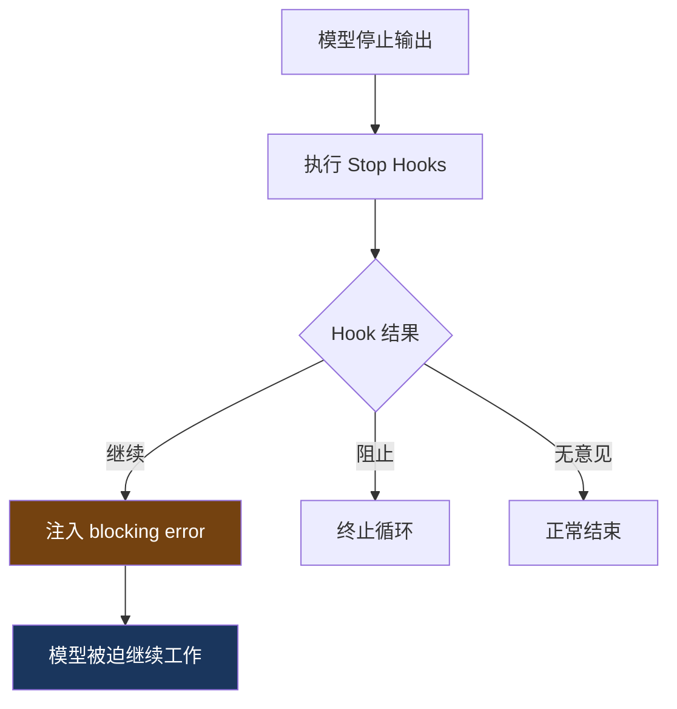
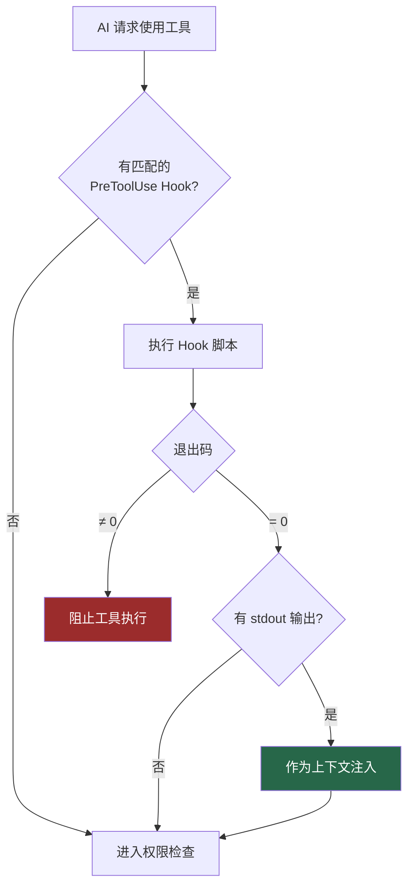

# 4. Hook 系统

> 源码位置: `src/utils/hooks.ts`

## 概述

Hook 系统是 Claude Code 的可扩展性基础设施。它在 agent 生命周期的关键节点插入检查点，允许外部逻辑拦截、修改或扩展 agent 的行为，实现 human-in-the-loop 控制。核心设计遵循**开放-封闭原则**——对扩展开放（通过添加 Hook 增加新行为），对修改封闭（不需要修改 Claude Code 核心代码）。

## 底层原理

### 6 种 Hook 类型

| Hook | 触发时机 | 能做什么 |
|------|---------|---------|
| `PreToolUse` | 工具调用前 | 拒绝、修改参数、注入上下文 |
| `PostToolUse` | 工具调用后 | 追加操作、记录日志 |
| `PreCompact` | 压缩前 | 注入自定义压缩指令 |
| `PostCompact` | 压缩后 | 追加恢复操作 |
| `Stop` | 模型停止输出时 | **强制模型继续** |
| `SessionStart` | 会话开始/压缩后 | 注入初始上下文 |

### Hook 配置结构

Hook 在 `settings.json` 中配置，支持工具级别的 matcher 过滤：

```json
{
  "hooks": {
    "PreToolUse": [
      {
        "matcher": "Bash",
        "hooks": [
          {
            "type": "command",
            "command": "if echo $CLAUDE_TOOL_INPUT | grep -q 'git push'; then npm test || exit 1; fi"
          }
        ]
      }
    ],
    "PostToolUse": [
      {
        "matcher": "FileEdit",
        "hooks": [
          {
            "type": "command",
            "command": "npx prettier --write $CLAUDE_FILE_PATH"
          }
        ]
      }
    ]
  }
}
```

### Hook 的四种能力

**1. 阻止操作**：Hook 脚本返回非零退出码时，操作被阻止

```bash
#!/bin/bash
# git push 前运行测试
npm test || exit 1  # 测试失败 → 阻止 push
```

**2. 修改输入**：Hook 通过 stdout 输出修改后的参数

```bash
#!/bin/bash
# 把相对路径转换为绝对路径
ABS_PATH=$(realpath "$CLAUDE_TOOL_INPUT_PATH")
echo "{\"path\": \"$ABS_PATH\"}"
```

**3. 注入上下文**：Hook 输出的信息作为系统提示附加到消息中

```bash
#!/bin/bash
echo "当前 Git 分支: $(git branch --show-current)"
echo "未提交的更改: $(git status --short | wc -l) 个文件"
```

**4. 后处理**：在工具执行后自动运行操作

```bash
#!/bin/bash
# 文件编辑后自动格式化
case "${CLAUDE_FILE_PATH##*.}" in
  ts|tsx|js|jsx) npx prettier --write "$CLAUDE_FILE_PATH" ;;
  py) black "$CLAUDE_FILE_PATH" ;;
  go) gofmt -w "$CLAUDE_FILE_PATH" ;;
esac
```

### 外部监督者模式 (Stop Hooks)



Stop hooks 是最独特的 hook 类型——模型自己不知道有这个监督者。当模型宣布"完成"时，外部脚本可以检查输出质量，不满意则注入 blocking error 强制模型继续。

### Hook 执行流程



### 超时限制

| Hook 类型 | 超时 | 原因 |
|-----------|------|------|
| 工具相关 Hook | 10 分钟 | 允许运行测试等耗时操作 |
| SessionEnd Hook | 1.5 秒 | 不能阻塞程序关闭 |

### 环境变量

Hook 脚本通过环境变量获取上下文：

```bash
$CLAUDE_SESSION_ID       # 当前会话 ID
$CLAUDE_TOOL_NAME        # 工具名称
$CLAUDE_TOOL_INPUT       # 工具输入（JSON 格式）
$CLAUDE_FILE_PATH        # 文件路径（FileEdit/FileWrite）
$CLAUDE_WORKING_DIR      # 当前工作目录
```

### Hook vs 权限规则

| | 权限规则 | Hook |
|---|---|---|
| 复杂度 | 简单的模式匹配 | 可运行任意脚本 |
| 能力 | 只能 allow/deny/ask | 阻止、修改输入、注入上下文、后处理 |
| 配置 | 模式字符串 | Shell 命令 |
| 适用场景 | 简单的黑白名单 | 复杂的业务逻辑 |

权限规则是"简单的开关"，Hook 是"可编程的逻辑"。两者互补：权限规则处理常见的 allow/deny 场景，Hook 处理需要自定义逻辑的场景。

## 设计原因

- **Human-in-the-loop**：每个工具调用都可被审查和拦截
- **可扩展性**：用户通过 hooks 自定义行为，不需要修改源码（开放-封闭原则）
- **质量保证**：Stop hooks 防止模型过早宣布"完成"
- **事件驱动**：Hook 系统本质上是事件驱动架构——在程序流程的特定点"挂载"行为，而不是硬编码 if/else

## 应用场景

::: tip 可借鉴场景
任何需要外部控制的 agent 系统。Hook 模式比硬编码的 if/else 更灵活。

实用示例：
- **自动格式化**：PostToolUse + FileEdit matcher → 编辑后自动运行 prettier/black
- **禁止修改特定文件**：PreToolUse + FileEdit matcher → 检测 package-lock.json 则 exit 1
- **Git push 前检查**：PreToolUse + Bash matcher → 检测 git push 则先运行 npm test
- **会话日志**：SessionEnd → 记录会话 ID 和时间到日志文件
:::
