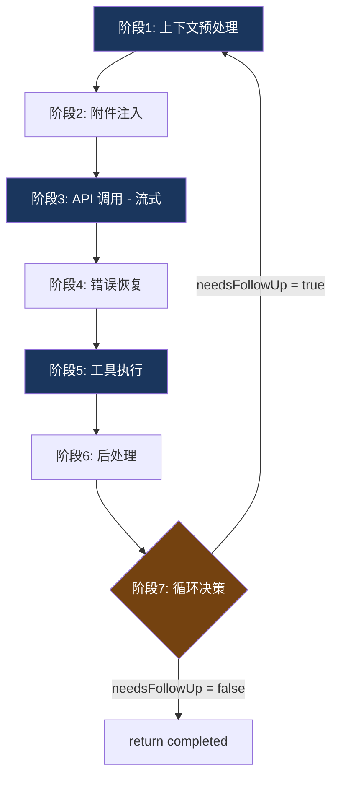
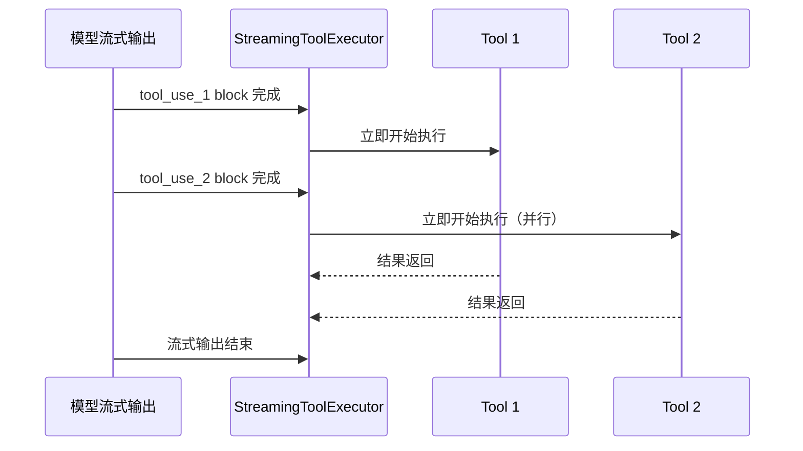

# 1. ReAct 循环工程化

> 源码位置: `src/query.ts` — `queryLoop()`

## 概述

Claude Code 的核心是一个 **ReAct (Reasoning + Acting)** 循环。模型交替进行"推理"（生成文本）和"行动"（调用工具），直到任务完成。与学术论文中的 ReAct 不同，这是一个高度工程化的 `while(true)` 循环，每轮迭代经历 7 个阶段。

## 底层原理

### 7 阶段流水线



### 各阶段详解

**阶段 1: 上下文预处理**
- `enforceToolResultBudget()` — 检查单消息聚合预算（200K 字符）
- `snipCompactIfNeeded()` — 历史裁剪
- `microcompactMessages()` — 清理旧工具结果
- `autoCompactIfNeeded()` — 全量压缩检查

**阶段 2: 附件注入**
- skill_discovery 附件
- memory prefetch 结果
- MCP 指令 / 工具 schema delta

**阶段 3: API 调用（流式）**
```typescript
for await (const message of deps.callModel({
  messages: prependUserContext(messagesForQuery, userContext),
  systemPrompt: fullSystemPrompt,
  tools: toolUseContext.options.tools,
  signal: toolUseContext.abortController.signal,
  // ...
})) {
  // 流式接收 + 边收边执行工具
}
```

**阶段 4: 错误恢复** — 详见 [多级错误恢复](/agent/error-recovery)

**阶段 5: 工具执行** — 并行/串行执行所有 tool_use blocks

**阶段 6: 后处理** — stop hooks、token budget 检查

**阶段 7: 循环决策** — `needsFollowUp` 为 true 则继续

### 关键设计：为什么用 while(true) 而不是递归？

递归调用会导致调用栈增长，长对话（几十轮工具调用）可能栈溢出。`while(true)` + `state` 对象传递保持恒定的栈深度：

```typescript
let state: State = { messages, toolUseContext, ... }

while (true) {
  const { messages, toolUseContext } = state
  // ... 执行一轮 ...
  
  if (needsFollowUp) {
    state = { messages: [...messages, ...newMessages], ... }
    continue  // 整体替换 state，不是修改 9 个变量
  }
  return { reason: 'completed' }
}
```

### 关键设计：stop_reason 驱动的循环决策

Claude API 每次回复都携带 `stop_reason`，查询引擎据此决定循环走向：

| stop_reason | 含义 | 查询引擎反应 |
|-------------|------|-------------|
| `end_turn` | 模型认为任务完成 | 结束循环 |
| `tool_use` | 模型请求调用工具 | 执行工具，继续循环 |
| `max_tokens` | 输出被截断 | 尝试恢复（最多 3 次） |

`max_tokens` 的恢复逻辑值得注意——模型输出被截断时，引擎注入一条恢复消息强制模型接续：

```typescript
if (response.stop_reason === "max_tokens") {
  if (recoveryCount < 3) {
    // 注入恢复指令：不要道歉、不要重复、直接继续
    messages.push({
      role: "user",
      content: "Resume directly — no apology, no recap. Break remaining work into smaller pieces."
    })
    await autoCompact(messages)
    recoveryCount++
    continue
  }
  break  // 恢复失败，退出循环
}
```

这是一个典型的**恢复消息注入**模式——通过精确的指令措辞（"no apology, no recap"）防止模型浪费 token 在道歉和重复上。

### 关键设计：StreamingToolExecutor

传统 ReAct 是串行的：等模型输出完 → 执行工具 → 等结果。`StreamingToolExecutor` 在模型还在输出时就开始执行已完成的 tool_use block：



### 关键设计：工具执行的批次分区

当模型在一次回复中调用多个工具时，引擎按读写属性将工具分批执行：

```
工具调用列表:
  [Read a.ts] [Read b.ts] [Write c.ts] [Read d.ts]

分成批次:
  批次 1: [Read a.ts, Read b.ts]  → 并行执行（都是只读）
  批次 2: [Write c.ts]            → 单独执行（写操作）
  批次 3: [Read d.ts]             → 单独执行（在写之后）
```

分区规则由工具元数据驱动：`isConcurrencySafe: true` 且 `isReadOnly: true` 的工具可以并行，否则串行。这个决策不是硬编码的，而是每个工具通过 `buildTool()` 声明自己的安全属性。

### 流式响应的 SSE 事件处理

API 调用使用 `messages.stream()` 而非 `messages.create()`，通过 Server-Sent Events (SSE) 协议逐块接收模型输出。事件层次结构：

```
message_start
  ├── content_block_start  → { type: "text" | "tool_use" | "thinking" }
  │     ├── content_block_delta  → text_delta / input_json_delta / thinking_delta
  │     ├── content_block_delta
  │     └── content_block_stop
  ├── content_block_start  → 另一个内容块
  │     └── ...
  └── message_stop
```

引擎使用异步生成器处理这些事件，关键在于 `content_block_stop` 时机——当一个 `tool_use` 类型的 block 完成时，其 `inputJson` 字段可以被完整解析，`StreamingToolExecutor` 立即开始执行该工具：

```typescript
case "content_block_stop":
  if (currentToolUse) {
    const input = JSON.parse(currentToolUse.inputJson)
    yield { type: "tool_use_complete", tool: currentToolUse.name, input }
    // StreamingToolExecutor 收到后立即开始执行
  }
  break
```

### 细粒度工具流式输入 (FGTS)

更进一步的优化：当 `eager_input_streaming` 启用时，模型刚开始输出工具名就可以触发预处理：

```
传统流程: 模型输出完整 tool_use → 权限检查(200ms) → 执行
FGTS 流程: 模型输出工具名 → 权限检查并行开始 → 模型输出完参数 → 立即执行
```

这个优化将权限检查和分类器评估与模型生成参数的时间重叠，节省几百毫秒延迟。

### 中断处理：Ctrl+C 的分级响应

用户按 Ctrl+C 时，引擎根据当前状态选择不同的中断策略：

```typescript
if (currentState === "streaming_text") {
  stream.abort()           // 停止接收，显示已收到的部分
}
if (currentState === "executing_tool") {
  if (tool.interruptBehavior === "cancel") {
    tool.cancel()          // 读操作可安全取消
  } else {
    showMessage("等待当前操作完成...")  // 写操作必须等待
  }
}
```

每个工具声明自己的中断行为：读文件可以取消（`cancel`），写文件必须等待完成（`block`）——写到一半中断会导致文件损坏。

## 设计原因

- **鲁棒性**：7 阶段流水线确保每轮都经过完整的上下文管理和错误检查
- **性能**：流式执行 + FGTS 将工具调用的等待时间压缩到最小
- **可观测性**：每个阶段都有 `queryCheckpoint()` 打点，方便性能分析
- **感知延迟优化**：SSE 流式让用户在 0.5 秒内看到首个 token，而非等待完整回复（心理学上，有反馈的等待比无反馈的等待感觉快得多）
- **恢复能力**：`max_tokens` 截断时的恢复消息注入，让长输出任务不会因为单次截断而失败

## 应用场景

::: tip 可借鉴场景
任何需要多轮工具调用的 AI agent 系统。关键是把循环的每个阶段显式化，而不是把所有逻辑塞在一个大函数里。7 阶段流水线的设计可以直接复用。
:::

## 关联知识点

- [多级错误恢复](/agent/error-recovery) — 阶段 4 的详细展开
- [五层防爆体系](/context/five-layers) — 阶段 1 的上下文预处理
- [工具类型系统](/tools/tool-type) — 阶段 5 的工具执行
