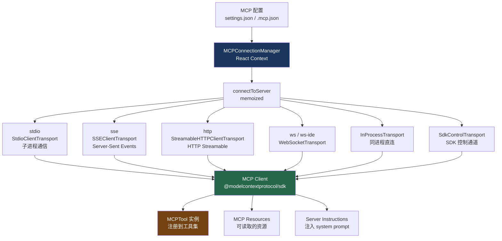
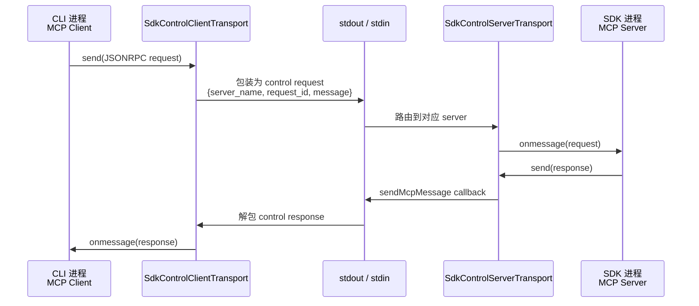

# 21. MCP 协议实现

> 源码位置: `src/services/mcp/`

## 概述

Claude Code 实现了完整的 MCP (Model Context Protocol) 客户端，支持 stdio、SSE、HTTP Streamable、WebSocket 四种传输协议，以及两种特殊的进程内传输：`InProcessTransport`（同进程通信）和 `SdkControlTransport`（SDK 控制通道）。MCP 让 Claude Code 能够连接外部工具服务器，将第三方工具无缝集成到 agent 的工具集中。

## 底层原理

### 连接架构总览



### InProcessTransport：零网络开销的进程内通信

当 MCP 服务器和客户端运行在同一个进程中时，不需要走网络或子进程。`InProcessTransport` 创建一对链接的传输对象，`send()` 直接投递到对端的 `onmessage`：

```typescript
class InProcessTransport implements Transport {
  private peer: InProcessTransport | undefined

  async send(message: JSONRPCMessage): Promise<void> {
    // 异步投递，避免同步请求/响应导致栈深度问题
    queueMicrotask(() => {
      this.peer?.onmessage?.(message)
    })
  }

  async close(): Promise<void> {
    this.closed = true
    this.onclose?.()
    // 关闭对端
    if (this.peer && !this.peer.closed) {
      this.peer.closed = true
      this.peer.onclose?.()
    }
  }
}

// 创建链接对
export function createLinkedTransportPair(): [Transport, Transport] {
  const a = new InProcessTransport()
  const b = new InProcessTransport()
  a._setPeer(b)
  b._setPeer(a)
  return [a, b]  // [clientTransport, serverTransport]
}
```

关键设计：`queueMicrotask` 而不是同步调用——避免 `client.send() → server.onmessage() → server.send() → client.onmessage()` 的同步递归导致栈溢出。

### SdkControlTransport：跨进程的 SDK 控制通道

当 Claude Code 作为 SDK 被嵌入时，MCP 服务器运行在 SDK 进程中，而 MCP 客户端运行在 CLI 进程中。`SdkControlTransport` 通过 stdout/stdin 控制消息桥接两个进程：



```typescript
// CLI 侧
export class SdkControlClientTransport implements Transport {
  constructor(
    private serverName: string,
    private sendMcpMessage: SendMcpMessageCallback,  // 通过 stdout 发送
  ) {}

  async send(message: JSONRPCMessage): Promise<void> {
    const response = await this.sendMcpMessage(this.serverName, message)
    this.onmessage?.(response)  // 将响应传回 MCP Client
  }
}

// SDK 侧
export class SdkControlServerTransport implements Transport {
  constructor(private sendMcpMessage: (message: JSONRPCMessage) => void) {}

  async send(message: JSONRPCMessage): Promise<void> {
    this.sendMcpMessage(message)  // 通过 callback 返回给 CLI
  }
}
```

### Instructions Delta 机制：只发送变化的指令

MCP 服务器可以在 `InitializeResult` 中携带 `instructions`（使用说明），这些指令需要注入到 system prompt 中。但如果每轮都重建完整的 MCP 指令，会破坏 prompt cache。

Delta 机制的解决方案：扫描对话历史中已经"宣布"过的服务器，只发送新增/移除的变化：

```typescript
export function getMcpInstructionsDelta(
  mcpClients: MCPServerConnection[],
  messages: Message[],
  clientSideInstructions: ClientSideInstruction[],
): McpInstructionsDelta | null {
  // 1. 扫描历史消息，收集已宣布的服务器名
  const announced = new Set<string>()
  for (const msg of messages) {
    if (msg.attachment?.type === 'mcp_instructions_delta') {
      for (const n of msg.attachment.addedNames) announced.add(n)
      for (const n of msg.attachment.removedNames) announced.delete(n)
    }
  }

  // 2. 找出新增的（有指令但未宣布）
  const added = [...blocks].filter(([name]) => !announced.has(name))

  // 3. 找出移除的（已宣布但不再连接）
  const removed = [...announced].filter(n => !connectedNames.has(n))

  if (added.length === 0 && removed.length === 0) return null
  return { addedNames, addedBlocks, removedNames }
}
```

Delta 作为 `mcp_instructions_delta` 类型的 attachment 持久化到消息历史中，而不是放在 system prompt 里。这样：
- 新连接的服务器指令只出现一次（作为 attachment）
- 不会每轮重建 system prompt 的 MCP 指令部分
- Prompt cache 前缀保持稳定

### OAuth 认证流程

远程 MCP 服务器（SSE/HTTP）支持 OAuth 2.0 认证。`ClaudeAuthProvider` 实现了完整的 OAuth 流程：

```typescript
class ClaudeAuthProvider implements OAuthClientProvider {
  // 1. 发现：获取服务器的 OAuth metadata
  // 2. 注册：动态客户端注册
  // 3. 授权：打开浏览器让用户授权
  async redirectToAuthorization(authorizationUrl: URL): Promise<void> {
    // 启动本地 HTTP 服务器接收回调
    // 打开浏览器跳转到授权页面
  }
  // 4. Token 管理：存储、刷新、缓存
  async tokens(): Promise<OAuthTokens | undefined> { ... }
  async saveTokens(tokens: OAuthTokens): Promise<void> { ... }
}
```

认证状态缓存在 `~/.claude/mcp-needs-auth-cache.json` 中，TTL 15 分钟，避免重复触发认证流程。

### MCPConnectionManager：React 组件管理连接

`MCPConnectionManager` 是一个 React Context Provider，管理所有 MCP 服务器的连接生命周期：

```typescript
export function MCPConnectionManager({
  children, dynamicMcpConfig, isStrictMcpConfig,
}: MCPConnectionManagerProps) {
  const { reconnectMcpServer, toggleMcpServer } =
    useManageMCPConnections(dynamicMcpConfig, isStrictMcpConfig)

  return (
    <MCPConnectionContext.Provider value={{ reconnectMcpServer, toggleMcpServer }}>
      {children}
    </MCPConnectionContext.Provider>
  )
}
```

子组件通过 `useMcpReconnect()` 和 `useMcpToggleEnabled()` hooks 获取重连和启停能力。

### MCP 工具的命名与发现

MCP 工具在 Claude Code 内部使用特殊的命名格式防止冲突：

```
mcp__服务器名__工具名

例如：
mcp__github__create_issue          GitHub 创建 Issue
mcp__database__query_database      数据库查询
mcp__slack__send_message           Slack 发消息
```

启动时，Claude Code 连接所有配置的 MCP 服务器并调用 `tools/list` 发现可用工具。这些工具被自动注册到 agent 的工具集中，对模型来说与内置工具无异——同样经过权限检查、同样支持 PreToolUse/PostToolUse hooks。

### MCP 配置示例

```json
{
  "mcpServers": {
    "github": {
      "command": "node",
      "args": ["~/.mcp/github/index.js"],
      "env": { "GITHUB_TOKEN": "ghp_xxxxxxxxxxxx" }
    },
    "database": {
      "command": "python",
      "args": ["~/.mcp/db-server/main.py"],
      "env": { "DATABASE_URL": "postgres://localhost/mydb" }
    }
  }
}
```

MCP 服务器可以用任何编程语言实现（Python、JavaScript、Go、Rust），只要遵循 MCP 协议。服务器在独立进程中运行，即使崩溃也不影响 Claude Code 本身——这是**安全隔离**的体现。

### MCP 工具的权限控制

MCP 工具同样受权限系统管控，支持通配符批量管理：

```json
{
  "permissions": {
    "alwaysAllow": ["mcp__github__list_issues"],
    "alwaysDeny": ["mcp__database__drop_table"],
    "alwaysAsk": ["mcp__slack__send_message"],
    "alwaysDeny": ["mcp__dangerous_server__*"]
  }
}
```

## 设计原因

- **多传输协议**：stdio 适合本地工具，SSE/HTTP/WS 适合远程服务，InProcess 适合内嵌场景——覆盖所有部署模式
- **Instructions Delta**：避免 MCP 指令变化破坏 prompt cache，每次只发送增量
- **memoized 连接**：`connectToServer` 被 memoize，相同配置的服务器不会重复连接
- **批量连接**：本地服务器 3 个一批，远程服务器 20 个一批并行连接，平衡启动速度和资源占用
- **认证缓存**：needs-auth 状态缓存 15 分钟，避免 30+ 个服务器同时 401 时反复触发认证
- **无限扩展性**：任何人都可以写 MCP 服务器提供任何功能，Claude Code 不需要为每种服务写适配代码
- **标准化接口**：所有 MCP 工具都有统一的 JSON Schema 定义输入输出，模型不需要学习每种工具的特殊用法

## 应用场景

::: tip 可借鉴场景
任何需要集成外部工具的 AI agent 系统。MCP 协议本身是开放标准，Claude Code 的实现展示了如何在生产环境中处理多传输协议、认证、连接管理等工程问题。Instructions Delta 机制是一个通用的"增量同步"模式——当某些元数据需要注入到 prompt 但又不能每轮重建时，用 delta attachment 记录变化。
:::

## 关联知识点

- [多 Provider 接口](/api/multi-provider) — MCP 工具调用最终通过 API 客户端执行
- [工具类型系统](/tools/tool-type) — MCPTool 是工具类型系统的一种实现
- [Prompt Cache 优化](/context/prompt-cache) — Instructions Delta 的核心目的是保护 cache
- [Hook 系统](/agent/hook-system) — MCP 工具调用也经过 PreToolUse/PostToolUse hooks
