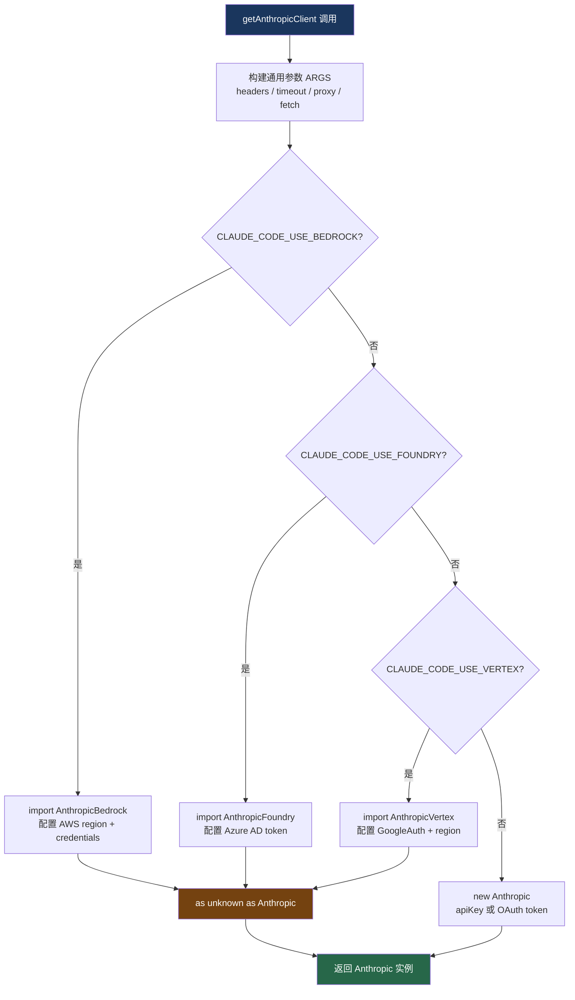

# 19. 多 Provider 统一接口

> 源码位置: `src/services/api/client.ts`

## 概述

Claude Code 支持四种 API Provider：Anthropic 直连、AWS Bedrock、Google Vertex AI、Azure Foundry。`getAnthropicClient()` 工厂函数根据环境变量自动选择 Provider，返回统一的 `Anthropic` 客户端实例。上层业务代码完全不感知底层走的是哪条通道——所有 Provider 都被强制转型为 `Anthropic` 类型。

## 底层原理

### Provider 选择流程



### 工厂函数核心结构

```typescript
export async function getAnthropicClient({
  apiKey, maxRetries, model, fetchOverride, source,
}: { ... }): Promise<Anthropic> {
  // 1. 构建通用参数（所有 Provider 共享）
  const ARGS = {
    defaultHeaders,        // x-app, User-Agent, session-id 等
    maxRetries,
    timeout: parseInt(process.env.API_TIMEOUT_MS || '600000'),
    dangerouslyAllowBrowser: true,
    fetchOptions: getProxyFetchOptions({ forAnthropicAPI: true }),
    ...(resolvedFetch && { fetch: resolvedFetch }),
  }

  // 2. 按环境变量分发
  if (isEnvTruthy(process.env.CLAUDE_CODE_USE_BEDROCK)) {
    const { AnthropicBedrock } = await import('@anthropic-ai/bedrock-sdk')
    return new AnthropicBedrock({ ...ARGS, awsRegion, ... }) as unknown as Anthropic
  }
  if (isEnvTruthy(process.env.CLAUDE_CODE_USE_FOUNDRY)) {
    const { AnthropicFoundry } = await import('@anthropic-ai/foundry-sdk')
    return new AnthropicFoundry({ ...ARGS, azureADTokenProvider, ... }) as unknown as Anthropic
  }
  if (isEnvTruthy(process.env.CLAUDE_CODE_USE_VERTEX)) {
    const { AnthropicVertex } = await import('@anthropic-ai/vertex-sdk')
    return new AnthropicVertex({ ...ARGS, region, googleAuth, ... }) as unknown as Anthropic
  }
  // 默认：Anthropic 直连
  return new Anthropic({ apiKey, authToken, ...ARGS })
}
```

### 四种 Provider 的认证方式

| Provider | 环境变量 | 认证方式 | SDK 包 |
|----------|---------|---------|--------|
| Anthropic 直连 | `ANTHROPIC_API_KEY` | API Key 或 OAuth token | `@anthropic-ai/sdk` |
| AWS Bedrock | `CLAUDE_CODE_USE_BEDROCK` | AWS credentials（STS / Bearer token） | `@anthropic-ai/bedrock-sdk` |
| Google Vertex | `CLAUDE_CODE_USE_VERTEX` | GoogleAuth + GCP project | `@anthropic-ai/vertex-sdk` |
| Azure Foundry | `CLAUDE_CODE_USE_FOUNDRY` | API Key 或 Azure AD DefaultAzureCredential | `@anthropic-ai/foundry-sdk` |

### buildFetch() — 自定义 fetch 包装

`buildFetch()` 在原生 `fetch` 外包了一层，注入请求追踪和日志：

```typescript
function buildFetch(fetchOverride, source): ClientOptions['fetch'] {
  const inner = fetchOverride ?? globalThis.fetch
  return (input, init) => {
    const headers = new Headers(init?.headers)
    // 注入 client-request-id（仅 firstParty），用于超时时关联服务端日志
    if (injectClientRequestId && !headers.has(CLIENT_REQUEST_ID_HEADER)) {
      headers.set(CLIENT_REQUEST_ID_HEADER, randomUUID())
    }
    // 记录请求路径和来源
    logForDebugging(`[API REQUEST] ${pathname} source=${source ?? 'unknown'}`)
    return inner(input, { ...init, headers })
  }
}
```

### 动态 import 的延迟加载

每个非直连 Provider 的 SDK 都通过 `await import()` 动态加载，而不是顶层 import。这样直连用户不会加载 ~279KB 的 AWS SDK 或 Google Auth 库：

```typescript
// 只在实际使用 Bedrock 时才加载
const { AnthropicBedrock } = await import('@anthropic-ai/bedrock-sdk')
```

## 设计原因

- **统一接口**：`as unknown as Anthropic` 强制转型让上层代码只依赖一个类型，四种 Provider 的差异被完全封装
- **延迟加载**：动态 import 避免不需要的 SDK 拖慢启动速度
- **环境变量驱动**：用户只需设置一个环境变量就能切换 Provider，不需要改代码
- **认证灵活性**：每种 Provider 支持多种认证方式（API Key、OAuth、IAM），并且支持 `SKIP_AUTH` 用于测试/代理场景

## 应用场景

::: tip 可借鉴场景
任何需要对接多个 LLM Provider 的应用。核心模式是"工厂函数 + 统一接口 + 环境变量选择"。通用参数（headers、timeout、proxy）提取到公共 ARGS 对象，Provider 特有参数在各分支内处理。动态 import 是关键优化——不要让用户为不使用的 Provider 付出启动成本。
:::

## 关联知识点

- [Token 估算](/api/token-estimate) — 不同 Provider 的 token 计数方式不同
- [MCP 协议](/api/mcp) — MCP 服务器也需要通过 API 客户端通信
- [Prompt Cache 优化](/context/prompt-cache) — buildFetch 中的 client-request-id 用于缓存调试
