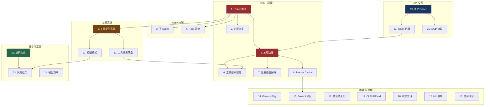

# 学习路线

> 推荐的 Claude Code 源码阅读顺序与学习路径

## 概述

24 个知识点之间有明确的依赖关系。按照正确的顺序阅读可以避免"看不懂"的挫败感。本文提供三种学习路径：1 天速览、1 周精读、2-3 周深入，以及完整的依赖关系图。

## 模块依赖图



## 8 个学习模块

| 优先级 | 模块 | 包含知识点 | 预计时间 | 前置要求 |
|-------|------|-----------|---------|---------|
| 🔴 P0 | Agent 核心循环 | 1. ReAct 循环、2. 错误恢复 | 2-3 小时 | 了解 LLM API 基本概念 |
| 🔴 P0 | 上下文管理 | 5. 五层防爆、6. 预算、7. 压缩、8. Cache | 3-4 小时 | 完成 Agent 核心循环 |
| 🟡 P1 | 工具系统 | 9. 类型系统、10. 权限、11. 落盘 | 2-3 小时 | 完成 Agent 核心循环 |
| 🟡 P1 | 提示词工程 | 22. 编码约束、23. 风险框架、24. 输出效率 | 1-2 小时 | 无（可独立阅读） |
| 🟡 P1 | Agent 进阶 | 3. 子 Agent、4. Hook 系统 | 2 小时 | 完成 Agent 核心循环 |
| 🟢 P2 | API 交互 | 19. 多 Provider、20. Token 估算、21. MCP | 2-3 小时 | 完成上下文管理 |
| 🟢 P2 | 构建系统 | 14. Feature Flag、15. Prompt 分区 | 1-2 小时 | 完成上下文管理 |
| 🟢 P2 | 数据与 UI | 16. 会话、17. CLAUDE.md、18. 状态、12-13. UI | 2-3 小时 | 无（可独立阅读） |

## 三种学习路径

### 🚀 如果你只有 1 天

**目标**：理解 Claude Code 的核心架构，能回答"它是怎么工作的"。

```
上午（3 小时）：
  1. ReAct 循环工程化 ← 理解整体架构
  5. 五层防爆体系    ← 理解上下文管理的核心思想

下午（3 小时）：
  22. 编码行为约束   ← 理解 prompt 设计哲学
  23. 风险评估框架   ← 理解安全设计
  附录：设计模式速查  ← 快速浏览所有模式
```

**收获**：掌握 ReAct 循环 + 五层防御 + prompt 设计三大支柱，能向他人解释 Claude Code 的核心设计。

### 📚 如果你有 1 周

**目标**：深入理解每个子系统，能在自己的项目中复用关键设计。

```
Day 1: Agent 核心
  1. ReAct 循环 → 2. 错误恢复

Day 2: 上下文管理
  5. 五层防爆 → 6. 工具结果预算 → 7. 压缩意图保持

Day 3: 上下文管理 + 工具
  8. Prompt Cache → 9. 工具类型系统

Day 4: 工具 + Agent 进阶
  10. 权限模式 → 11. 落盘 → 3. 子 Agent → 4. Hook

Day 5: 提示词 + API
  22-24. 提示词三篇 → 19. 多 Provider → 20. Token 估算
```

**收获**：能够在自己的 AI agent 项目中复用五层防御、决策冻结、草稿纸模式等核心设计。

### 🔬 如果你有 2-3 周

**目标**：完整掌握所有 24 个知识点，能独立分析和修改 Claude Code 源码。

```
Week 1: 核心架构（知识点 1-8）
  按依赖顺序逐篇精读
  每篇对照源码阅读
  尝试在本地运行关键代码路径

Week 2: 工具 + 提示词 + API（知识点 9-11, 19-24）
  重点关注工具系统和 prompt 设计
  尝试修改 prompt 观察行为变化
  阅读 MCP 协议实现

Week 3: 构建 + 数据 + UI + 实践（知识点 12-18）
  阅读构建系统和状态管理
  完成设计模式速查表的所有模式
  尝试实现一个简化版的 ReAct 循环
```

**收获**：完整理解 Claude Code 的设计哲学，能独立分析源码中的任何模块。

## 前置知识

| 知识领域 | 需要程度 | 说明 |
|---------|---------|------|
| TypeScript | 必须 | 源码语言，需要理解泛型、类型体操 |
| LLM API 基础 | 必须 | messages API、tool_use、streaming |
| React / Ink | 建议 | UI 部分使用 Ink（终端 React），不影响核心理解 |
| Prompt Engineering | 建议 | 有助于理解提示词设计的"为什么" |
| AWS / GCP / Azure | 可选 | 仅在阅读多 Provider 和 Bedrock/Vertex 时需要 |
| MCP 协议 | 可选 | 阅读 MCP 章节前建议了解基本概念 |

## 阅读建议

1. **先看概述再看源码**：每篇文章的"概述"和"设计原因"比代码细节更重要
2. **关注 Mermaid 图**：流程图是理解架构的最快方式
3. **对照源码**：文章中的代码片段都标注了源文件位置，建议对照完整源码阅读
4. **关注注释**：Claude Code 源码中的注释质量很高，经常包含设计决策的背景
5. **从"应用场景"倒推**：如果你有具体的应用需求，从"可借鉴场景"找到最相关的知识点开始
