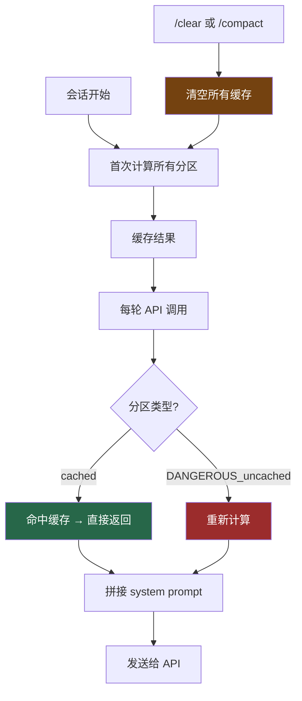

# 15. System Prompt 分区缓存

> 源码位置: `src/constants/systemPromptSections.ts` — `systemPromptSection()`, `resolveSystemPromptSections()`

## 概述

Claude Code 的 system prompt 不是一个静态字符串，而是由多个**可独立缓存的分区**组成。每个分区通过 `systemPromptSection()` 声明，计算一次后缓存到 `/clear` 或 `/compact`。需要每轮重新计算的分区必须使用 `DANGEROUS_uncachedSystemPromptSection()`，并附带解释为什么需要破坏缓存。这种声明式的 prompt 构建方式让缓存策略一目了然。

## 底层原理

### 两种分区类型

```typescript
type SystemPromptSection = {
  name: string
  compute: () => string | null | Promise<string | null>
  cacheBreak: boolean
}

// 缓存分区：计算一次，缓存到 /clear 或 /compact
function systemPromptSection(
  name: string,
  compute: () => string | null | Promise<string | null>,
): SystemPromptSection {
  return { name, compute, cacheBreak: false }
}

// 非缓存分区：每轮重新计算，会破坏 prompt cache
// 必须提供 reason 解释为什么需要这样做
function DANGEROUS_uncachedSystemPromptSection(
  name: string,
  compute: () => string | null | Promise<string | null>,
  _reason: string,  // 强制开发者解释
): SystemPromptSection {
  return { name, compute, cacheBreak: true }
}
```

### 分区解析流程

```typescript
async function resolveSystemPromptSections(
  sections: SystemPromptSection[],
): Promise<(string | null)[]> {
  const cache = getSystemPromptSectionCache()

  return Promise.all(
    sections.map(async s => {
      // 非 cacheBreak 且已缓存 → 直接返回
      if (!s.cacheBreak && cache.has(s.name)) {
        return cache.get(s.name) ?? null
      }
      // 否则计算并缓存
      const value = await s.compute()
      setSystemPromptSectionCacheEntry(s.name, value)
      return value
    }),
  )
}
```

关键点：`Promise.all` 让所有分区**并行解析**。如果某个分区需要异步操作（如读取文件、查询配置），不会阻塞其他分区。

### 缓存生命周期



### 缓存清空

```typescript
function clearSystemPromptSections(): void {
  clearSystemPromptSectionState()  // 清空分区缓存
  clearBetaHeaderLatches()         // 重置 beta header 锁存器
}
```

`/clear` 和 `/compact` 都会调用此函数。清空后，下一轮 API 调用会重新计算所有分区。同时重置 beta header 锁存器，让新对话获得新的 AFK/fast-mode/cache-editing header 评估。

### 与 Prompt Cache 的协同

分区缓存和 API 层的 prompt cache 是两个不同层次的缓存：

```
┌─────────────────────────────────────────┐
│ API Prompt Cache (服务端)                │
│ 缓存整个 system prompt 的 token 化结果    │
│ 前缀匹配：前缀不变 → 缓存命中             │
├─────────────────────────────────────────┤
│ 分区缓存 (客户端)                        │
│ 缓存每个分区的字符串计算结果               │
│ 避免重复的文件读取、配置查询等             │
├─────────────────────────────────────────┤
│ DANGEROUS_uncached 分区                  │
│ 每轮重新计算 → 可能改变 prompt 内容       │
│ → 破坏 API prompt cache 前缀             │
└─────────────────────────────────────────┘
```

这就是为什么 `DANGEROUS_uncachedSystemPromptSection` 的命名如此醒目——它不仅破坏客户端缓存，还可能破坏服务端的 prompt cache，导致额外的 token 计费。

### 典型分区组成

一个完整的 system prompt 由以下类型的分区组成：

| 分区类型 | 缓存策略 | 示例 |
|---------|---------|------|
| 核心指令 | cached | 角色定义、安全规则 |
| 工具描述 | cached | 各工具的 prompt() 输出 |
| CLAUDE.md | cached | 用户/项目指令 |
| 环境信息 | cached | OS、cwd、git branch |
| 动态状态 | DANGEROUS | 当前时间、token 预算 |

## 设计原因

- **声明式缓存**：开发者在定义分区时就声明缓存策略，而不是在使用时判断。`DANGEROUS_` 前缀让破坏缓存的决定不可能被忽视
- **并行解析**：`Promise.all` 让异步分区不互相阻塞，减少 system prompt 的构建延迟
- **prompt cache 友好**：大部分分区是 cached 的，system prompt 在轮次间保持稳定，最大化 API prompt cache 命中率
- **强制解释**：`_reason` 参数虽然在运行时不使用，但强制开发者在代码中记录为什么需要破坏缓存

## 应用场景

::: tip 可借鉴场景
任何需要动态构建 system prompt 的 AI 应用。核心思想是将 prompt 拆分为独立的、可缓存的分区，用声明式 API 管理缓存策略。`DANGEROUS_` 命名约定是一个很好的"代码即文档"实践——让危险操作在代码审查中一眼可见。
:::

## 关联知识点

- [Prompt Cache 优化](/context/prompt-cache) — API 层的 prompt cache 机制
- [CLAUDE.md 发现机制](/data/claudemd) — CLAUDE.md 内容作为 system prompt 分区
- [Feature Flag 编译期消除](/build/feature-flag) — feature flag 影响哪些分区被包含
