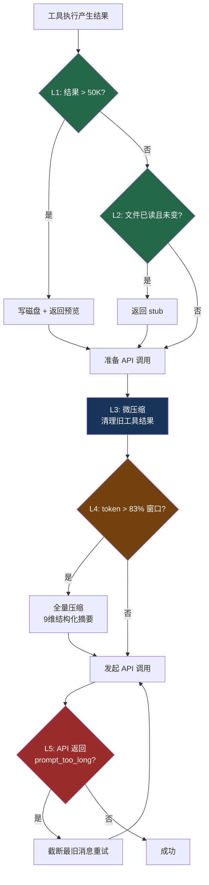

# 5. 五层上下文防爆体系

> 源码位置: `src/constants/toolLimits.ts`, `src/utils/toolResultStorage.ts`, `src/services/compact/`

## 概述

Claude Code 的上下文管理不是单一机制，而是一个从"源头控制"到"最终兜底"的**五层防御体系**。每一层解决不同粒度的问题，成本递增，触发频率递减。大多数对话只用到 L1-L3，永远不需要全量压缩。

## 底层原理

### 架构总览



### L1: 源头截断 — 不让大数据进来

在工具执行阶段就控制输出大小。核心常量：

```typescript
// src/constants/toolLimits.ts
export const DEFAULT_MAX_RESULT_SIZE_CHARS = 50_000    // 单工具 50K 字符
export const MAX_TOOL_RESULT_TOKENS = 100_000          // 单工具 100K tokens
export const MAX_TOOL_RESULTS_PER_MESSAGE_CHARS = 200_000  // 单消息聚合 200K
```

超限时，完整内容写入磁盘，模型只看到 2KB 预览 + 文件路径：

```
<persisted-output>
Output too large (523KB). Full output saved to: /path/to/file.txt
Preview (first 2KB):
...前2000字符...
</persisted-output>
```

其他源头限制：
- Git status: 2,000 字符（`context.ts`）
- CLAUDE.md 单文件: 40,000 字符（`claudemd.ts`）
- FileRead 单次: 2,000 行（`FileReadTool/prompt.ts`）

### L2: 去重 — 不重复放相同内容

文件读取去重通过 `readFileState`（`FileStateCache`）追踪已读文件的内容哈希：

```typescript
// 文件未变时返回 stub，不重复放入完整内容
export const FILE_UNCHANGED_STUB =
  'File unchanged since last read. The content from the earlier Read ' +
  'tool_result in this conversation is still current — refer to that ' +
  'instead of re-reading.'
```

一个 5000 行的文件如果被读了 3 次但没变，只有第一次占用上下文空间。

### L3: 微压缩 — 每轮清理旧工具结果

在每次 API 调用前，`microcompactMessages()` 清理旧的工具结果。两条路径：

**缓存编辑路径**（热缓存）：利用 API 的 `cache_edits` 能力，在服务端删除旧结果，不破坏 prompt cache。

**时间触发路径**（冷缓存）：距离上次 API 调用超过缓存 TTL，直接清空旧结果内容。

只清理**读取类工具**（Read、Bash、Grep、Glob），保留**写入类工具**（Edit、Write）——因为写入记录了实际变更历史。

### L4: 自动压缩 — 接近上限时全量摘要

```typescript
// src/services/compact/autoCompact.ts
const MAX_OUTPUT_TOKENS_FOR_SUMMARY = 20_000
export const AUTOCOMPACT_BUFFER_TOKENS = 13_000

// 有效窗口 = 上下文窗口 - 输出预留
// 自动压缩阈值 = 有效窗口 - 13K
// 200K 窗口 → 167K 触发（~83%）
```

触发后执行 9 维结构化摘要（详见 [压缩意图保持](/context/compact-intent)），旧消息全部替换为摘要 + 恢复附件。

### L5: 兜底 — 压缩本身也爆了

如果压缩请求本身也超了上下文窗口，`truncateHeadForPTLRetry()` 按 API 轮次分组，从最旧的开始丢弃：

```typescript
const MAX_PTL_RETRIES = 3

function truncateHeadForPTLRetry(messages, ptlResponse) {
  const groups = groupMessagesByApiRound(messages)
  const tokenGap = getPromptTooLongTokenGap(ptlResponse)
  // 精确丢弃：累加最旧的组直到覆盖 gap
  // 模糊丢弃：丢 20%
  // 保留至少一组
}
```

最终保底：transcript 文件保存完整历史，模型可以用 Read 工具按需回查。

### 各层对比

| 层级 | 触发条件 | 成本 | 信息损失 | 触发频率 |
|------|---------|------|---------|---------|
| L1 源头截断 | 工具结果 > 阈值 | 零（磁盘 I/O） | 无（完整内容在磁盘） | 高 |
| L2 去重 | 文件未变 | 零（hash 比较） | 无 | 高 |
| L3 微压缩 | 每轮 API 调用前 | 低（cache_edits） | 旧工具结果被清空 | 中 |
| L4 自动压缩 | token > 83% 窗口 | 高（额外 API 调用） | 细节丢失，保留意图 | 低 |
| L5 兜底 | 压缩也超限 | 高 | 最旧轮次被丢弃 | 极低 |

### Token 预算的组成

一次 API 请求中 token 的分配并不均匀，"固定开销"占据了相当大的比例：

```
┌────────────────────────────────┐
│ 系统提示词        ~5,000 tokens │  ← 身份、规范、安全指令
├────────────────────────────────┤
│ 工具定义          ~8,000 tokens │  ← 40+ 工具的 JSON Schema
├────────────────────────────────┤
│ CLAUDE.md 记忆    ~2,000 tokens │  ← 项目记忆文件
├────────────────────────────────┤
│ 对话历史         ~50,000 tokens │  ← 所有消息 + 工具结果
├────────────────────────────────┤
│ AI 输出空间      ~8,000 tokens  │  ← 模型回复预留
└────────────────────────────────┘
```

固定开销（系统提示词 + 工具定义 + 记忆）约 15K tokens。真正留给对话的空间比上下文窗口标称值小得多。更关键的是，大文件读取是 token 消耗的"大户"——读 3 个 5000 行的文件（约 60K tokens）就能让可用空间减半。这解释了为什么 FileRead 有 2000 行限制、为什么大结果要落盘。

### Token 估算的惰性精确策略

精确计算 token 数需要 API 调用（~100ms），但估算几乎零成本。五层体系中的阈值判断采用惰性策略：

```typescript
const estimated = Math.ceil(text.length / 4)  // ~0ms

if (estimated < contextWindow * 0.7) {
  return estimated  // 离上限还远，估算够用
}

if (estimated > contextWindow * 0.85) {
  return await exactTokenCount(messages)  // 接近上限，精确计算
}
```

90% 的时间用估算（0ms），只在接近 L4 触发阈值时才调用精确计算。这是一个通用的优化模式——"大部分时候粗略估计就够了，只在关键时刻才精确计算"。

## 设计原因

- **分层防御**：便宜的操作先做，昂贵的操作只在必要时触发
- **信息保真**：每一层都尽量保留用户意图，优先丢弃可恢复的数据
- **缓存友好**：L3 的 cache_edits 路径专门为不破坏 prompt cache 设计
- **提示缓存协同**：L4 压缩后的摘要替换旧消息，但 system prompt 前缀不变，prompt cache 仍然有效。提示缓存本身节省约 90% 的重复 token 费用，与五层体系形成互补——缓存减少成本，五层减少 token 用量

## 应用场景

::: tip 可借鉴场景
任何长对话 AI 应用。核心思想是"分层防御"——不要等到上下文快满了才处理，而是在每个环节都做控制。五层的成本递增、频率递减的设计可以直接复用。

一个实用的数学直觉：100 轮对话 × 500 tokens/轮 = 50K tokens，看似充裕。但加上 3 次大文件读取（60K tokens）+ 固定开销（15K tokens），总计 125K/200K，可用空间只剩 37%。大文件读取是 token 消耗的"大户"，这就是 L1 源头截断存在的根本原因。
:::

## 关联知识点

- [工具结果预算](/context/tool-budget) — L1 的两级预算详解
- [压缩意图保持](/context/compact-intent) — L4 的摘要设计详解
- [Prompt Cache 优化](/context/prompt-cache) — L3 的缓存编辑路径
- [工具结果落盘](/tools/tool-persist) — L1 的落盘机制详解
