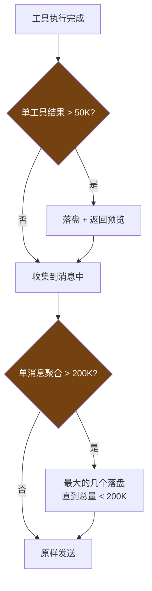
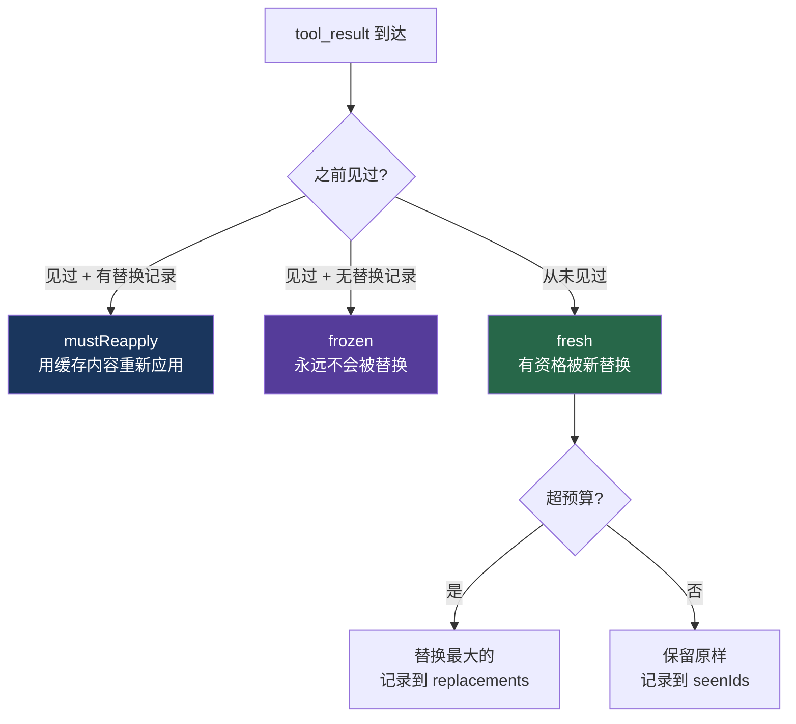

# 6. 工具结果预算系统

> 源码位置: `src/utils/toolResultStorage.ts`

## 概述

并行工具调用可以在一轮内产生巨量输出（8 个 grep 搜索 × 40K = 320K 字符）。Claude Code 用**两级预算 + 决策冻结**来防御，同时保证 prompt cache 的稳定性。

## 底层原理

### 两级预算



**第一级：单工具限制**
```typescript
DEFAULT_MAX_RESULT_SIZE_CHARS = 50_000    // 50K 字符
MAX_TOOL_RESULT_TOKENS = 100_000          // 100K tokens ≈ 400KB
```

**第二级：单消息聚合限制**
```typescript
MAX_TOOL_RESULTS_PER_MESSAGE_CHARS = 200_000  // 200K 字符
```

### 决策冻结机制

这是最精妙的设计。每个 `tool_result` 的命运在第一次被看到时就被"冻结"了：

```typescript
type ContentReplacementState = {
  seenIds: Set<string>              // 见过的所有 tool_use_id
  replacements: Map<string, string> // 被替换的 id → 替换后的内容
}
```



### 为什么需要冻结？

Anthropic API 的 prompt cache 基于**前缀匹配**。如果第 5 轮的工具结果在第 5 轮没被替换，但在第 8 轮突然被替换了，那第 5-7 轮积累的缓存前缀全部失效。

冻结决策确保消息内容在整个会话中保持稳定。被替换的结果，每轮都用 Map 查找重新应用完全相同的字符串——**零 I/O，字节级一致，不可能失败**。

### 阈值的动态配置

阈值不是写死的，`getPersistenceThreshold()` 有三层优先级：

1. **GrowthBook 远程配置**（`tengu_satin_quoll`）：按工具名动态调整，不需要发版
2. **工具自声明的 `maxResultSizeChars`**：每个工具可以声明自己的上限
3. **全局默认 50K 字符**：兜底值

特殊情况：Read 工具声明 `maxResultSizeChars: Infinity`，永远不会被落盘（否则模型需要再用 Read 去读落盘文件——形成循环）。

## 设计原因

- **prompt cache 稳定性**：决策冻结保证消息内容不会在后续轮次中突然变化
- **成本控制**：大结果落盘而不是塞进上下文，节省 token
- **可恢复性**：落盘的内容可以通过 Read 工具按需加载
- **远程可调**：GrowthBook 配置允许不发版就调整阈值

## 应用场景

::: tip 可借鉴场景
任何需要 prompt cache 的系统。"决策冻结"是一个通用模式——一旦做出决定就不再改变，保证下游系统看到的数据是稳定的。这个模式也适用于缓存 key 的稳定性、幂等性设计等场景。
:::

## 关联知识点

- [五层防爆体系](/context/five-layers) — 预算系统是 L1 的核心
- [工具结果落盘](/tools/tool-persist) — 落盘的具体实现
- [Prompt Cache 优化](/context/prompt-cache) — 冻结机制服务于 cache 稳定性
