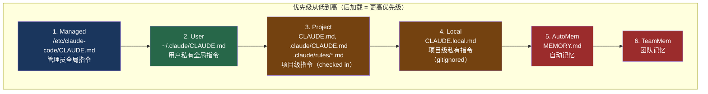
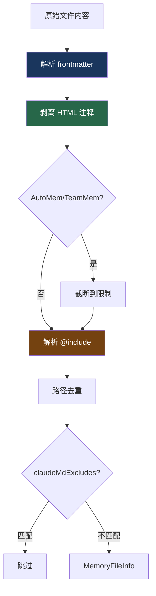

# 17. CLAUDE.md 发现机制

> 源码位置: `src/utils/claudemd.ts` — `getMemoryFiles()`, `processMemoryFile()`, `@include` 指令解析

## 概述

CLAUDE.md 是 Claude Code 的**指令注入系统**，让用户和项目可以在不同层级定义持久化的指令。系统按 6 级优先级加载这些文件：Managed → User → Project → Local → AutoMem → TeamMem，从 cwd 向上遍历到根目录，支持 `@include` 指令引用外部文件，支持 frontmatter glob 模式限定文件的适用范围。

## 底层原理

### 6 级优先级层次



文件按**反优先级顺序**加载（最先加载 = 最低优先级），因为模型对 prompt 尾部的内容关注度更高。

### 目录遍历

```typescript
async function getMemoryFiles(): Promise<MemoryFileInfo[]> {
  const result: MemoryFileInfo[] = []
  const processedPaths = new Set<string>()

  // 1. Managed（全局管理员配置）
  result.push(...await processMemoryFile('/etc/claude-code/CLAUDE.md', 'Managed', ...))
  result.push(...await processMdRules({ rulesDir: managedRulesDir, type: 'Managed', ... }))

  // 2. User（用户私有）
  result.push(...await processMemoryFile('~/.claude/CLAUDE.md', 'User', ...))
  result.push(...await processMdRules({ rulesDir: '~/.claude/rules/', type: 'User', ... }))

  // 3 & 4. Project + Local：从 cwd 向上遍历到根目录
  const dirs: string[] = []
  let currentDir = originalCwd
  while (currentDir !== parse(currentDir).root) {
    dirs.push(currentDir)
    currentDir = dirname(currentDir)
  }

  // 从根目录向下处理（远离 cwd = 低优先级）
  for (const dir of dirs.reverse()) {
    // Project: CLAUDE.md, .claude/CLAUDE.md, .claude/rules/*.md
    result.push(...await processMemoryFile(join(dir, 'CLAUDE.md'), 'Project', ...))
    result.push(...await processMemoryFile(join(dir, '.claude', 'CLAUDE.md'), 'Project', ...))
    result.push(...await processMdRules({ rulesDir: join(dir, '.claude', 'rules'), ... }))

    // Local: CLAUDE.local.md
    result.push(...await processMemoryFile(join(dir, 'CLAUDE.local.md'), 'Local', ...))
  }

  // 5. AutoMem（自动记忆）
  // 6. TeamMem（团队记忆，feature flag 控制）
  return result
}
```

### @include 指令

CLAUDE.md 文件可以通过 `@` 语法引用其他文件：

```markdown
# 项目规范

@./coding-standards.md
@~/global-rules.md
@/absolute/path/to/rules.md
```

解析规则：
- `@path` 或 `@./path` — 相对于当前文件的路径
- `@~/path` — 相对于用户 home 目录
- `@/path` — 绝对路径
- 只在**叶文本节点**中解析（不在代码块、代码 span 中）
- 最大递归深度 5 层，防止循环引用
- 非文本文件（图片、PDF 等）被静默跳过

```typescript
// 支持的文本文件扩展名（部分）
const TEXT_FILE_EXTENSIONS = new Set([
  '.md', '.txt', '.json', '.yaml', '.yml',
  '.js', '.ts', '.tsx', '.jsx', '.py', '.go', '.rs',
  '.java', '.kt', '.c', '.cpp', '.h', '.cs', '.swift',
  '.sh', '.bash', '.sql', '.html', '.css',
  // ... 100+ 种扩展名
])
```

### Frontmatter Glob 模式

```markdown
---
paths:
  - src/auth/**
  - src/security/**
---

# 认证模块规范

所有认证相关代码必须使用 bcrypt...
```

带 `paths` frontmatter 的规则文件只在模型操作匹配路径的文件时生效：

```typescript
function parseFrontmatterPaths(rawContent: string) {
  const { frontmatter, content } = parseFrontmatter(rawContent)
  if (!frontmatter.paths) return { content }

  const patterns = splitPathInFrontmatter(frontmatter.paths)
    .map(p => p.endsWith('/**') ? p.slice(0, -3) : p)
    .filter(p => p.length > 0)

  // 全部是 ** → 视为无 glob（适用于所有路径）
  if (patterns.every(p => p === '**')) return { content }

  return { content, paths: patterns }
}
```

### HTML 注释剥离

```typescript
// 剥离块级 HTML 注释，保留代码块中的注释
function stripHtmlComments(content: string) {
  if (!content.includes('<!--')) return { content, stripped: false }
  // 使用 marked lexer 识别块级 HTML token
  // 只剥离 <!-- ... --> 形式的完整注释
  // 未闭合的注释保留（防止误删）
}
```

这让用户可以在 CLAUDE.md 中写注释给人看，但不会被注入到 system prompt 中。

### 内容处理管线



### 单文件大小限制

```typescript
const MAX_MEMORY_CHARACTER_COUNT = 40_000  // 40K 字符
```

超过此限制的文件会被截断，防止单个 CLAUDE.md 占用过多 system prompt 空间。

### Git Worktree 去重

当在 git worktree 中运行时（如 `claude -w`），向上遍历会经过 worktree 根目录和主仓库根目录，两者都有 CLAUDE.md。系统检测这种情况并跳过主仓库的 Project 类型文件：

```typescript
const isNestedWorktree =
  gitRoot !== null &&
  canonicalRoot !== null &&
  gitRoot !== canonicalRoot &&
  pathInWorkingPath(gitRoot, canonicalRoot)

// 在嵌套 worktree 中，跳过主仓库目录的 checked-in 文件
// CLAUDE.local.md 不受影响（它是 gitignored 的，只存在于主仓库）
```

## 设计原因

- **6 级优先级**：管理员、用户、项目、本地各有不同的指令需求，分层让每一层都能设置自己的规则而不互相干扰
- **反优先级加载**：利用模型对 prompt 尾部内容的注意力偏向，高优先级内容放在后面
- **@include 指令**：让大型项目可以将规则拆分到多个文件，保持 CLAUDE.md 的可维护性
- **frontmatter glob**：条件化规则避免了不相关的指令污染上下文（如认证规则不需要在 UI 组件开发时出现）
- **HTML 注释剥离**：让 CLAUDE.md 同时服务于人类阅读和 AI 指令，注释只给人看

### 自动记忆提取

Claude Code 可以在会话中自动提取关键信息并更新记忆文件。记忆系统支持四种类型：

| 类型 | 存储内容 | 示例 |
|------|---------|------|
| user | 用户信息（角色、偏好、技能） | "偏好函数式编程，不喜欢 class 组件" |
| feedback | 用户反馈（该做/不该做） | "不要在回复末尾添加总结" |
| project | 项目信息（目标、决策、截止日期） | "2024-06 从 React Router v5 迁移到 v6" |
| reference | 外部资源指针 | 文档链接、工具位置 |

记忆更新遵循一个核心原则：**只记住不能从其他地方获取的信息**。代码内容直接读文件，Git 历史直接查 Git，只有用户脑中的信息才写入记忆。这种"能查就不存"的策略避免了记忆与现实不一致的问题。

### 嵌套记忆附件

CLAUDE.md 可以通过 `@include` 引用其他文件作为"目录"，详细文档放在单独的文件中：

```markdown
# CLAUDE.md

## 架构文档
@./docs/architecture.md

## API 规范
@./docs/api-spec.md
```

引用的文件会自动加载到模型上下文中，让大型项目可以将规则拆分到多个文件而不失去可维护性。

## 应用场景

::: tip 可借鉴场景
任何需要分层配置的 AI 应用。核心思想是"多级配置 + 目录遍历"——从最具体（当前目录）到最通用（全局），每一级都可以覆盖上一级。`@include` 指令和 frontmatter glob 是两个让配置系统从"能用"变成"好用"的关键特性。
:::

## 关联知识点

- [System Prompt 分区缓存](/build/prompt-section) — CLAUDE.md 内容作为 system prompt 的一个分区
- [五层上下文防爆体系](/context/five-layers) — 单文件 40K 字符限制是 L1 源头控制的一部分
- [会话持久化与恢复](/data/session) — 会话恢复时重新加载 CLAUDE.md
