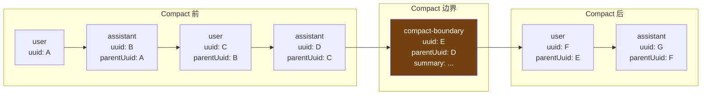
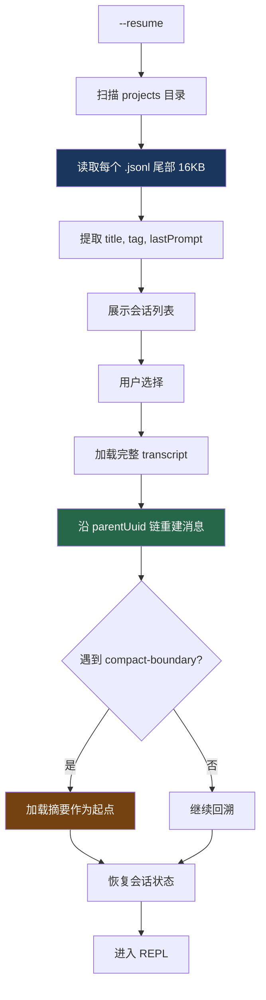

# 16. 会话持久化与恢复

> 源码位置: `src/utils/sessionStorage.ts` — `Project` 类，JSONL 读写，`--resume` 流程

## 概述

Claude Code 将每个会话持久化为一个 **JSONL（JSON Lines）** 文件，每行是一个独立的 JSON 对象。这种格式支持追加写入（不需要读取整个文件）、流式解析（不需要加载到内存）、以及跨 compact 边界的消息链接。`--resume` 恢复流程通过 `logicalParentUuid` 链重建对话历史，并在文件尾部 16KB 窗口中扫描会话元数据。

## 底层原理

### JSONL Transcript 格式

每个会话对应一个 `{sessionId}.jsonl` 文件，存储在 `~/.claude/projects/{sanitizedPath}/` 下：

```jsonl
{"type":"user","uuid":"abc-123","parentUuid":null,"message":{...},"timestamp":"..."}
{"type":"assistant","uuid":"def-456","parentUuid":"abc-123","message":{...}}
{"type":"user","uuid":"ghi-789","parentUuid":"def-456","message":{...}}
{"type":"compact-boundary","uuid":"jkl-012","parentUuid":"ghi-789","summary":"..."}
{"type":"user","uuid":"mno-345","parentUuid":"jkl-012","message":{...}}
{"type":"custom-title","customTitle":"重构认证模块","sessionId":"..."}
{"type":"last-prompt","lastPrompt":"帮我重构 auth.ts","sessionId":"..."}
```

### 消息链：parentUuid 和 logicalParentUuid



`parentUuid` 形成一条链，`compact-boundary` 节点将 compact 前后的消息连接起来。`--resume` 从最后一条消息沿链回溯，遇到 `compact-boundary` 时加载摘要而非原始消息。

### 只有 transcript 消息参与链

```typescript
// 参与 parentUuid 链的消息类型
function isChainParticipant(m: { type: string }): boolean {
  return m.type !== 'progress'
}

// transcript 消息 = 持久化到 JSONL 的消息
function isTranscriptMessage(entry: Entry): entry is TranscriptMessage {
  return (
    entry.type === 'user' ||
    entry.type === 'assistant' ||
    entry.type === 'attachment' ||
    entry.type === 'system'
  )
}
// progress 消息是临时 UI 状态，不持久化，不参与链
```

### 批量写入队列

```typescript
class Project {
  private writeQueues = new Map<string, Array<{ entry: Entry; resolve: () => void }>>()
  private FLUSH_INTERVAL_MS = 100
  private MAX_CHUNK_BYTES = 100 * 1024 * 1024  // 100MB

  // 写入不是立即的，而是入队 + 定时批量刷新
  private enqueueWrite(filePath: string, entry: Entry): Promise<void> {
    return new Promise(resolve => {
      let queue = this.writeQueues.get(filePath)
      if (!queue) { queue = []; this.writeQueues.set(filePath, queue) }
      queue.push({ entry, resolve })
      this.scheduleDrain()  // 100ms 后批量写入
    })
  }

  // 批量写入：拼接 JSONL 行，一次 appendFile
  private async drainWriteQueue(): Promise<void> {
    for (const [filePath, queue] of this.writeQueues) {
      const batch = queue.splice(0)
      let content = ''
      for (const { entry, resolve } of batch) {
        const line = JSON.stringify(entry) + '\n'
        if (content.length + line.length >= this.MAX_CHUNK_BYTES) {
          await appendFile(filePath, content)  // 分块写入防 OOM
          content = ''
        }
        content += line
      }
      if (content.length > 0) await appendFile(filePath, content)
    }
  }
}
```

### reAppendSessionMetadata：16KB 尾部窗口

```typescript
// 会话元数据（标题、标签、最后 prompt）需要在文件尾部
// 因为 --resume 列表只读取尾部 16KB 来提取元数据
reAppendSessionMetadata(): void {
  if (!this.sessionFile) return

  // 1. 读取尾部 16KB，检查是否有外部写入的更新值
  const tail = readFileTailSync(this.sessionFile)

  // 2. 从尾部刷新 SDK 可能写入的字段（title, tag）
  const titleLine = tailLines.findLast(l => l.startsWith('{"type":"custom-title"'))
  if (titleLine) {
    const tailTitle = extractLastJsonStringField(titleLine, 'customTitle')
    if (tailTitle !== undefined) this.currentSessionTitle = tailTitle || undefined
  }

  // 3. 重新追加所有元数据到文件末尾
  if (this.currentSessionLastPrompt)
    appendEntry({ type: 'last-prompt', lastPrompt: this.currentSessionLastPrompt })
  if (this.currentSessionTitle)
    appendEntry({ type: 'custom-title', customTitle: this.currentSessionTitle })
  if (this.currentSessionTag)
    appendEntry({ type: 'tag', tag: this.currentSessionTag })
  // ... agent-name, agent-color, mode, worktree-state, pr-link
}
```

这个函数在两个时机调用：
1. **Compact 时**：在 boundary marker 之前写入，确保元数据在 pre-compact 区域可恢复
2. **会话退出时**：在 EOF 写入，确保元数据在尾部窗口内

### --resume 恢复流程



### 子 agent 的 transcript

子 agent 有独立的 transcript 文件，存储在 `{sessionId}/subagents/` 目录下：

```typescript
function getAgentTranscriptPath(agentId: AgentId): string {
  const base = join(projectDir, sessionId, 'subagents')
  return join(base, `agent-${agentId}.jsonl`)
}

// 子 agent 的元数据（agentType, worktreePath）存储在 sidecar 文件
// agent-{id}.meta.json
```

## 设计原因

- **JSONL 格式**：追加写入 O(1)，不需要读取-修改-写入整个文件。流式解析不需要将整个文件加载到内存
- **批量写入**：100ms 的刷新间隔将高频写入合并为单次 I/O，减少文件系统压力
- **16KB 尾部窗口**：`--resume` 列表需要快速展示，读取尾部比解析整个文件快几个数量级
- **reAppend 机制**：compact 会将元数据推到文件中间，重新追加确保它始终在尾部窗口内
- **parentUuid 链**：支持跨 compact 边界的消息追溯，不需要额外的索引结构

### 会话恢复的用户体验

`/resume` 命令展示最近的会话列表，用户选择后恢复完整对话历史：

```
$ /resume

最近的会话：
  1. [2024-06-03] 新功能开发 (45 条消息)
  2. [2024-06-02] Bug 修复 (23 条消息)
  3. [2024-06-01] 项目重构 (67 条消息)

选择要恢复的会话 (1-3):
```

恢复时，引擎沿 `parentUuid` 链回溯，遇到 `compact-boundary` 时加载摘要而非原始消息。恢复后还会重新加载 CLAUDE.md，确保项目指令是最新的。

### 会话记录与记忆系统的关系

会话持久化（transcript）和记忆系统（CLAUDE.md）是互补的两个层次：

| 维度 | 会话 Transcript | CLAUDE.md 记忆 |
|------|----------------|---------------|
| 粒度 | 完整的对话历史 | 提炼的关键信息 |
| 生命周期 | 单次会话 | 跨会话持久 |
| 访问方式 | `--resume` 恢复 | 每次会话自动加载 |
| 信息类型 | 所有消息和工具调用 | 项目规范、架构决策、用户偏好 |

记忆系统遵循"只记住不能从其他地方获取的信息"原则——代码内容直接读文件，Git 历史直接查 Git，只有用户脑中的信息（偏好、决策、反馈）才写入 CLAUDE.md。

## 应用场景

::: tip 可借鉴场景
任何需要持久化长对话历史的 AI 应用。JSONL + 追加写入是最简单可靠的方案。16KB 尾部窗口扫描是一个巧妙的优化——避免了为"列出最近会话"而解析所有历史文件。`reAppendSessionMetadata` 的设计解决了一个常见问题：元数据被不断增长的内容推出快速访问区域。
:::

## 关联知识点

- [压缩意图保持](/context/compact-intent) — compact-boundary 中的摘要格式
- [全屏模式的消息管理](/ui/fullscreen) — UI 消息 vs transcript 消息的区别
- [CLAUDE.md 发现机制](/data/claudemd) — 会话恢复时重新加载 CLAUDE.md
