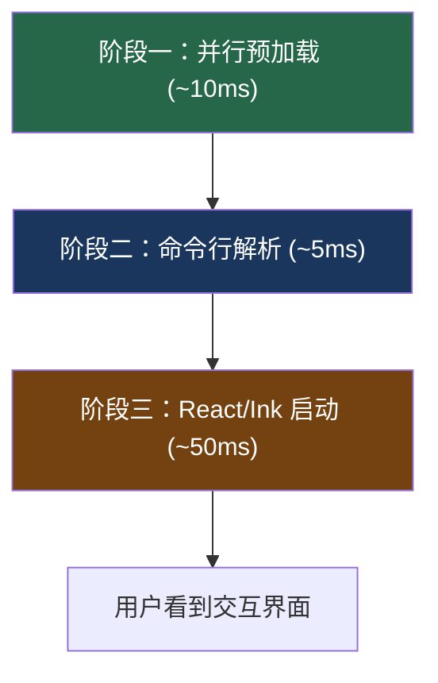

# 快速开始

> Claude Code v2.1.88 源码学习指南

## 项目背景

本站内容基于从 `@anthropic-ai/claude-code` v2.1.88 npm 包的 source map 中还原出的完整 TypeScript 源码。

## 项目统计

| 指标 | 数值 |
|------|------|
| 源文件总数 | 4,756 |
| 核心源码 | 1,906 文件 |
| Feature Flag | 90+ 个 |
| 构建产出 | 22 MB |
| 版本 | 2.1.88 |

## 启动序列

当你在终端输入 `claude` 并按下回车，程序经历三阶段启动，总耗时约 100ms：



**阶段一**：在导入模块之前就发起两个耗时操作（读取系统管理策略 + 钥匙串预取 API Key），与模块导入并行执行，节省约 65ms。

**阶段二**：Commander.js 解析命令行参数（`--model`、`--permissions`、`--tools`、`--bridge` 等）。

**阶段三**：创建 Zustand 状态仓库 → 加载功能开关 → 连接 MCP 服务器 → 加载 CLAUDE.md → 渲染终端界面。

### 五种启动模式

| 模式 | 命令 | 说明 |
|------|------|------|
| REPL | `claude` | 交互式对话（默认） |
| 单次执行 | `claude "问题"` | 回答后退出 |
| 管道 | `cat file \| claude "分析"` | 接收 stdin 输入 |
| 桥接 | `claude --bridge` | 与 IDE 通过 WebSocket 通信 |
| SDK | `import { ClaudeCode }` | 作为库被其他程序调用 |

## 前置知识

- TypeScript / JavaScript 基础
- React 基本概念（组件、hooks、状态管理）
- LLM API 基础（messages、tool_use、streaming）
- 终端 / CLI 基本操作

## 源码目录结构

```
src/
├── entrypoints/cli.tsx    # 构建入口
├── main.tsx               # 主 REPL 逻辑 (~4,600 行)
├── query.ts               # 核心查询管道 ⭐ (~68,000 行)
├── QueryEngine.ts         # API 调用和工具执行循环 (~46,000 行)
├── Tool.ts                # 工具类型系统 (~29,000 行)
├── tools.ts               # 工具注册中心 (~17,000 行)
├── context.ts             # 上下文组装
├── tools/                 # 工具实现 (184 文件)
│   ├── BashTool/          #   Bash 工具 (18+ 文件)
│   ├── FileReadTool/      #   文件读取
│   ├── FileEditTool/      #   文件编辑
│   ├── AgentTool/         #   子 Agent (17 目录)
│   └── ...
├── services/compact/      # 压缩服务
├── services/api/          # API 交互 + 重试逻辑
├── services/mcp/          # MCP 协议 (25 文件)
├── components/            # 终端 UI 组件
├── ink/                   # 自研渲染引擎
├── hooks/                 # React Hooks
│   └── useCanUseTool.tsx  #   权限决策引擎 (~40,000 行)
├── utils/                 # 工具函数 (564 文件)
│   ├── permissions/       #   权限系统
│   ├── toolResultStorage.ts # 工具结果落盘
│   └── hooks.ts           #   Hook 系统
├── state/                 # Zustand 状态管理
├── bridge/                # IDE 桥接 (33 文件)
├── coordinator/           # 多 Agent 协调
└── constants/prompts.ts   # 系统提示词
```

## 核心术语速查

| 术语 | 含义 |
|------|------|
| Agent Loop | "思考 → 行动 → 观察" 的循环，查询引擎的核心模式 |
| Context Window | 模型一次能"看到"的最大文本量（200K-1M tokens） |
| Token | 模型处理文本的基本单位，约 4 英文字符或 1.5 中文字符 |
| SSE | Server-Sent Events，流式响应协议 |
| MCP | Model Context Protocol，连接外部工具的标准协议 |
| Prompt Caching | 缓存不变的 system prompt 内容，节省 ~90% token 费用 |
| Feature Flag | 功能开关，控制新功能的渐进式发布 |
| Zod | TypeScript 运行时类型验证库，用于工具输入校验 |
| Zustand | 轻量级 React 状态管理库 |
| Ink | 让 React 在终端中运行的框架 |

## 推荐阅读顺序

1. [ReAct 循环工程化](/agent/react-loop) — 理解核心循环
2. [五层防爆体系](/context/five-layers) — 理解上下文管理
3. [工具类型系统](/tools/tool-type) — 理解工具如何工作
4. [编码行为约束](/prompt/coding-prompt) — 理解提示词设计
