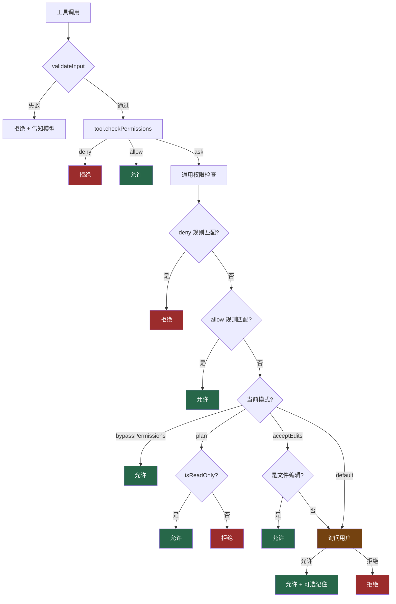

# 10. 权限模式

> 源码位置: `src/utils/permissions/` — `permissions.ts`, `PermissionMode.ts`, `dangerousPatterns.ts`

## 概述

Claude Code 的权限系统是一个**多层决策树**，从规则匹配到模式检查再到用户交互，每一步都有明确的优先级。系统支持四种权限模式（default、acceptEdits、bypassPermissions、plan），并为 Bash 工具实现了细粒度的白名单/黑名单机制。核心设计原则：**deny 优先于 allow，allow 优先于 ask**。

## 底层原理

### 四种权限模式

```typescript
const PERMISSION_MODE_CONFIG = {
  default: {
    title: 'Default',
    // 每次写入/执行都需要用户确认
  },
  plan: {
    title: 'Plan Mode',
    symbol: '⏸',
    // 只允许读取操作，写入全部阻止
  },
  acceptEdits: {
    title: 'Accept edits',
    symbol: '⏵⏵',
    // 自动允许文件编辑，Bash 仍需确认
  },
  bypassPermissions: {
    title: 'Bypass Permissions',
    symbol: '⏵⏵',
    // 跳过所有权限检查（危险）
  },
}
```

### 权限决策树



### 规则系统

权限规则来自多个来源，按优先级排列：

```typescript
const PERMISSION_RULE_SOURCES = [
  'managedSettings',    // /etc/claude-code/ 管理员配置
  'enterpriseSettings', // 企业级配置
  'userSettings',       // ~/.claude/settings.json
  'projectSettings',    // .claude/settings.json
  'localSettings',      // .claude/settings.local.json
  'cliArg',            // 命令行参数
  'command',           // /allowed-tools 命令
  'session',           // 会话内临时规则
]
```

规则格式支持工具级和内容级匹配：

```typescript
// 工具级：允许整个 Read 工具
{ toolName: 'Read' }

// 内容级：只允许 git 开头的 Bash 命令
{ toolName: 'Bash', ruleContent: 'git *' }

// MCP 服务器级：允许某服务器所有工具
{ toolName: 'mcp__server1' }
```

### Bash 工具的危险模式黑名单

```typescript
const DANGEROUS_BASH_PATTERNS = [
  // 解释器 — 可执行任意代码
  'python', 'python3', 'node', 'deno', 'ruby', 'perl',
  // 包运行器
  'npx', 'bunx', 'npm run', 'yarn run',
  // Shell 嵌套
  'bash', 'sh', 'zsh', 'eval', 'exec',
  // 提权
  'sudo',
  // 远程执行
  'ssh',
]
```

这些模式用于 auto mode 入口时**剥离过于宽泛的 allow 规则**。例如 `Bash(python:*)` 会让模型通过 Python 解释器执行任意代码，绕过分类器，因此在进入 auto mode 时被自动移除。

### Bash 命令的深度安全分析

简单的正则匹配不足以覆盖所有危险场景。Bash 工具的安全代码超过 50 万行（分布在 18 个文件中），实现了多层语义分析：

```typescript
function analyzeCommand(command: string): SecurityAnalysis {
  // 1. 分解管道命令
  const stages = splitPipeline(command)

  for (const stage of stages) {
    const { executable, args, redirections } = parseShellCommand(stage)

    // 2. 检查重定向目标
    for (const redir of redirections) {
      if (redir.type === "write" && isSystemPath(redir.target)) {
        return { dangerous: true, reason: "重定向到系统文件" }
      }
    }

    // 3. 检查路径是否超出工作目录
    for (const arg of args) {
      if (isPathOutsideWorkdir(arg)) {
        return { dangerous: true, reason: "路径超出工作目录" }
      }
    }
  }
  return { dangerous: false }
}
```

特别值得注意的是 **sed 命令的专用解析器**（约 21,000 行代码），它能区分 `sed -i`（修改文件，非只读）和无 `-i` 的 sed（只输出，只读）。这种细粒度的语义理解让权限系统能对同一个命令的不同用法做出不同的决策。

### 只读命令的快速通道

权限系统维护了一个只读命令白名单，这些命令可以跳过部分权限检查：

```typescript
const READ_ONLY_COMMANDS = [
  "ls", "cat", "head", "tail", "wc",
  "grep", "find", "which", "pwd",
  "echo", "date", "whoami",
  "git status", "git log", "git diff",
  "npm list", "node --version",
]
```

只读命令的优势：跳过某些权限检查（提高速度）、可以并行执行（不会互相影响）、在 plan mode 下仍然允许。

### 纵深防御：六层安全架构

权限系统不是单一防线，而是遵循**纵深防御**原则的多层架构：

```
第一层：AI 的自我约束
  └── system prompt 中的风险评估框架

第二层：工具级别的验证
  └── 每个工具的 checkPermissions() + inputSchema 校验

第三层：权限规则
  └── 用户定义的 allow/deny/ask 规则（多来源优先级）

第四层：AI 安全分类器
  └── 异步运行，评估操作是否符合用户意图

第五层：用户确认
  └── 权限对话框 + 智能建议（如 "Allow all npm commands: Bash(npm *)"）

第六层：沙箱隔离
  └── macOS sandbox-exec / Linux firejail / Docker
```

即使某一层被绕过，其他层仍然可以拦截危险操作。

### 权限检查的快速路径

`hasPermissionsToUseTool` 在 auto mode 下有三条快速路径，避免昂贵的分类器 API 调用：

```typescript
// 快速路径 1: acceptEdits 模拟
// 如果 acceptEdits 模式会允许，auto mode 也允许
const acceptEditsResult = await tool.checkPermissions(input, {
  ...context,
  getAppState: () => ({ ...state, toolPermissionContext: { ...ctx, mode: 'acceptEdits' } })
})
if (acceptEditsResult.behavior === 'allow') return allow

// 快速路径 2: 安全工具白名单
if (isAutoModeAllowlistedTool(tool.name)) return allow

// 快速路径 3: 才走分类器
const classifierResult = await classifyYoloAction(messages, action, tools, ctx, signal)
```

## 设计原因

- **deny 优先**：安全关键系统必须让拒绝规则不可被覆盖，防止 allow 规则意外放行危险操作
- **多来源规则**：管理员、用户、项目各有不同的安全需求，分层规则让每一层都能设置自己的边界。管理员策略优先级最高，确保企业环境下的安全底线不可被用户覆盖
- **快速路径**：auto mode 的分类器调用是额外的 API 请求，对大多数安全操作（文件编辑、读取工具）走快速路径可以显著降低延迟和成本
- **危险模式剥离**：用户可能不理解 `Bash(python:*)` 的安全含义，系统在 auto mode 入口自动保护
- **拒绝后的优雅降级**：操作被拒绝时，系统生成合成的 `tool_result`（`is_error: true`），模型收到后会理解被拒绝并尝试其他方式完成任务，而不是陷入死循环

## 应用场景

::: tip 可借鉴场景
任何需要细粒度权限控制的 AI agent 系统。核心思想是"规则匹配 + 模式检查"的两阶段决策，以及 deny > allow > ask 的优先级链。Bash 工具的危险模式黑名单是一个很好的"安全护栏"设计模式——不是禁止用户使用，而是在高风险模式下自动收紧。
:::

## 关联知识点

- [工具类型系统](/tools/tool-type) — `checkPermissions` 在 Tool 接口中的位置
- [ReAct 循环工程化](/agent/react-loop) — 权限检查在阶段 5 工具执行前触发
