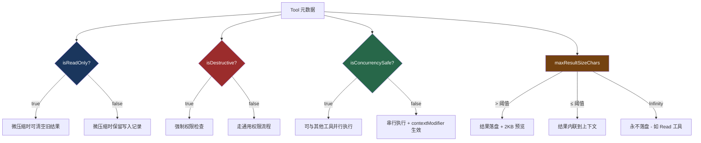
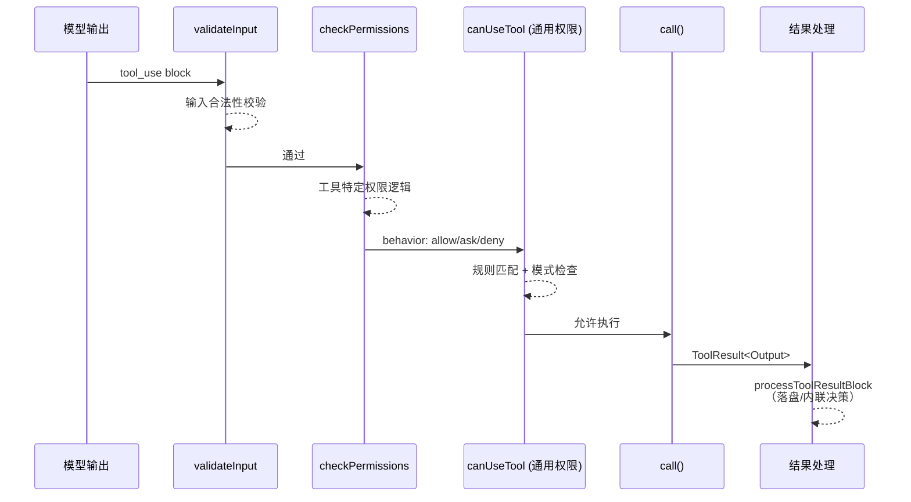
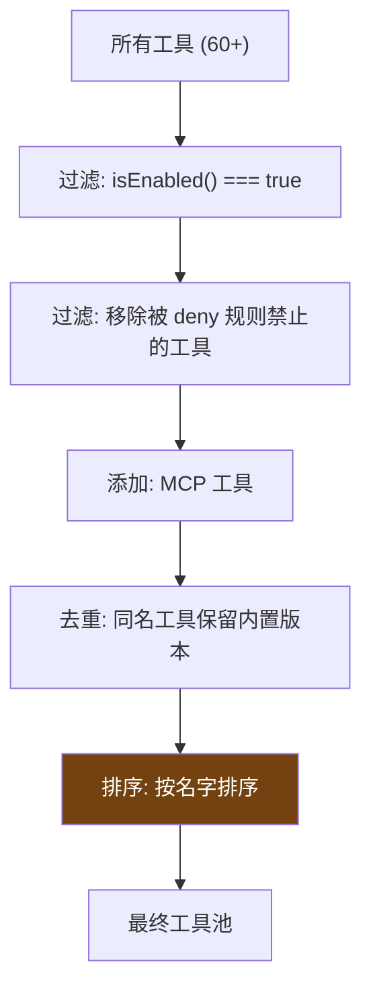
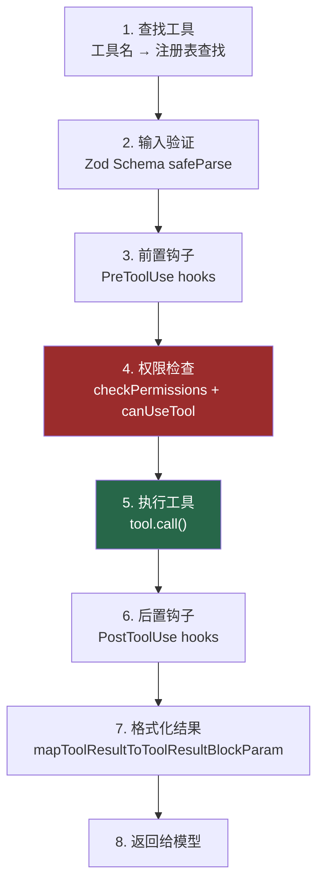

# 9. 工具类型系统

> 源码位置: `src/Tool.ts` — `Tool` 接口 + `buildTool()` 工厂函数

## 概述

Claude Code 定义了一个统一的 `Tool` 接口，包含 30+ 个方法，覆盖工具的**执行、权限、渲染、分类**四大维度。所有 60+ 个内置工具通过 `buildTool()` 工厂函数构建，该函数提供 7 个安全默认值（fail-closed 原则），确保新工具即使忘记实现某些方法也不会产生安全漏洞。

## 底层原理

### Tool 接口核心方法

```typescript
type Tool<Input, Output, P> = {
  // === 执行 ===
  call(args, context, canUseTool, parentMessage, onProgress): Promise<ToolResult<Output>>
  
  // === 元数据 ===
  isReadOnly(input): boolean          // 是否只读（影响微压缩）
  isDestructive?(input): boolean      // 是否破坏性（影响权限检查）
  isConcurrencySafe(input): boolean   // 是否可并行执行
  maxResultSizeChars: number          // 结果大小上限（影响落盘）
  
  // === 权限 ===
  checkPermissions(input, context): Promise<PermissionResult>
  validateInput?(input, context): Promise<ValidationResult>
  
  // === 渲染 ===
  prompt(options): Promise<string>    // 生成工具描述给模型
  renderToolUseMessage(input, options): React.ReactNode
  renderToolResultMessage?(content, progress, options): React.ReactNode
  
  // === 分类 ===
  toAutoClassifierInput(input): unknown  // 安全分类器输入
  isSearchOrReadCommand?(input): { isSearch, isRead, isList }
}
```

### buildTool() 工厂函数

```typescript
const TOOL_DEFAULTS = {
  isEnabled: () => true,
  isConcurrencySafe: () => false,    // 假设不安全
  isReadOnly: () => false,           // 假设会写入
  isDestructive: () => false,
  checkPermissions: (input) =>       // 交给通用权限系统
    Promise.resolve({ behavior: 'allow', updatedInput: input }),
  toAutoClassifierInput: () => '',   // 跳过分类器
  userFacingName: () => '',
}

function buildTool<D extends AnyToolDef>(def: D): BuiltTool<D> {
  return {
    ...TOOL_DEFAULTS,
    userFacingName: () => def.name,
    ...def,  // 用户定义覆盖默认值
  }
}
```

### 元数据如何驱动系统行为



### 工具执行链



### 关键设计：fail-closed 默认值

`buildTool()` 的默认值遵循 fail-closed 原则：

| 默认值 | 含义 | 安全影响 |
|--------|------|---------|
| `isConcurrencySafe: false` | 假设不可并行 | 防止竞态条件 |
| `isReadOnly: false` | 假设会写入 | 微压缩不会误删写入记录 |
| `toAutoClassifierInput: ''` | 跳过分类器 | 安全相关工具必须主动覆盖 |

如果一个新工具忘记声明 `isReadOnly: true`，最坏情况是微压缩不清理它的旧结果（浪费上下文），而不是误删重要的写入历史。

### 工具注册与条件加载

所有工具在 `tools.ts` 中注册，支持条件加载：

```typescript
export function getAllBaseTools(): Tool[] {
  return [
    // 核心工具（总是可用）
    AgentTool, BashTool, FileReadTool, FileEditTool,
    FileWriteTool, GlobTool, GrepTool, WebFetchTool,

    // 条件工具（需要特定环境或 feature flag）
    ...(isTaskV2Enabled() ? [TaskCreateTool, TaskUpdateTool] : []),
    ...(isWorktreeEnabled() ? [EnterWorktreeTool, ExitWorktreeTool] : []),
    ...(isLSPEnabled() ? [LSPTool] : []),
  ]
}
```

### 工具池的多层过滤

最终发送给模型的工具列表经过多层过滤和排序：



按名字排序看似多余，实际上是为了 prompt cache——工具定义是 system prompt 的一部分，如果工具顺序变了，缓存就失效了。

### 延迟加载：ToolSearch

当工具太多时，每次都把所有工具定义发给模型很浪费 token。Claude Code 通过 `ToolSearch` 实现延迟加载：

```
初始请求: 只发送核心工具（Bash, FileRead, FileEdit, FileWrite, Grep, Glob）
当模型需要其他工具时:
  模型调用 ToolSearch("cron schedule")
  → 系统返回 CronCreateTool 的定义
  → 下一轮模型就可以使用 CronCreateTool
```

### 工具执行的 8 步流程



每一步都有错误处理。这种"层层把关"的设计确保了系统的健壮性——任何一步失败都会产生有意义的错误信息返回给模型。

## 设计原因

- **类型安全**：`BuiltTool<D>` 在类型层面精确反映 `{...TOOL_DEFAULTS, ...def}` 的运行时行为，60+ 个工具零类型错误
- **fail-closed**：默认值总是选择更安全的选项，新工具不会因遗漏而产生安全问题
- **关注点分离**：工具只需实现 `call()` 和业务相关方法，权限、渲染、分类由框架统一处理

## 应用场景

::: tip 可借鉴场景
任何需要插件/工具系统的 AI agent 框架。核心思想是用工厂函数 + fail-closed 默认值替代继承，让每个工具只关注自己的业务逻辑。元数据驱动行为（`isReadOnly` → 微压缩策略、`maxResultSizeChars` → 落盘策略）的模式可以直接复用。
:::

## 关联知识点

- [权限模式](/tools/permission) — `checkPermissions` 的详细展开
- [工具结果落盘](/tools/tool-persist) — `maxResultSizeChars` 驱动的落盘机制
- [ReAct 循环工程化](/agent/react-loop) — 工具在阶段 5 的执行流程
- [五层上下文防爆体系](/context/five-layers) — `isReadOnly` 对微压缩的影响
