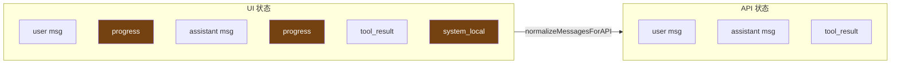
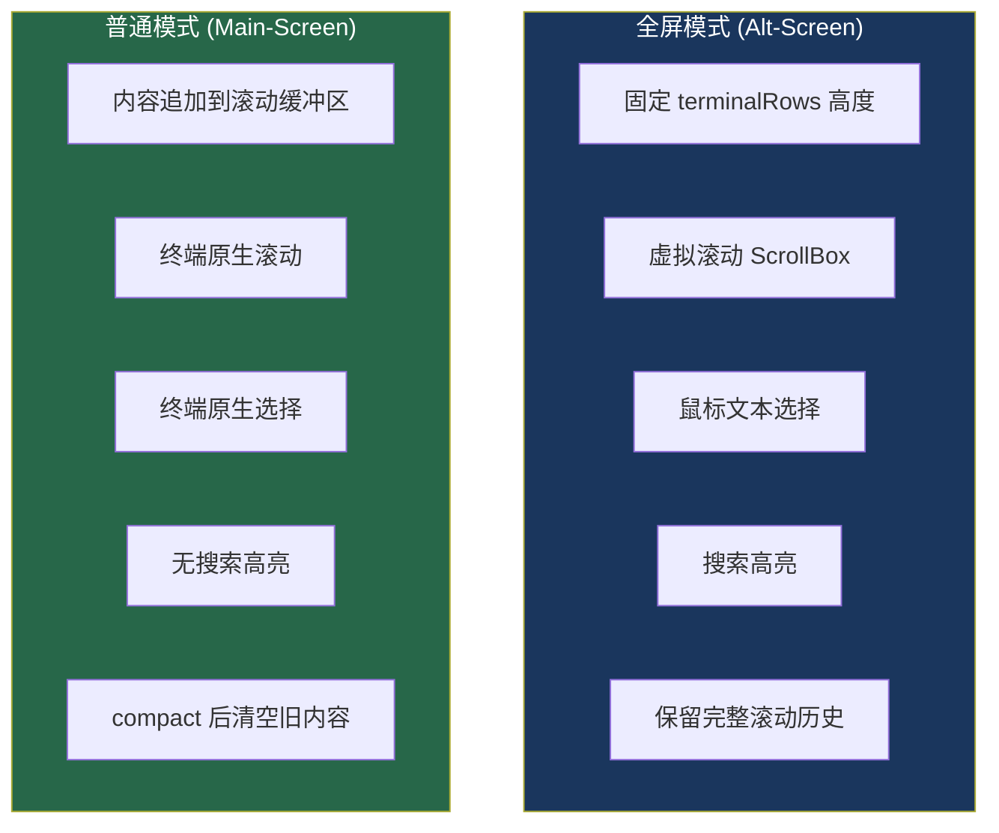

# 13. 全屏模式的消息管理

> 源码位置: `src/screens/REPL.tsx` — `REPL` 组件，`src/ink/ink.tsx` — `Ink` 类

## 概述

Claude Code 的全屏模式（alt-screen）和普通模式（main-screen scrollback）在消息管理上有本质区别。全屏模式将整个终端作为一个可控的画布，支持虚拟滚动、鼠标选择、搜索高亮；普通模式则利用终端的原生滚动缓冲区。两种模式共享同一套 React 组件树，但通过 `conversationId` 刷新和 UI/API 状态分离来管理各自的生命周期。

## 底层原理

### UI 状态 vs API 状态分离

REPL 维护两套消息状态：

```typescript
// UI 状态：React 组件树中的消息列表
// 包含 progress、system_local_command 等 UI-only 消息
const [messages, setMessages] = useState<Message[]>(initialMessages)

// API 状态：发送给模型的消息
// normalizeMessagesForAPI() 过滤掉 UI-only 消息
// progress 消息被完全移除
// 连续的 user 消息被合并（Bedrock 兼容）
```

这种分离在 compact（压缩）时尤为重要：



compact 操作替换 API 状态中的旧消息为摘要，但 UI 状态可以保留完整的滚动历史（全屏模式）或清空（普通模式）。

### conversationId 刷新触发 React 重渲染

```typescript
// REPL 组件接收 setConversationId 回调
// 当 /clear 或 compact 发生时，生成新的 conversationId
setConversationId?: (id: UUID) => void

// conversationId 变化触发：
// 1. React key 变化 → 组件树重新挂载
// 2. 消息列表重置
// 3. 文件状态缓存清空
// 4. 内容替换状态重建
```

### 全屏 vs 普通模式的差异



### Alt-Screen 管理

```typescript
class Ink {
  enterAlternateScreen(): void {
    // 写入 ANSI 转义序列进入 alt buffer
    // \x1b[?1049h — 保存光标 + 切换到 alt buffer
    // 启用鼠标追踪
  }

  exitAlternateScreen(): void {
    // \x1b[?1049l — 恢复光标 + 切换回 main buffer
    // 禁用鼠标追踪
    // main buffer 的滚动历史完好无损
  }

  // Alt-screen 的帧管理
  private resetFramesForAltScreen(): void {
    // 进入/退出/调整大小时重置帧缓冲区
    // 标记 prevFrameContaminated = true
    // 下一帧禁用 blit，全量重绘
  }
}
```

### 虚拟滚动

全屏模式使用 `ScrollBox` 组件实现虚拟滚动，只渲染可见区域的消息：

```typescript
// useVirtualScroll.ts
// scrollTop 量化为 SCROLL_QUANTUM 桶
// Object.is 对小滚动看不到变化 → React 跳过 commit
// 避免每个滚轮 tick（每个 notch 3-5 次）都触发完整的
// React commit + Yoga calculateLayout + Ink diff 周期

useSyncExternalStore(subscribe, () => {
  const s = scrollRef.current
  if (!s) return NaN
  // 量化的 scrollTop 作为 snapshot
  return Math.floor(s.scrollTop / SCROLL_QUANTUM)
})
```

### 进度消息的原地替换

```typescript
// 高频进度消息（Bash 输出、Sleep 倒计时）
// 在 REPL 中替换前一条同类消息，而非追加
const EPHEMERAL_PROGRESS_TYPES = new Set([
  'bash_progress',
  'powershell_progress',
  'mcp_progress',
])

// 这些消息：
// ✓ 在 UI 中原地更新（看起来像实时输出）
// ✗ 不写入 transcript JSONL
// ✗ 不发送给 API
// ✗ 不参与 parentUuid 链
```

### Transcript 模式

全屏模式还支持 transcript 模式（查看完整对话历史），通过 `screen` 状态切换：

```typescript
const [screen, setScreen] = useState<Screen>('prompt')
// 'prompt' — 正常交互模式
// 'transcript' — 查看完整对话历史
// 'settings' — 设置界面
```

## 设计原因

- **UI/API 分离**：progress 消息对用户有价值（看到实时输出），但对模型是噪音。分离让两边各取所需
- **conversationId 刷新**：利用 React 的 key 机制，一个 UUID 变化就能干净地重置整个组件树状态
- **虚拟滚动量化**：滚轮事件频率远高于有意义的 UI 变化，量化避免了不必要的渲染开销
- **Alt-screen 隔离**：全屏模式的所有渲染都在 alt buffer 中，退出后 main buffer 的历史完好无损

## 应用场景

::: tip 可借鉴场景
任何需要在终端中实现复杂交互式 UI 的项目。UI/API 状态分离的模式适用于所有需要"展示给用户的内容"和"发送给后端的内容"不同的场景。`conversationId` 刷新是一个优雅的"重置一切"机制，比手动清理每个状态要可靠得多。虚拟滚动的量化技巧可以推广到任何高频事件驱动的 React 渲染场景。
:::

## 关联知识点

- [自研 Ink 渲染引擎](/ui/ink-engine) — 全屏模式的底层渲染管线
- [极简状态管理](/data/store) — `useAppState` 驱动 REPL 的状态更新
- [会话持久化与恢复](/data/session) — transcript JSONL 的写入和读取
