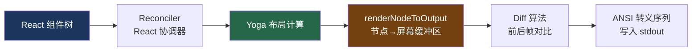

# 12. 自研 Ink 渲染引擎

> 源码位置: `src/ink/` — 深度 fork 的 Ink 框架，40+ 个模块

## 概述

Claude Code 的终端 UI 基于一个**深度 fork 的 Ink 框架**（React + Yoga 布局引擎）。原版 Ink 是一个将 React 组件渲染到终端的库，但 Claude Code 对其进行了大量改造：自定义 ANSI 旁路组件（`RawAnsi`）、不可选区域（`NoSelect`）、WeakMap 布局缓存、虚拟滚动、全屏 alt-screen 模式等。这些改造让一个原本只能做简单 CLI 的框架，变成了能支撑复杂交互式 IDE 体验的渲染引擎。

## 底层原理

### 渲染管线



### 关键组件：RawAnsi

普通的 `<Ansi>` 组件会将 ANSI 字符串解析为 React 元素树，经过 Yoga 布局，再重新序列化为 ANSI——对于已经是终端就绪的内容（如语法高亮的 diff），这是一个 O(n) 的无用功。

```typescript
// RawAnsi 绕过整个解析→布局→序列化的往返
// 直接将预渲染的 ANSI 行作为单个 Yoga 叶节点输出
export function RawAnsi({ lines, width }: Props) {
  if (lines.length === 0) return null
  return (
    <ink-raw-ansi
      rawText={lines.join('\n')}
      rawWidth={width}
      rawHeight={lines.length}
    />
  )
}
```

`<ink-raw-ansi>` 是一个自定义 DOM 元素，Yoga 用常量时间测量函数（`width × lines.length`）计算布局，`output.write()` 直接将拼接的字符串写入屏幕缓冲区。对于长 transcript 中大量语法高亮的 diff，这是渲染的主要性能瓶颈优化。

### 关键组件：NoSelect

全屏模式下支持鼠标文本选择，但行号、diff 符号等"装饰"内容不应被选中：

```typescript
// NoSelect 标记其子内容为不可选
// 拖选时这些区域被跳过，复制的文本是干净的代码
export function NoSelect({ children, fromLeftEdge, ...boxProps }) {
  return (
    <Box {...boxProps} noSelect={fromLeftEdge ? 'from-left-edge' : true}>
      {children}
    </Box>
  )
}

// 使用示例：diff 渲染
<Box flexDirection="row">
  <NoSelect fromLeftEdge>
    <Text dimColor> 42 +</Text>  {/* 行号和 +/- 符号不可选 */}
  </NoSelect>
  <Text>const x = 1</Text>       {/* 代码内容可选 */}
</Box>
```

`fromLeftEdge` 选项将排除区域从列 0 扩展到该 Box 的右边缘，解决了嵌套缩进容器中多行拖选会拾取前导缩进的问题。

### WeakMap 布局缓存

```typescript
// node-cache.ts
type CachedLayout = {
  x: number; y: number; width: number; height: number;
  top?: number  // yoga getComputedTop()，用于 ScrollBox 视口裁剪
}

// WeakMap：节点被 GC 时缓存自动清理
export const nodeCache = new WeakMap<DOMElement, CachedLayout>()

// 移除的子节点需要清除的矩形区域
export const pendingClears = new WeakMap<DOMElement, Rectangle[]>()
```

`nodeCache` 存储每个 DOM 节点的布局边界，用于：
- **Blit 优化**：未变化的子树直接从前一帧复制，跳过重新渲染
- **ScrollBox 视口裁剪**：O(dirty) 而非 O(mounted) 的首遍扫描

### 渲染器的帧管理

```typescript
function createRenderer(node: DOMElement, stylePool: StylePool): Renderer {
  // Output 跨帧复用，charCache（tokenize + grapheme 聚类）持久化
  // 大多数行在帧间不变，缓存命中率很高
  let output: Output | undefined

  return (options) => {
    // Alt-screen：屏幕缓冲区 = alt buffer，固定 terminalRows 高
    // 溢出内容被裁剪而非滚动
    const height = options.altScreen ? terminalRows : yogaHeight

    // Blit 安全性检查：
    // - 选择覆盖层修改了前一帧 → 不安全
    // - alt-screen 进入/调整大小 → 不安全
    // - 绝对定位节点被移除 → 不安全（可能画在了非兄弟节点上）
    const absoluteRemoved = consumeAbsoluteRemovedFlag()
    renderNodeToOutput(node, output, {
      prevScreen: absoluteRemoved || options.prevFrameContaminated
        ? undefined  // 禁用 blit，全量重绘
        : prevScreen
    })
  }
}
```

### 进度消息原地替换

REPL 中的工具执行进度（如 Bash 输出、Sleep 倒计时）使用**原地替换**而非追加：

```typescript
// 高频工具进度 tick 是 UI-only 的
// 不发送给 API，不在工具完成后渲染
const EPHEMERAL_PROGRESS_TYPES = new Set([
  'bash_progress',
  'powershell_progress',
  'mcp_progress',
])
```

这些进度消息在 REPL 中替换前一条同类消息，而不是追加到消息列表。这样 Bash 命令的实时输出看起来像是在原地更新，而不是不断增长的日志。

## 设计原因

- **性能**：`RawAnsi` 将 diff 渲染从 O(spans) 降到 O(1)，WeakMap 缓存让 blit 跳过未变化的子树
- **用户体验**：`NoSelect` 让复制的代码是干净的，没有行号和 diff 符号的干扰
- **内存安全**：WeakMap 自动清理被 GC 的节点缓存，不需要手动管理生命周期
- **帧一致性**：blit 安全性检查防止选择覆盖层、alt-screen 切换等场景下的渲染伪影

## 应用场景

::: tip 可借鉴场景
任何需要在终端中构建复杂交互式 UI 的项目。`RawAnsi` 的"旁路"模式适用于所有已经有预渲染内容的场景（语法高亮、外部渲染器输出）。`NoSelect` 的设计模式可以推广到任何需要区分"可交互区域"和"装饰区域"的 UI 系统。WeakMap 布局缓存是一个通用的 React 自定义渲染器优化技巧。
:::

## 关联知识点

- [全屏模式的消息管理](/ui/fullscreen) — alt-screen 模式下的消息渲染
- [极简状态管理](/data/store) — UI 状态驱动渲染更新
