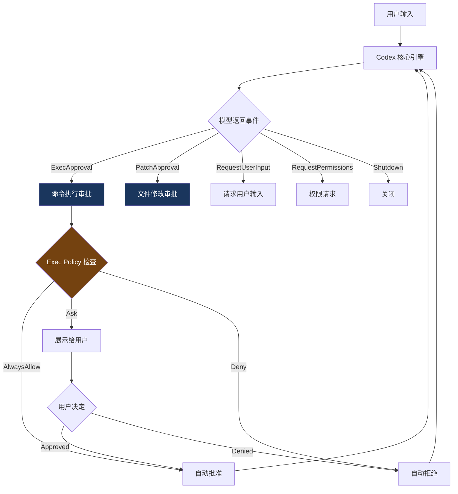

# 1. 事件驱动 Agent 循环

> 源码位置: `codex-rs/core/src/codex_delegate.rs`, `codex-rs/core/src/codex_thread.rs`

## 概述

Codex 的 Agent Loop 不是 Claude Code 那样的 `while(true)` 循环，而是一个**事件驱动**的架构。核心用 Rust 的 async/await + tokio 运行时实现，通过 channel 通信处理 Agent 事件。

## 底层原理

### 两种运行模式

```rust
// codex_delegate.rs

// 交互式模式：持续运行，处理用户输入和 Agent 事件
pub async fn run_codex_thread_interactive(codex, delegate) {
    loop {
        match forward_events(codex, delegate).await {
            ExecApproval(approval)     → handle_exec_approval()
            PatchApproval(patch)       → handle_patch_approval()
            RequestUserInput(request)  → handle_request_user_input()
            RequestPermissions(request)→ handle_request_permissions()
            Shutdown                   → break
        }
    }
    shutdown_delegate(codex).await
}

// 单次执行模式：执行一个任务后退出
pub async fn run_codex_thread_one_shot(codex, delegate) {
    // 提交用户输入 → 等待完成 → 退出
}
```

### 事件处理流程



### 与 Claude Code 的关键差异

| 维度 | Codex（事件驱动） | Claude Code（while loop） |
|------|------------------|-------------------------|
| 循环控制 | 事件匹配（match） | 条件判断（if/else） |
| 审批模型 | 显式事件（ExecApproval） | 工具执行中的副作用（checkPermission） |
| 并发模型 | tokio async runtime | 单线程 + StreamingToolExecutor |
| 状态传递 | Rust 所有权系统 | State 对象整体替换 |
| 中断处理 | cancellation token | AbortController |

### 命令执行审批详解

```rust
async fn handle_exec_approval(codex, delegate, approval) {
    // 1. 检查 exec policy（Starlark 策略引擎）
    let policy_decision = exec_policy_manager
        .create_exec_approval_requirement_for_command(&approval.command)
        .await;
    
    match policy_decision {
        AlwaysAllow => {
            // 策略允许 → 自动批准，不打扰用户
            codex.approve_exec(approval.id).await;
        }
        Ask(reason) => {
            // 策略要求确认 → 展示给用户
            let user_decision = await_approval_with_cancel(
                delegate.prompt_user(approval, reason),
                codex.cancellation_token(),
            ).await;
            
            match user_decision {
                Approved => codex.approve_exec(approval.id).await,
                Denied => codex.deny_exec(approval.id).await,
                Cancelled => { /* 用户取消整个操作 */ }
            }
        }
        Deny(reason) => {
            // 策略禁止 → 自动拒绝
            codex.deny_exec(approval.id, reason).await;
        }
    }
}
```

### Guardian 安全审查

```rust
// codex_delegate.rs — Guardian 模式

fn spawn_guardian_review(codex, delegate, approval) {
    // Guardian 是一个独立的 LLM 审查器
    // 在用户审批之前，先让 Guardian 评估操作的安全性
    // 如果 Guardian 认为不安全 → 自动拒绝，不展示给用户
    // 如果 Guardian 认为安全 → 继续正常审批流程
}
```

### 文件修改审批

```rust
async fn handle_patch_approval(codex, delegate, patch) {
    // 与命令审批类似，但针对文件修改
    // 展示 diff 给用户
    // 用户可以：
    //   - 接受全部修改
    //   - 拒绝全部修改
    //   - 逐个文件审查（未来功能）
}
```

## 设计原因

- **安全优先**：审批是显式事件，不是工具执行的副作用。不可能"绕过"审批
- **可扩展**：新的事件类型只需要添加 match 分支
- **Rust 安全性**：所有权系统确保状态不会被意外修改
- **取消安全**：`await_approval_with_cancel` 确保用户可以随时取消

## 关联知识点

- [策略引擎](/execpolicy/policy-engine) — ExecApproval 的策略检查详解
- [沙箱架构](/sandbox/architecture) — 命令在沙箱中执行
- [多 Agent 系统](/agent/multi-agent) — 多个 Agent 的事件路由
