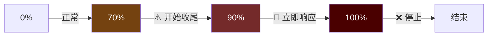
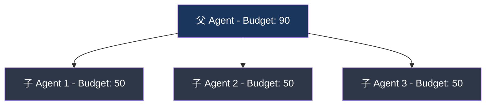

# 3. 迭代预算

> 源码位置: `run_agent.py` — `IterationBudget` 类

## 概述

IterationBudget 是一个线程安全的迭代计数器，控制 Agent 的最大工具调用轮数。父 Agent 默认 90 轮，子 Agent 默认 50 轮，各自独立计数。`execute_code` 工具的迭代可以退还（refund），因为它是程序化工具调用，不应消耗预算。

## 底层原理

### IterationBudget 实现

```python
class IterationBudget:
    def __init__(self, max_total: int):
        self.max_total = max_total
        self._used = 0
        self._lock = threading.Lock()

    def consume(self) -> bool:
        """尝试消耗一次迭代。返回 True 表示允许。"""
        with self._lock:
            if self._used >= self.max_total:
                return False
            self._used += 1
            return True

    def refund(self) -> None:
        """退还一次迭代（如 execute_code 轮次）。"""
        with self._lock:
            if self._used > 0:
                self._used -= 1

    @property
    def remaining(self) -> int:
        with self._lock:
            return max(0, self.max_total - self._used)
```

### 预算压力警告



```python
# run_agent.py
self._budget_caution_threshold = 0.7   # 70% — 提示开始收尾
self._budget_warning_threshold = 0.9   # 90% — 紧急，立即响应
```

预算警告注入到最后一个工具结果的 JSON 中（`_budget_warning` 字段），而不是作为独立消息。这样不会破坏消息结构，也不会使 prompt cache 失效。

### 父子预算独立



每个子 Agent 获得独立的 IterationBudget（默认 50），这意味着总迭代数可以超过父 Agent 的上限。用户通过 `delegation.max_iterations` 配置控制每个子 Agent 的预算。

### 预算警告清理

```python
def _strip_budget_warnings_from_history(messages: list) -> None:
    """从历史消息中移除预算压力警告。"""
```

预算警告是当轮信号，不应泄漏到重放的历史中。清理逻辑处理两种格式：
1. JSON 中的 `_budget_warning` 键
2. 纯文本中的 `[BUDGET WARNING: ...]` 模式

### 与 Claude Code / Codex 的对比

| 维度 | Hermes Agent | Claude Code | Codex CLI |
|------|-------------|-------------|-----------|
| 预算机制 | IterationBudget（线程安全计数器） | 无显式预算（依赖 token 限制） | max_turns 参数 |
| 默认值 | 父 90 / 子 50 | 无限制 | 可配置 |
| 压力警告 | 70% / 90% 两级 | 无 | 无 |
| 退还机制 | execute_code 可退还 | 无 | 无 |
| 父子关系 | 独立预算 | 共享上下文 | 独立 |

## 设计原因

- **线程安全**：子 Agent 在 ThreadPoolExecutor 中运行，多个子 Agent 可能同时消耗预算，Lock 保证原子性
- **独立预算**：如果父子共享预算，一个复杂的子任务可能耗尽父 Agent 的所有迭代，导致主任务无法完成
- **execute_code 退还**：`execute_code` 是程序化工具调用（Python 沙箱），一次调用可能执行多个工具操作，不应按 LLM 轮次计费
- **预算警告注入到工具结果**：避免插入独立的 system/user 消息破坏对话交替结构，同时利用模型对工具结果的注意力

## 关联知识点

- [双 Agent 循环](/agent/dual-loop) — 预算在循环中的检查位置
- [子 Agent 委托](/agent/subagent) — 子 Agent 的独立预算分配
