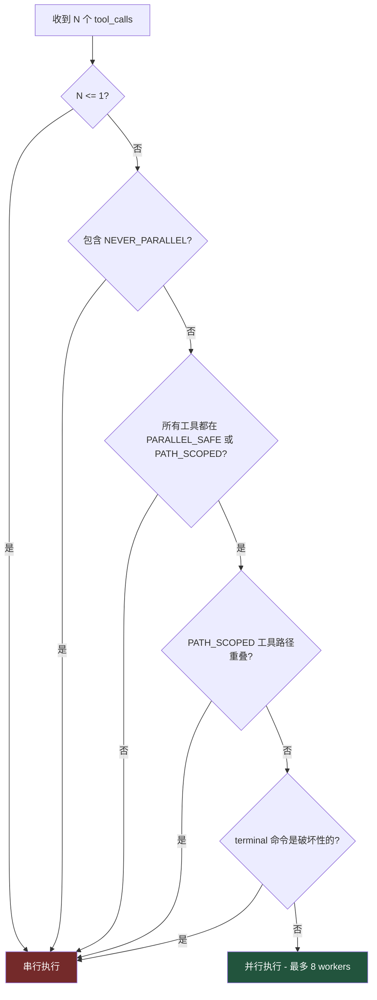

# 2. 并行工具执行

> 源码位置: `run_agent.py` — `_should_parallelize_tool_batch()`, `_PARALLEL_SAFE_TOOLS`, `_PATH_SCOPED_TOOLS`

## 概述

当模型在一次回复中调用多个工具时，Hermes Agent 会分析这批工具调用的安全性，决定并行还是串行执行。核心原则：只读工具并行，写操作串行，路径重叠检测防止竞态。

## 底层原理

### 并行决策流程



### 三类工具分类

```python
# 绝对不能并行的工具（交互式 / 用户面向）
_NEVER_PARALLEL_TOOLS = frozenset({"clarify"})

# 只读工具，无共享可变状态
_PARALLEL_SAFE_TOOLS = frozenset({
    "ha_get_state", "ha_list_entities", "ha_list_services",
    "read_file", "search_files", "session_search",
    "skill_view", "skills_list", "vision_analyze",
    "web_extract", "web_search",
})

# 文件工具，路径不重叠时可并行
_PATH_SCOPED_TOOLS = frozenset({"read_file", "write_file", "patch"})
```

### 路径重叠检测

```python
def _paths_overlap(left: Path, right: Path) -> bool:
    """两个路径是否可能指向同一子树"""
    left_parts = left.parts
    right_parts = right.parts
    common_len = min(len(left_parts), len(right_parts))
    return left_parts[:common_len] == right_parts[:common_len]
```

例如：
- `/home/user/a.py` 和 `/home/user/b.py` → 不重叠 ✅ 可并行
- `/home/user/src` 和 `/home/user/src/main.py` → 重叠 ❌ 串行
- `/home/user/a.py` 和 `/home/user/a.py` → 重叠 ❌ 串行

### 破坏性命令检测

```python
_DESTRUCTIVE_PATTERNS = re.compile(
    r"""(?:^|\s|&&|\|\||;|`)(?:
        rm\s|rmdir\s|mv\s|sed\s+-i|truncate\s|
        dd\s|shred\s|git\s+(?:reset|clean|checkout)\s
    )""", re.VERBOSE,
)
_REDIRECT_OVERWRITE = re.compile(r'[^>]>[^>]|^>[^>]')
```

当 terminal 工具的命令匹配这些模式时，整个批次降级为串行执行。

### 并行执行上限

```python
_MAX_TOOL_WORKERS = 8
```

即使批次中有 20 个安全的只读工具，也最多 8 个并发执行。

### 与 Claude Code 工具批次分区的对比

| 维度 | Hermes Agent | Claude Code |
|------|-------------|-------------|
| 分区策略 | 全批次判断（安全则全并行，否则全串行） | 按读写属性分批（读并行 → 写串行 → 读串行） |
| 安全声明 | 静态集合（`_PARALLEL_SAFE_TOOLS`） | 工具元数据（`isConcurrencySafe`） |
| 路径检测 | 有（`_paths_overlap`） | 无（依赖工具元数据） |
| 破坏性检测 | 有（正则匹配命令） | 无（依赖权限模式） |
| 最大并发 | 8 workers | 无硬限制 |
| 流式执行 | 否（等批次完成） | 是（StreamingToolExecutor） |

## 设计原因

- **全批次判断而非分批**：简化实现，避免批次间依赖分析的复杂性。一个不安全的工具就让整个批次串行，宁可慢一点也不冒竞态风险
- **路径重叠检测**：`write_file` 和 `patch` 操作同一文件会导致数据损坏，路径级别的检测比工具级别更精确
- **破坏性命令检测**：terminal 工具是万能的，不能简单地标记为"安全"或"不安全"，需要检查具体命令内容
- **8 workers 上限**：防止大量并行 I/O 导致系统资源耗尽，同时对大多数场景足够

## 关联知识点

- [双 Agent 循环](/agent/dual-loop) — 并行执行在 AIAgent 循环中的位置
- [工具注册表](/tools/registry) — 工具的注册和分发
- [工具类型](/tools/tool-types) — 各类工具的特性
