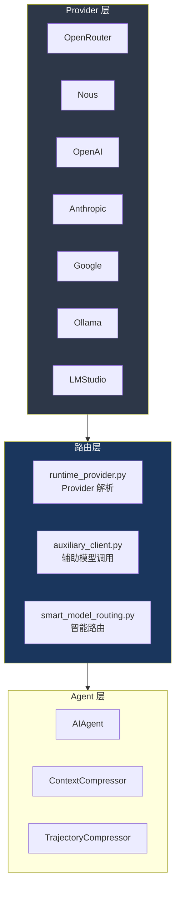

# 17. 多 Provider 支持

> 源码位置: `agent/auxiliary_client.py`, `hermes_cli/runtime_provider.py`, `hermes_cli/providers.py`

## 概述

Hermes Agent 支持多个 LLM Provider：OpenRouter、Nous、OpenAI、Anthropic、Google、以及本地模型（Ollama、LMStudio）。核心特性包括 Credential Pool（多 API key 轮转）、智能模型路由（cheap/strong）、Anthropic prompt caching。

## 底层原理

### Provider 架构



### Credential Pool（API Key 轮转）

```python
# AIAgent.__init__
self._credential_pool = credential_pool
```

Credential Pool 允许配置多个 API key，在请求间轮转使用：
- 分散 rate limit 压力
- 单个 key 被限流时自动切换
- 支持不同 Provider 的 key 池

### API 模式自动检测

```python
# run_agent.py — AIAgent.__init__
if self.provider == "openai-codex":
    self.api_mode = "codex_responses"
elif self.provider == "anthropic":
    self.api_mode = "anthropic_messages"
elif self._is_direct_openai_url():
    self.api_mode = "codex_responses"  # GPT-5.x 需要 Responses API
else:
    self.api_mode = "chat_completions"
```

三种 API 模式：
| 模式 | Provider | 特点 |
|------|---------|------|
| `chat_completions` | OpenRouter, Nous, Ollama, LMStudio | 标准 OpenAI 格式 |
| `codex_responses` | OpenAI 直连 | Responses API（GPT-5.x 需要） |
| `anthropic_messages` | Anthropic 直连 | Messages API |

### Anthropic Prompt Caching

```python
# agent/prompt_caching.py
def apply_anthropic_cache_control(api_messages, cache_ttl="5m"):
    """system_and_3 策略：系统提示词 + 最后 3 条非系统消息。"""
    # 4 个 cache_control 断点（Anthropic 最大值）
    # 1. 系统提示词（跨轮次稳定）
    # 2-4. 最后 3 条非系统消息（滚动窗口）
```

自动为 Claude 模型（通过 OpenRouter 或直连）启用 prompt caching，减少 ~75% 的输入 token 成本。

### 辅助模型调用

```python
# agent/auxiliary_client.py
def call_llm(task="compression", messages=..., model=None, ...):
    """用于压缩、摘要等辅助任务的 LLM 调用。"""
```

上下文压缩器和轨迹压缩器使用辅助模型（通常是便宜的模型）生成摘要，通过 `auxiliary_client.py` 统一路由。

### Provider 检测

```python
# trajectory_compressor.py
def _detect_provider(self) -> str:
    url = (self.config.base_url or "").lower()
    if "openrouter" in url: return "openrouter"
    if "nousresearch.com" in url: return "nous"
    if "api.anthropic.com" in url: return "anthropic"
    if "moonshot.ai" in url: return "kimi-coding"
    # ...
```

### 与 Claude Code / Codex / Vercel AI SDK 的对比

| 维度 | Hermes Agent | Claude Code | Codex CLI | Vercel AI SDK |
|------|-------------|-------------|-----------|---------------|
| Provider 数量 | 7+ | 1（Anthropic） | 1（OpenAI） | 20+ |
| API 模式 | 3 种自动检测 | Messages API | Responses API | 统一抽象 |
| Key 轮转 | Credential Pool | 无 | 无 | 无 |
| Prompt Cache | Anthropic system_and_3 | 内置 | 无 | Provider 依赖 |
| 辅助模型 | auxiliary_client | 无 | 无 | 无 |
| 本地模型 | Ollama, LMStudio | 无 | 无 | Ollama Provider |

## 设计原因

- **多 Provider 支持**：Hermes Agent 是通用平台，不绑定单一 Provider。用户可以根据成本、性能、隐私需求选择 Provider
- **Credential Pool**：高频使用场景（如网关服务多用户）单个 API key 容易触发 rate limit，轮转分散压力
- **API 模式自动检测**：用户不需要手动指定 API 模式，系统根据 Provider 和 URL 自动选择正确的协议
- **Prompt Caching**：多轮对话中系统提示词和早期消息重复发送，caching 显著降低成本

## 关联知识点

- [智能模型路由](/api/smart-routing) — cheap/strong 模型切换
- [上下文压缩器](/context/compressor) — 使用辅助模型生成摘要
- [双 Agent 循环](/agent/dual-loop) — API 调用在循环中的位置
