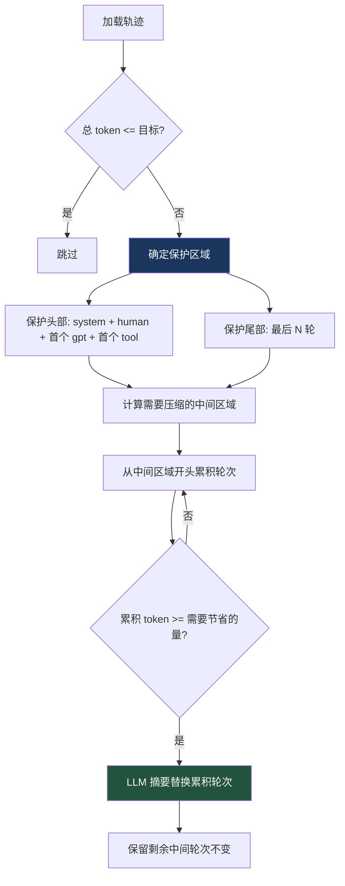

# 11. 轨迹压缩器

> 源码位置: `trajectory_compressor.py`

## 概述

TrajectoryCompressor 是 RL 训练的后处理工具，将完成的 Agent 轨迹压缩到目标 token 预算内，同时保留训练信号质量。与运行时的 ContextCompressor 不同，这是离线批量处理，支持 YAML 配置、异步并发、详细指标追踪。

## 底层原理

### 压缩策略



### CompressionConfig（YAML 配置）

```yaml
tokenizer:
  name: "moonshotai/Kimi-K2-Thinking"
  trust_remote_code: true

compression:
  target_max_tokens: 15250
  summary_target_tokens: 750

protected_turns:
  first_system: true
  first_human: true
  first_gpt: true
  first_tool: true
  last_n_turns: 4

summarization:
  model: "google/gemini-3-flash-preview"
  temperature: 0.3
  max_retries: 3

processing:
  num_workers: 4
  max_concurrent_requests: 50
  per_trajectory_timeout: 300
```

### 保护区域

```python
def _find_protected_indices(self, trajectory):
    protected = set()
    # 保护首个 system/human/gpt/tool 轮次
    if self.config.protect_first_system and first_system is not None:
        protected.add(first_system)
    # ...
    # 保护最后 N 轮
    for i in range(max(0, n - self.config.protect_last_n_turns), n):
        protected.add(i)
    return protected, compressible_start, compressible_end
```

### 异步批量处理

```python
# 使用 asyncio.Semaphore 控制并发
max_concurrent_requests: int = 50

# 每个轨迹有超时限制
per_trajectory_timeout: int = 300  # 5 分钟
```

### 指标追踪

```python
@dataclass
class AggregateMetrics:
    total_trajectories: int = 0
    trajectories_compressed: int = 0
    trajectories_skipped_under_target: int = 0
    trajectories_still_over_limit: int = 0
    trajectories_failed: int = 0
    total_tokens_before: int = 0
    total_tokens_after: int = 0
    total_tokens_saved: int = 0
    compression_ratios: List[float] = field(default_factory=list)
```

输出详细的压缩指标到 JSON 文件，包含：
- 总体统计（压缩率、跳过率、失败率）
- Token 统计（压缩前后、节省量）
- 轮次统计（移除数量）
- 摘要 API 调用统计（成功率）
- 处理时间

### 与运行时 ContextCompressor 的对比

| 维度 | TrajectoryCompressor | ContextCompressor |
|------|---------------------|-------------------|
| 用途 | RL 训练后处理 | 运行时上下文管理 |
| 触发 | 离线批量 | 在线实时 |
| 格式 | ShareGPT JSONL | OpenAI 消息格式 |
| 配置 | YAML 文件 | 构造函数参数 |
| 并发 | asyncio + Semaphore | 单线程 |
| 指标 | AggregateMetrics | 基础日志 |
| 摘要 | `[CONTEXT SUMMARY]:` 前缀 | 结构化模板（7 节） |
| 保护 | 首个 system/human/gpt/tool + 最后 N | 头 N + token 预算尾部 |

## 设计原因

- **保护首个轮次**：system prompt 定义任务，首个 human 是用户指令，首个 gpt+tool 是模型的初始理解和行动——这些是训练信号的关键锚点
- **从中间开头压缩**：中间的早期轮次通常是探索性的（试错、搜索），信息密度低于后期的执行轮次
- **保留剩余中间轮次**：只压缩"刚好够"的量，保留尽可能多的原始工具调用序列，因为这些是 RL 训练的核心信号
- **YAML 配置**：不同的训练任务可能需要不同的压缩参数（如不同的目标 token 数、不同的保护策略），YAML 比代码参数更灵活
- **异步批量**：大规模训练数据可能有数千条轨迹，异步并发 + Semaphore 控制 API 调用速率

## 关联知识点

- [上下文压缩器](/context/compressor) — 运行时压缩的对比
- [RL Agent 循环](/rl/agent-loop) — 生成轨迹的循环
- [轨迹管理](/rl/trajectory) — 轨迹的保存和格式
