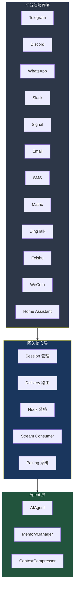

# 5. 网关架构

> 源码位置: `gateway/`

## 概述

Hermes Agent 的多平台网关是其核心差异化能力。通过统一的网关层，同一个 Agent 核心可以同时服务 CLI、Telegram、Discord、WhatsApp、Slack、Signal、Email、SMS、Matrix、DingTalk、Feishu、WeCom、Home Assistant 等 15+ 平台。

## 底层原理

### 网关分层架构



### 核心组件

**Session 管理** (`gateway/session.py`)
- 每个用户-平台组合维护一个会话
- 会话包含 AIAgent 实例、消息历史、平台元数据
- 会话超时和清理机制

**Delivery 路由** (`gateway/delivery.py`)
- 将 Agent 的响应路由到正确的平台
- 处理 `MEDIA:/path/to/file` 标记，转换为平台原生媒体消息
- 长消息分片（不同平台有不同的消息长度限制）

**Stream Consumer** (`gateway/stream_consumer.py`)
- 消费 Agent 的流式输出
- 将流式 token 聚合为完整消息后投递
- 处理工具执行期间的"正在输入"状态

**Pairing 系统** (`gateway/pairing.py`)
- 跨平台用户身份关联
- 允许同一用户在不同平台间共享会话上下文

### 共享核心工具集

```python
# toolsets.py
_HERMES_CORE_TOOLS = [
    "web_search", "web_extract",
    "terminal", "process",
    "read_file", "write_file", "patch", "search_files",
    "vision_analyze", "image_generate",
    "skills_list", "skill_view", "skill_manage",
    "browser_navigate", "browser_snapshot", "browser_click", ...
    "text_to_speech",
    "todo", "memory", "session_search",
    "clarify", "execute_code", "delegate_task",
    "cronjob", "send_message",
    "ha_list_entities", "ha_get_state", "ha_list_services", "ha_call_service",
]
```

所有平台共享同一套核心工具，通过 `check_fn` 门控条件可用性（如 `send_message` 需要网关运行，`ha_*` 需要 HASS_TOKEN）。

### 平台特定提示

```python
# agent/prompt_builder.py
PLATFORM_HINTS = {
    "whatsapp": "You are on WhatsApp. Do not use markdown...",
    "telegram": "You are on Telegram. Do not use markdown...",
    "discord":  "You are in a Discord server...",
    "slack":    "You are in a Slack workspace...",
    "email":    "You are communicating via email...",
    "cron":     "You are running as a scheduled cron job...",
    "cli":      "You are a CLI AI Agent...",
    "sms":      "You are communicating via SMS. Keep responses concise...",
}
```

### 与 Claude Code / Codex 的对比

| 维度 | Hermes Agent | Claude Code | Codex CLI |
|------|-------------|-------------|-----------|
| 平台数量 | 15+ | 1（CLI） | 1（CLI） |
| 网关层 | 完整的适配器 + 路由 + 会话 | 无 | 无 |
| 媒体支持 | MEDIA: 标记 → 原生附件 | 无 | 无 |
| 跨平台 | Pairing 系统 | 无 | 无 |
| 定时任务 | cron 平台提示 | 无 | 无 |

## 设计原因

- **共享核心工具集**：所有平台使用相同的 `_HERMES_CORE_TOOLS`，修改一处即可更新所有平台，避免工具集不一致
- **平台提示注入**：不同平台有不同的格式限制（WhatsApp 不支持 markdown、SMS 有字符限制），通过提示词引导模型适配
- **MEDIA: 标记**：统一的媒体投递协议，Agent 不需要知道具体平台的媒体 API，只需输出 `MEDIA:/path`
- **Session 隔离**：每个用户-平台组合独立会话，防止跨用户信息泄漏

## 关联知识点

- [平台适配器](/gateway/platforms) — 各平台的具体实现
- [网关 Hook](/gateway/hooks) — Hook 系统的扩展机制
- [Toolset 系统](/skills/toolsets) — 平台级 toolset 定义
