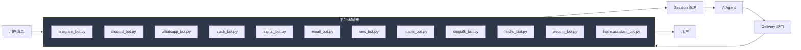

# 6. 平台适配器

> 源码位置: `gateway/platforms/`

## 概述

每个支持的平台都有独立的适配器模块，负责消息收发、媒体处理和平台特定的交互逻辑。所有适配器共享 `_HERMES_CORE_TOOLS` 工具集，通过 `PLATFORM_HINTS` 字典注入平台特定的行为提示。

## 底层原理

### 适配器统一接口



### 平台 Toolset 映射

```python
# toolsets.py — 每个平台有对应的 toolset
"hermes-cli":        { "tools": _HERMES_CORE_TOOLS },
"hermes-telegram":   { "tools": _HERMES_CORE_TOOLS },
"hermes-discord":    { "tools": _HERMES_CORE_TOOLS },
"hermes-whatsapp":   { "tools": _HERMES_CORE_TOOLS },
"hermes-slack":      { "tools": _HERMES_CORE_TOOLS },
"hermes-signal":     { "tools": _HERMES_CORE_TOOLS },
"hermes-email":      { "tools": _HERMES_CORE_TOOLS },
"hermes-sms":        { "tools": _HERMES_CORE_TOOLS },
"hermes-matrix":     { "tools": _HERMES_CORE_TOOLS },
"hermes-dingtalk":   { "tools": _HERMES_CORE_TOOLS },
"hermes-feishu":     { "tools": _HERMES_CORE_TOOLS },
"hermes-wecom":      { "tools": _HERMES_CORE_TOOLS },
"hermes-homeassistant": { "tools": _HERMES_CORE_TOOLS },
```

### MEDIA: 协议

Agent 在响应中包含 `MEDIA:/absolute/path/to/file`，Delivery 路由会：

1. 检测 MEDIA: 标记
2. 根据文件扩展名确定媒体类型
3. 调用平台特定的媒体发送 API

```
平台        | 图片          | 音频          | 视频          | 文件
------------|--------------|--------------|--------------|-------------
Telegram    | 照片消息      | 语音气泡(.ogg)| 内联播放      | 文档附件
WhatsApp    | 照片消息      | 音频附件      | 内联播放      | 文档附件
Discord     | 图片附件      | 文件附件      | 文件附件      | 文件附件
Slack       | 图片上传      | 文件上传      | 文件上传      | 文件上传
Signal      | 照片消息      | 附件          | 附件          | 附件
Email       | 内联图片      | 附件          | 附件          | 附件
```

### 平台提示差异

不同平台的格式限制通过 `PLATFORM_HINTS` 注入系统提示词：

- **WhatsApp/Telegram/Signal/SMS**：不使用 markdown（不渲染）
- **Discord/Slack**：支持部分 markdown
- **Email**：纯文本格式，无问候语/签名
- **Cron**：无用户在场，完全自主执行
- **CLI**：简单文本，终端可渲染
- **SMS**：~1600 字符限制，极简

### 网关联合 Toolset

```python
"hermes-gateway": {
    "description": "Gateway toolset - union of all messaging platform tools",
    "tools": [],
    "includes": ["hermes-telegram", "hermes-discord", "hermes-whatsapp",
                 "hermes-slack", "hermes-signal", "hermes-homeassistant",
                 "hermes-email", "hermes-sms", "hermes-mattermost",
                 "hermes-matrix", "hermes-dingtalk", "hermes-feishu",
                 "hermes-wecom", "hermes-webhook"]
}
```

## 设计原因

- **共享 `_HERMES_CORE_TOOLS`**：一处修改，所有平台同步更新。避免平台间工具集不一致导致的行为差异
- **MEDIA: 协议**：Agent 不需要了解每个平台的媒体 API，只需输出统一的标记。这是一个经典的**平台无关核心工具**模式
- **平台提示而非平台代码**：通过提示词引导模型适配平台限制，而不是在代码层面限制模型能力

## 关联知识点

- [网关架构](/gateway/architecture) — 网关的整体分层
- [Toolset 系统](/skills/toolsets) — 平台级 toolset 的组合机制
- [网关 Hook](/gateway/hooks) — 平台事件的扩展点
