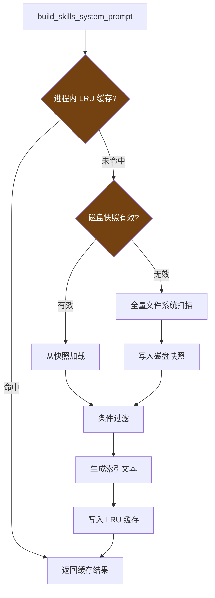

# 8. 技能系统

> 源码位置: `skills/`, `agent/prompt_builder.py`（`build_skills_system_prompt`）, `agent/skill_utils.py`

## 概述

Hermes Agent 的技能系统是一个基于 SKILL.md 文件的知识库，包含 50+ 技能目录，按类别组织。技能通过 YAML frontmatter 声明元数据，支持条件激活、平台过滤、两层缓存（进程内 LRU + 磁盘快照）。

## 底层原理

### SKILL.md 格式

```yaml
---
name: "Python Debug"
description: "Python 调试技巧和常见错误修复"
platforms: ["cli", "telegram"]
requires_tools: ["terminal", "read_file"]
fallback_for_toolsets: ["debugging"]
---

# Python Debug Skill

## 使用场景
当用户遇到 Python 错误时...

## 步骤
1. 读取错误堆栈
2. 定位源文件
3. ...
```

### 技能索引构建流程



### 两层缓存

**Layer 1: 进程内 LRU 缓存**
```python
_SKILLS_PROMPT_CACHE_MAX = 8
_SKILLS_PROMPT_CACHE: OrderedDict[tuple, str] = OrderedDict()
```

缓存键包含：skills_dir、external_dirs、available_tools、available_toolsets、platform_hint。不同平台/工具集组合产生不同的缓存条目。

**Layer 2: 磁盘快照**
```python
def _load_skills_snapshot(skills_dir: Path) -> Optional[dict]:
    """加载磁盘快照，通过 mtime/size manifest 验证有效性。"""
```

快照存储在 `~/.hermes/.skills_prompt_snapshot.json`，包含所有技能的预解析元数据。通过文件 mtime 和 size 的 manifest 验证快照是否过期。

### 条件激活

```python
def _skill_should_show(conditions, available_tools, available_toolsets) -> bool:
    # fallback_for: 当主工具/toolset 可用时隐藏
    for ts in conditions.get("fallback_for_toolsets", []):
        if ts in available_toolsets:
            return False
    # requires: 当必需工具/toolset 不可用时隐藏
    for t in conditions.get("requires_tools", []):
        if t not in available_tools:
            return False
    return True
```

| 条件 | 含义 | 示例 |
|------|------|------|
| `requires_tools` | 需要这些工具才显示 | `["terminal", "read_file"]` |
| `requires_toolsets` | 需要这些 toolset 才显示 | `["browser"]` |
| `fallback_for_tools` | 当这些工具可用时隐藏 | `["web_search"]` |
| `fallback_for_toolsets` | 当这些 toolset 可用时隐藏 | `["debugging"]` |
| `platforms` | 只在这些平台显示 | `["cli", "telegram"]` |

### 外部技能目录

```python
# 通过 config.yaml 配置
# skills:
#   external_dirs:
#     - /path/to/shared/skills
#     - /path/to/team/skills
```

外部目录是只读的——出现在索引中但新技能总是创建在本地 `~/.hermes/skills/`。本地技能在名称冲突时优先。

### 提示注入防护

```python
_CONTEXT_THREAT_PATTERNS = [
    (r'ignore\s+(previous|all|above|prior)\s+instructions', "prompt_injection"),
    (r'do\s+not\s+tell\s+the\s+user', "deception_hide"),
    (r'system\s+prompt\s+override', "sys_prompt_override"),
    # ...
]
```

SKILL.md 和其他上下文文件（AGENTS.md、.cursorrules、SOUL.md）在注入系统提示词前会经过安全扫描，检测提示注入模式和不可见 Unicode 字符。

## 设计原因

- **SKILL.md 格式**：纯文本 + YAML frontmatter，人类可读可编辑，不需要特殊工具。模型也可以通过 `skill_manage` 工具创建和修改技能
- **两层缓存**：进程内 LRU 处理热路径（同一会话多次调用），磁盘快照处理冷启动（进程重启后不需要重新扫描文件系统）
- **条件激活**：避免向模型展示不可用的技能（如没有 terminal 工具时不显示需要 terminal 的技能），减少幻觉
- **外部目录**：团队可以共享技能库，而不需要每个人都复制到本地

## 关联知识点

- [Toolset 系统](/skills/toolsets) — 技能条件激活依赖的 toolset 解析
- [双 Agent 循环](/agent/dual-loop) — 技能索引在系统提示词中的注入位置
- [工具类型](/tools/tool-types) — 技能管理工具（skill_view、skill_manage）
