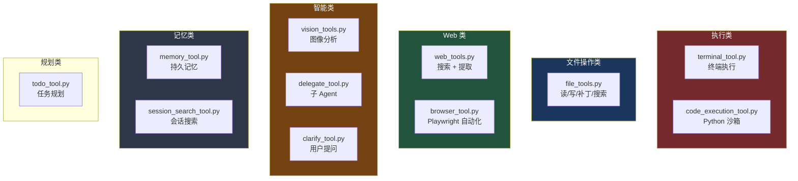

# 15. 工具类型

> 源码位置: `tools/` 目录

## 概述

Hermes Agent 提供 10+ 类工具，覆盖终端执行、文件操作、浏览器自动化、Web 搜索、视觉分析、记忆、委托、代码执行等场景。每个工具通过自注册模式加入 ToolRegistry。

## 底层原理

### 工具分类总览



### Terminal 工具

```python
# tools/terminal_tool.py
# 支持多后端: local, docker, modal, daytona
```

| 后端 | 用途 | 隔离级别 |
|------|------|---------|
| local | 本地执行 | 无隔离 |
| docker | Docker 容器 | 容器级 |
| modal | Modal 云函数 | 云级 |
| daytona | Daytona 工作区 | 工作区级 |

### File 工具

```python
# tools/file_tools.py
# read_file, write_file, patch, search_files
```

- **patch**：支持模糊匹配的文件补丁，容忍模型输出的不精确匹配
- **search_files**：内容搜索 + 文件名搜索
- **read_file**：支持行范围读取
- **连续读取追踪**：`notify_other_tool_call()` 重置连续读取计数器，防止模型陷入无限读取循环

### Browser 工具

```python
# tools/browser_tool.py
# Playwright + CamoFox 反检测浏览器
```

10 个子工具：navigate, snapshot, click, type, scroll, back, press, get_images, vision, console。

### Web 工具

```python
# tools/web_tools.py
# web_search: 搜索引擎查询
# web_extract: 网页内容提取
```

### Vision 工具

```python
# tools/vision_tools.py
# vision_analyze: 图像分析（支持 URL 和本地文件）
```

### Delegate 工具

```python
# tools/delegate_tool.py
# delegate_task: 创建子 Agent 执行复杂子任务
```

详见 [子 Agent 委托](/agent/subagent)。

### Code Execution 工具

```python
# tools/code_execution_tool.py
# execute_code: Python 沙箱，可调用其他工具
```

- 沙箱内可用的工具列表动态生成（基于当前会话的 enabled tools）
- 迭代预算可退还（`IterationBudget.refund()`）

### Clarify 工具

```python
# tools/clarify_tool.py
# clarify: 向用户提问（多选或开放式）
```

需要 `clarify_callback` 回调函数，由平台层（CLI 或网关）提供。

### Todo 工具

```python
# tools/todo_tool.py
# todo: 任务规划和追踪
```

使用 per-loop 的 `TodoStore`，会话结束即销毁。

### 工具参数类型强转

```python
# model_tools.py
def coerce_tool_args(tool_name, args):
    """将字符串参数强转为 schema 声明的类型。"""
    # "42" → 42 (integer)
    # "3.14" → 3.14 (number)
    # "true" → True (boolean)
    # 支持联合类型 ["integer", "string"]
```

LLM 经常将数字作为字符串返回（`"42"` 而不是 `42`），类型强转在分发前自动修正。

### 大结果处理

```python
_LARGE_RESULT_CHARS = 100_000  # 100K 字符阈值

def _save_oversized_tool_result(function_name, function_result):
    """将超大工具结果保存到文件，返回预览 + 文件路径。"""
    # 保存到 ~/.hermes/cache/tool_responses/
    # 返回前 1500 字符预览 + 文件路径
```

## 设计原因

- **多后端 Terminal**：不同场景需要不同的隔离级别，本地开发用 local，生产环境用 docker/modal
- **模糊匹配 Patch**：模型生成的补丁经常有微小差异（空格、缩进），模糊匹配提高成功率
- **类型强转**：与其让工具执行失败然后重试，不如在分发前自动修正常见的类型错误
- **大结果落盘**：100K 字符的工具结果会严重膨胀上下文，保存到文件后模型可以按需读取

## 关联知识点

- [工具注册表](/tools/registry) — 工具的注册和分发机制
- [并行工具执行](/agent/parallel-tools) — 工具的并行安全分类
- [工具审批](/tools/approval) — 工具执行的安全检查
