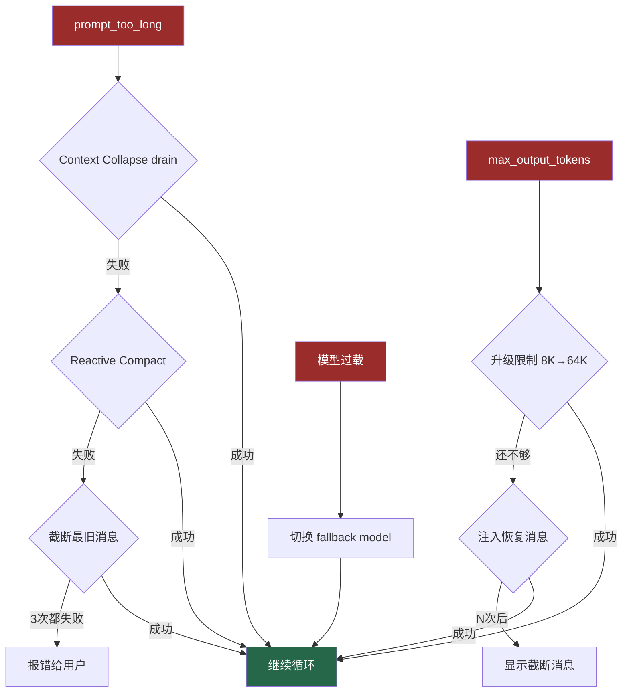

# 2. 多级错误恢复

> 源码位置: `src/query.ts` 第 1000-1300 行

## 概述

LLM API 调用会遇到多种错误。Claude Code 实现了**分层恢复**机制——从最轻量的恢复开始尝试，逐级升级到更重的操作，并用熔断器防止无限循环。

## 底层原理

### 三类错误的恢复链



### 恢复消息注入

当输出被截断时，注入的恢复消息非常精炼：

```
Output token limit hit. Resume directly — no apology, no recap of what 
you were doing. Pick up mid-thought if that is where the cut happened. 
Break remaining work into smaller pieces.
```

关键词："no apology, no recap"——防止模型浪费 token 说"抱歉，让我继续..."。

### 熔断机制

```typescript
const MAX_CONSECUTIVE_AUTOCOMPACT_FAILURES = 3

if (tracking?.consecutiveFailures >= MAX_CONSECUTIVE_AUTOCOMPACT_FAILURES) {
  return { wasCompacted: false }  // 停止重试
}
```

源码注释：曾有 1,279 个会话出现 50+ 次连续失败（最多 3,272 次），每天浪费约 25 万次 API 调用。

## 设计原因

- **用户体验**：大多数错误自动恢复，用户无感知
- **成本控制**：熔断器防止失败循环浪费 API 调用
- **渐进式降级**：从最轻量的恢复开始，避免不必要的信息丢失

## 应用场景

::: tip 可借鉴场景
任何调用外部 API 的系统。三个原则：(1) 分层恢复，从轻到重；(2) 每层独立重试计数器；(3) 熔断器防止无限循环。
:::

## 关联知识点

- [ReAct 循环工程化](/claude_code_docs/agent/react-loop) — 错误恢复是循环的阶段 4
- [五层防爆体系](/claude_code_docs/context/five-layers) — Reactive Compact 是 L4 的紧急触发
