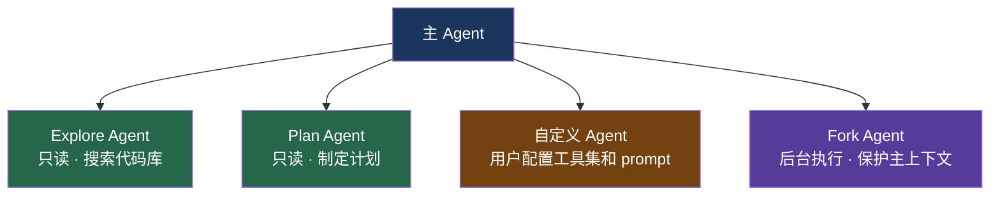
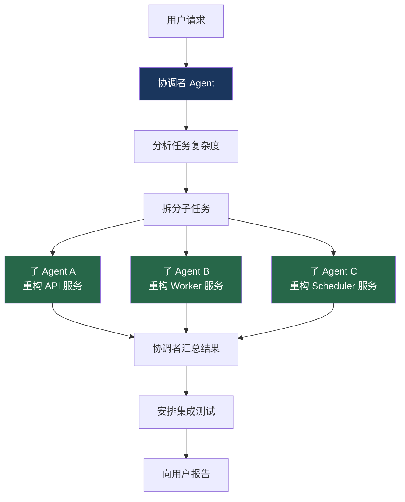

# 3. 子 Agent 委托

> 源码位置: `src/tools/AgentTool/runAgent.ts`

## 概述

主 agent 可以通过 `AgentTool` 启动子 agent 处理子任务。每个子 agent 运行独立的 ReAct 循环，有独立的上下文和工具集，但可以选择性地继承父 agent 的上下文以共享 prompt cache。

## 底层原理

### 子 Agent 类型



### 上下文隔离 vs 继承

| 特性 | 隔离 | 继承 |
|------|------|------|
| 消息历史 | 独立 | 可 fork 父上下文 (`forkContextMessages`) |
| readFileState | 独立实例 | 可 clone 父缓存 |
| agentId | 独立 UUID | — |
| transcript | 独立文件 | — |
| prompt cache | — | fork 时共享前缀 |
| CLAUDE.md | — | 只读 agent 跳过注入 |

### CLAUDE.md 裁剪

只读 agent（Explore/Plan）不需要项目规范（commit/PR/lint 规则），跳过 CLAUDE.md 注入节省 token：

```typescript
const shouldOmitClaudeMd =
  agentDefinition.omitClaudeMd &&
  !override?.userContext
// 节省 ~5-15 Gtok/week（34M+ Explore spawns）
```

### 自定义 Agent

除了预定义类型，用户可以在 `~/.claude/agents/` 目录下创建自定义 agent：

```markdown
# ~/.claude/agents/security-reviewer.md

---
name: security-reviewer
description: 安全代码审查专家
tools: ["FileRead", "Grep", "Glob"]
---

你是一个安全代码审查专家。你的任务是：
1. 查找 OWASP Top 10 安全漏洞
2. 检查输入验证和身份认证
3. 给出修复建议
```

主 agent 通过 `subagent_type: "security-reviewer"` 调用自定义 agent。自定义 agent 的工具集由配置文件限定，不能超出声明范围。

### 后台执行与 Git Worktree 隔离

子 agent 支持两种高级执行模式：

**后台执行**：不阻塞主对话，完成后通知结果。适合长时间运行的任务（如安全审计、大规模搜索）。

```typescript
{
  name: "Agent",
  input: {
    prompt: "对整个项目进行安全审计...",
    run_in_background: true
  }
}
```

**Worktree 隔离**：当多个子 agent 可能修改同一文件时，每个 agent 在独立的 git worktree 中工作：

```
主工作目录:    /Users/alice/project  (main 分支)
子 agent A:    /tmp/worktree-a/      (feature-auth 分支)
子 agent B:    /tmp/worktree-b/      (feature-db 分支)
```

完成后通过 Git 合并回主分支，避免并行修改冲突。

### 协调者模式：多 Agent 编排

对于大规模任务，Claude Code 支持协调者模式——一个协调者 agent 负责任务分解和结果汇总：



协调者模式的关键挑战：
- **冲突检测**：两个 agent 修改同一公共函数签名时，协调者需要识别依赖关系
- **资源控制**：每个 agent 是独立的 API 会话，并行工作时费用线性增长
- **智能调度**：简单任务不需要多 agent，协调者应评估任务复杂度后决定是否拆分

### 子 Agent 间的通信

子 agent 不能直接互相通信，只能通过**共享文件系统**间接交互：

```
子 Agent A 修改了 config.ts
子 Agent B 读取了 config.ts
→ B 看到了 A 的修改
```

这种"通过共享状态通信"的模式避免了复杂的消息传递协议，但也是 worktree 隔离存在的原因——防止并发写入冲突。

## 设计原因

- **上下文保护**：子 agent 的搜索结果不污染主 agent 上下文
- **并行化**：多个子 agent 可同时工作，worktree 隔离防止冲突
- **成本优化**：裁剪不需要的上下文（如 Explore agent 跳过 CLAUDE.md），节省 token
- **cache 共享**：fork 上下文时共享 prompt cache 前缀，避免重复付费
- **渐进复杂度**：简单任务用单 agent，复杂任务用子 agent，大规模任务用协调者模式——按需选择合适的编排层级

## 应用场景

::: tip 可借鉴场景
复杂任务分解。关键是找到隔离和共享的平衡点——完全隔离浪费 cache，完全共享会污染上下文。

适合多 agent 的场景：大规模重构（涉及很多文件）、需要不同专业知识的任务（前端 + 后端 + 测试）、可以明确拆分的独立子任务。

不适合的场景：简单的单文件修改、需要深度上下文的任务（子 agent 没有主对话的完整历史）、紧密耦合的工作（频繁需要协调的开销可能超过并行的收益）。
:::

## 关联知识点

- [ReAct 循环工程化](/claude_code_docs/agent/react-loop) — 子 agent 运行独立的 ReAct 循环
- [Prompt Cache 优化](/claude_code_docs/context/prompt-cache) — fork 上下文共享 cache
