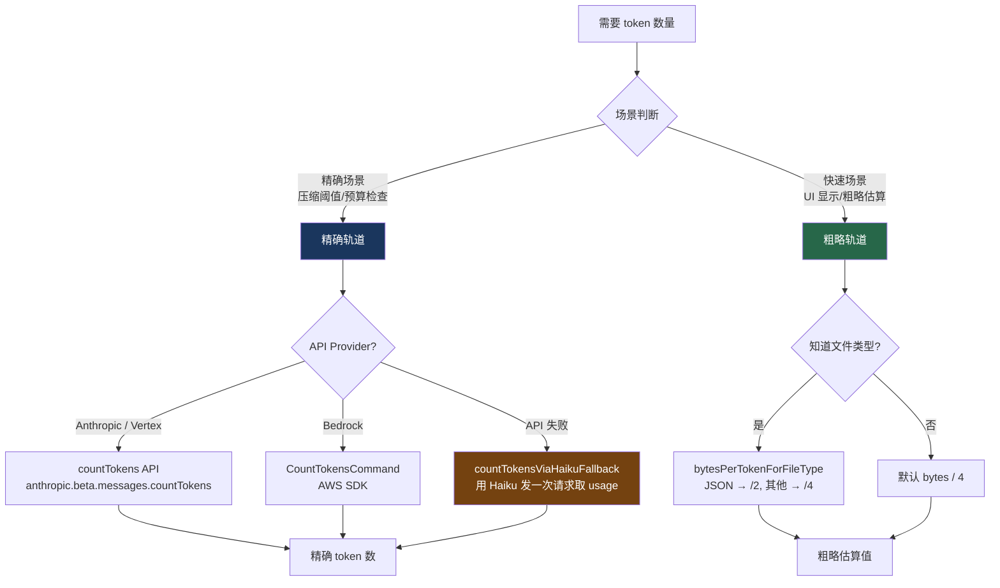

# 20. Token 估算双轨制

> 源码位置: `src/services/tokenEstimation.ts`

## 概述

Claude Code 需要在多个场景下估算 token 数量：自动压缩阈值判断、工具结果预算检查、上下文窗口利用率计算。源码实现了"精确"和"粗略"两条轨道：精确轨道调用 API 获取真实 token 数，粗略轨道用字节数除以系数快速估算。两条轨道各有适用场景，互为 fallback。

## 底层原理

### 双轨架构总览



### 精确轨道：countMessagesTokensWithAPI

直接调用 Anthropic 的 `countTokens` API，返回精确的 input_tokens 数：

```typescript
export async function countMessagesTokensWithAPI(
  messages: BetaMessageParam[],
  tools: BetaToolUnion[],
): Promise<number | null> {
  const model = getMainLoopModel()
  const betas = getModelBetas(model)

  if (getAPIProvider() === 'bedrock') {
    // Bedrock 走独立的 CountTokensCommand
    return countTokensWithBedrock({ model, messages, tools, betas, ... })
  }

  const anthropic = await getAnthropicClient({ maxRetries: 1, model, source: 'count_tokens' })
  const response = await anthropic.beta.messages.countTokens({
    model: normalizeModelStringForAPI(model),
    messages,
    tools,
    ...(containsThinking && {
      thinking: { type: 'enabled', budget_tokens: 1024 },
    }),
  })
  return response.input_tokens
}
```

Bedrock 的实现使用 AWS SDK 的 `CountTokensCommand`，需要将请求体序列化为 JSON 字节：

```typescript
async function countTokensWithBedrock({ model, messages, tools, ... }) {
  const client = await createBedrockRuntimeClient()
  const { CountTokensCommand } = await import('@aws-sdk/client-bedrock-runtime')
  const response = await client.send(new CountTokensCommand({
    modelId,
    input: {
      invokeModel: {
        body: new TextEncoder().encode(JSON.stringify(requestBody)),
      },
    },
  }))
  return response.inputTokens ?? null
}
```

### 粗略轨道：roughTokenCountEstimation

核心公式极其简单——字节数除以一个系数：

```typescript
export function roughTokenCountEstimation(
  content: string,
  bytesPerToken: number = 4,
): number {
  return Math.round(content.length / bytesPerToken)
}
```

但不同文件类型的 token 密度差异很大：

```typescript
export function bytesPerTokenForFileType(fileExtension: string): number {
  switch (fileExtension) {
    case 'json':
    case 'jsonl':
    case 'jsonc':
      return 2   // JSON 有大量单字符 token: { } : , "
    default:
      return 4   // 普通代码/文本
  }
}
```

### 各内容类型的粗略估算策略

| 内容类型 | 估算方式 | 说明 |
|---------|---------|------|
| 纯文本 | `length / 4` | 默认 4 bytes/token |
| JSON 文件 | `length / 2` | 单字符 token 多，密度高 |
| 图片/PDF | 固定 2000 | 匹配 API 实际计费，避免 base64 膨胀误导 |
| tool_use | `name + JSON.stringify(input)` 的长度 / 4 | 模型生成的 JSON 输入 |
| thinking | `thinking` 字段长度 / 4 | 思考内容 |
| 其他 block | `JSON.stringify(block)` 长度 / 4 | 兜底：序列化后估算 |

### Haiku Fallback：更便宜的精确计数

当 `countTokens` API 不可用时，用 Haiku（最便宜的模型）发一次 `messages.create` 请求，从 `usage` 字段取 token 数：

```typescript
export async function countTokensViaHaikuFallback(
  messages: BetaMessageParam[],
  tools: BetaToolUnion[],
): Promise<number | null> {
  // 选择最便宜的模型
  const model = isVertexGlobalEndpoint || isBedrockWithThinking
    ? getDefaultSonnetModel()   // Haiku 不可用时退回 Sonnet
    : getSmallFastModel()       // 通常是 Haiku

  const response = await anthropic.beta.messages.create({
    model, max_tokens: 1,  // 只要 usage，不要输出
    messages, tools,
  })

  const usage = response.usage
  return usage.input_tokens + (usage.cache_creation_input_tokens || 0)
       + (usage.cache_read_input_tokens || 0)
}
```

### 何时用哪条轨道

| 场景 | 轨道 | 原因 |
|------|------|------|
| 自动压缩阈值判断 | 精确 → 粗略 fallback | 阈值判断需要准确，但不能因 API 失败而阻塞 |
| 工具结果预算检查 | 粗略 | 高频调用，精确 API 太慢 |
| UI 显示 token 用量 | 粗略 | 用户只需大致数字 |
| 压缩后 token 验证 | Haiku fallback | 需要精确但 countTokens 可能不支持 |
| 文件大小预检 | 粗略 + 文件类型 | 快速判断是否超限 |

## 设计原因

- **双轨互补**：精确轨道保证关键决策的准确性，粗略轨道保证高频场景的性能
- **文件类型感知**：JSON 的 2 bytes/token 避免了严重低估——一个 100KB 的 JSON 文件如果按 4 bytes/token 估算会少算一半
- **图片/PDF 特殊处理**：base64 编码后的图片可能有 1MB+，但 API 实际只计费 ~2000 tokens，不做特殊处理会导致粗略估算偏差 100 倍以上
- **Haiku fallback**：用最便宜的模型做 token 计数，成本约为主模型的 1/10

## 应用场景

::: tip 可借鉴场景
任何需要管理 LLM 上下文窗口的应用。核心思路是"精确和粗略两条路"——关键决策用 API 精确计数，日常检查用字节估算。特别注意不同内容类型的 token 密度差异：JSON 比普通文本密度高一倍，图片/PDF 的 base64 编码会严重误导字节级估算。
:::

## 关联知识点

- [五层防爆体系](/claude_code_docs/context/five-layers) — L4 自动压缩的阈值判断依赖精确 token 计数
- [工具结果预算](/claude_code_docs/context/tool-budget) — 预算检查使用粗略估算
- [多 Provider 接口](/claude_code_docs/api/multi-provider) — 不同 Provider 的 countTokens 实现不同
