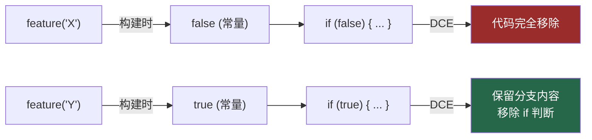

# 14. Feature Flag 编译期消除

> 源码位置: `build.ts` — Bun bundler 配置 + `bun:bundle` feature shim 插件

## 概述

Claude Code 使用 `feature()` API 实现编译期 feature flag，90+ 个 flag 在构建时被替换为布尔常量，bundler 的死代码消除（DCE）自动移除未启用功能的所有代码。这不是运行时的 `if/else` 分支——被禁用的功能在产物中**完全不存在**，既减小了包体积，也消除了运行时开销。

## 底层原理

### feature() API 的使用方式

```typescript
// 源码中的使用方式
import { feature } from 'bun:bundle'

if (feature('TRANSCRIPT_CLASSIFIER')) {
  // 这整个分支在 external build 中被消除
  const classifierModule = require('./classifierDecision.js')
  classifierModule.classify(...)
}

// 条件导入
const teamMemPaths = feature('TEAMMEM')
  ? require('../memdir/teamMemPaths.js')
  : null
```

### 构建时替换机制

```typescript
// build.ts
const featureFlags: Record<string, boolean> = {
  ABLATION_BASELINE: false,
  BASH_CLASSIFIER: false,
  BRIDGE_MODE: false,
  BUDDY: false,
  BUILTIN_EXPLORE_PLAN_AGENTS: true,   // 少数默认开启
  COMPACTION_REMINDERS: true,
  MCP_SKILLS: true,
  TOKEN_BUDGET: true,
  TRANSCRIPT_CLASSIFIER: false,
  // ... 90+ flags
}

// Bun bundler 插件拦截 bun:bundle 导入
plugins: [{
  name: 'bun-bundle-feature-shim',
  setup(build) {
    build.onResolve({ filter: /^bun:bundle$/ }, () => ({
      path: 'bun:bundle',
      namespace: 'bun-bundle-shim',
    }))
    build.onLoad({ filter: /.*/, namespace: 'bun-bundle-shim' }, () => ({
      contents: `
const features = { ${Object.entries(featureFlags)
  .map(([k, v]) => `'${k}': ${v}`)
  .join(', ')} };
export function feature(name) {
  if (name in features) return features[name];
  return false;  // 未知 flag 默认关闭
}`,
      loader: 'js',
    }))
  },
}]
```

### 死代码消除流程



### MACRO 常量注入

除了 feature flags，构建还注入了一组 MACRO 常量：

```typescript
define: {
  'MACRO.VERSION': JSON.stringify('2.1.88'),
  'MACRO.BUILD_TIME': JSON.stringify(new Date().toISOString()),
  'MACRO.ISSUES_EXPLAINER': JSON.stringify('report the issue at ...'),
  'MACRO.FEEDBACK_CHANNEL': JSON.stringify('https://github.com/...'),
  'MACRO.PACKAGE_URL': JSON.stringify('https://www.npmjs.com/...'),
  'MACRO.VERSION_CHANGELOG': JSON.stringify(''),
}
```

源码中直接使用 `MACRO.VERSION`，构建时被替换为字符串字面量：

```typescript
// 源码
const VERSION = typeof MACRO !== 'undefined' ? MACRO.VERSION : 'unknown'

// 构建后
const VERSION = "2.1.88"
```

### 与 webpack DefinePlugin 的对比

| 特性 | Claude Code (Bun) | webpack DefinePlugin |
|------|-------------------|---------------------|
| 替换时机 | 构建时（bundler 插件） | 构建时（loader 阶段） |
| 替换粒度 | 函数调用 `feature('X')` | 标识符 `process.env.X` |
| DCE 支持 | Bun 内置 | 需要 TerserPlugin |
| 类型安全 | `import { feature } from 'bun:bundle'` | 需要额外的 `.d.ts` |
| 未知 flag | 返回 `false`（fail-closed） | `undefined`（可能运行时错误） |
| 条件 require | 原生支持 | 需要 `require.context` |

关键区别：Claude Code 的 `feature()` 是一个**函数调用**，而不是全局变量替换。这意味着：
1. 有明确的导入来源（`bun:bundle`），IDE 可以跳转到定义
2. 未知 flag 返回 `false` 而不是 `undefined`，遵循 fail-closed 原则
3. 可以在表达式位置使用（三元运算符、`&&` 短路）

### 文本文件加载器

构建还包含一个文本文件加载器，将 `.md` 和 `.txt` 文件内联为字符串：

```typescript
{
  name: 'text-file-loader',
  setup(build) {
    build.onLoad({ filter: /\.(md|txt)$/ }, async (args) => {
      const contents = await fs.readFile(args.path, 'utf-8')
      return {
        contents: `export default ${JSON.stringify(contents)}`,
        loader: 'js',
      }
    })
  },
}
```

这让 system prompt 模板可以作为独立的 `.md` 文件维护，构建时自动内联。

## 设计原因

- **包体积**：90+ 个 flag 中大部分是 `false`（内部功能），DCE 移除了大量代码路径
- **运行时零开销**：不是运行时的 `if/else`，而是编译期常量折叠，V8 不需要做任何分支预测
- **fail-closed**：未知 flag 返回 `false`，新功能默认关闭，必须显式启用
- **内部/外部构建分离**：同一份源码通过不同的 flag 配置生成内部版和外部版，ant-only 功能在外部版中完全不存在

## 应用场景

::: tip 可借鉴场景
任何需要在同一代码库中维护多个构建变体的项目（内部版/外部版、免费版/付费版）。核心思想是用编译期常量替代运行时分支，让 bundler 的 DCE 自动清理。`feature()` 函数 + fail-closed 默认值的模式比 `process.env.X` 更安全、更可维护。
:::

## 关联知识点

- [System Prompt 分区缓存](/claude_code_docs/build/prompt-section) — 文本文件加载器内联 prompt 模板
- [CLAUDE.md 发现机制](/claude_code_docs/data/claudemd) — feature flag 控制 TeamMem 等功能的启用
