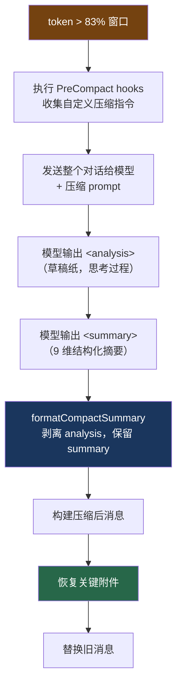

# 7. 压缩摘要的意图保持

> 源码位置: `src/services/compact/prompt.ts`, `src/services/compact/compact.ts`

## 概述

全量压缩后，10 万 token 的对话被压缩成 ~5000 token 的摘要。核心挑战是：**如何不"忘记"自己在做什么？** Claude Code 用 9 维结构化摘要 + 草稿纸模式 + 逐字引用来解决意图漂移问题。

## 底层原理

### 压缩的完整流程



### 9 维结构化摘要

| # | 维度 | 解决的"遗忘"风险 |
|---|------|-----------------|
| 1 | Primary Request and Intent | 忘记用户最初要做什么 |
| 2 | Key Technical Concepts | 丢失技术决策上下文（"我们选了 JWT 而不是 session"） |
| 3 | Files and Code Sections | 忘记代码细节（要求含完整代码片段） |
| 4 | Errors and fixes | 重复犯同样的错误 |
| 5 | Problem Solving | 丢失推理链 |
| 6 | **All user messages** | **最关键——用户反馈被丢失** |
| 7 | Pending Tasks | 忘记还有什么没做 |
| 8 | Current Work | 不知道压缩前在做什么 |
| 9 | Optional Next Step | 意图漂移（要求逐字引用原文） |

第 6 维特别重要：用户的消息往往很短（"改一下这个函数"、"不对，用另一种方式"），但它们是理解意图变化的关键。

### 防漂移的三重保障

**1. 草稿纸模式（`<analysis>`）**

要求模型先在 `<analysis>` 中思考，再在 `<summary>` 中输出。`<analysis>` 提高摘要质量但不进入最终上下文：

```typescript
function formatCompactSummary(summary) {
  // 剥离 analysis（草稿纸）
  formattedSummary = formattedSummary.replace(
    /<analysis>[\s\S]*?<\/analysis>/, ''
  )
  // 提取 summary 内容
  const summaryMatch = formattedSummary.match(/<summary>([\s\S]*?)<\/summary>/)
  // ...
}
```

**2. 逐字引用要求**

```
If there is a next step, include direct quotes from the most recent 
conversation showing exactly what task you were working on and where 
you left off. This should be verbatim to ensure there's no drift in 
task interpretation.
```

每次压缩都会引入信息损失。如果摘要用模型自己的话重新表述任务，经过多次压缩后，任务描述可能逐渐偏离原始意图（"传话游戏"效应）。逐字引用打断了这个漂移链。

**3. 续接指令**

```
Continue the conversation from where it left off without asking the user 
any further questions. Resume directly — do not acknowledge the summary, 
do not recap what was happening, do not preface with "I'll continue" or 
similar. Pick up the last task as if the break never happened.
```

### 压缩后的上下文恢复

摘要只是文字描述，模型继续工作还需要"活的"上下文：

```typescript
const POST_COMPACT_MAX_FILES_TO_RESTORE = 5       // 最近 5 个文件
const POST_COMPACT_MAX_TOKENS_PER_FILE = 5_000    // 每个最多 5K token
const POST_COMPACT_MAX_TOKENS_PER_SKILL = 5_000   // 每个 skill 最多 5K
const POST_COMPACT_SKILLS_TOKEN_BUDGET = 25_000    // skills 总预算 25K
```

恢复的内容：
- 最近读过的文件（从 `readFileState` 缓存取出）
- 当前 plan 文件
- 已调用的 skills 内容
- MCP 指令 delta
- 工具 schema delta
- transcript 路径（外部记忆保底）

### 压缩后的消息结构

```typescript
function buildPostCompactMessages(result) {
  return [
    result.boundaryMarker,       // 1. 分界标记（system 消息，不发给 API）
    ...result.summaryMessages,   // 2. 摘要（伪用户消息）
    ...(result.messagesToKeep),  // 3. 保留的原始消息（部分压缩时）
    ...result.attachments,       // 4. 恢复的附件
    ...result.hookResults,       // 5. SessionStart hooks 输出
  ]
}
```

## 设计原因

- **结构化模板**：9 个维度确保不遗漏关键信息类型
- **草稿纸模式**：提高摘要质量但不浪费上下文空间
- **逐字引用**：打断多次压缩的意图漂移链
- **续接指令**：防止模型浪费 token 做无用的"回顾"
- **上下文恢复**：摘要 + 活文件 + 外部记忆，三层保障

## 应用场景

::: tip 可借鉴场景
任何需要长对话摘要的系统。三个关键设计可以直接复用：(1) 结构化模板确保覆盖面；(2) 原文引用防止漂移；(3) 续接指令防止废话。
:::

## 关联知识点

- [五层防爆体系](/claude_code_docs/context/five-layers) — 压缩是 L4 的核心
- [Prompt Cache 优化](/claude_code_docs/context/prompt-cache) — 压缩后的消息结构影响 cache
- [会话持久化](/claude_code_docs/data/session) — transcript 作为外部记忆
