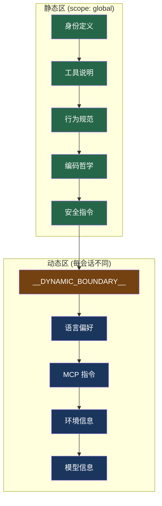

# 8. Prompt Cache 优化策略

> 源码位置: `src/constants/prompts.ts`, `src/utils/api.ts`, `src/constants/systemPromptSections.ts`

## 概述

Anthropic API 的 prompt cache 基于前缀匹配——如果两次请求的 system prompt + 消息前缀相同，第二次可以复用缓存，节省 90% 输入 token 成本。Claude Code 的设计处处围绕"不破坏缓存前缀"展开。

## 底层原理

### System Prompt 静态/动态分区



`SYSTEM_PROMPT_DYNAMIC_BOUNDARY` 是一个标记字符串，分隔静态内容和动态内容。静态区可以跨用户缓存（`scope: 'global'`），动态区每会话不同。

### Context 注入位置的选择

| 内容 | 注入位置 | 原因 |
|------|---------|------|
| systemContext (git status) | system prompt 末尾 | 会话级不变，可被缓存 |
| userContext (CLAUDE.md + 日期) | 第一条伪用户消息 | 可能很大(40K+)，放 system 里变化时会打破缓存 |

```typescript
// src/utils/api.ts

// systemContext 追加到 system prompt 末尾
function appendSystemContext(systemPrompt, context) {
  return [...systemPrompt, "gitStatus: ..."]
}

// userContext 作为伪用户消息注入
function prependUserContext(messages, context) {
  return [
    createUserMessage({
      content: `<system-reminder>...CLAUDE.md 内容...</system-reminder>`,
      isMeta: true,  // UI 不显示
    }),
    ...messages,
  ]
}
```

### 声明式 Prompt 段管理

```typescript
// src/constants/systemPromptSections.ts

// 可缓存的段
systemPromptSection('memory', () => loadMemoryPrompt())

// 不可缓存的段（每轮可能变化）
DANGEROUS_uncachedSystemPromptSection(
  'mcp_instructions',
  () => getMcpInstructionsSection(mcpClients),
  'MCP servers connect/disconnect between turns'
)
```

`DANGEROUS_` 前缀是一个命名约定，提醒开发者这个段会破坏缓存，需要谨慎使用。

### 微压缩的 cache_edits 路径

微压缩有两条路径，其中 cache_edits 路径专门为不破坏缓存设计：

- **cache_edits 路径**：在服务端删除旧工具结果的缓存内容，不修改本地消息 → 缓存前缀不变
- **时间触发路径**：缓存已过期，直接修改本地消息 → 反正缓存已冷，无额外成本

### 决策冻结与 cache 稳定性

`ContentReplacementState` 的冻结机制（详见 [工具结果预算](/claude_code_docs/context/tool-budget)）确保每个 tool_result 的内容在整个会话中保持稳定。被替换的结果每轮用 Map 查找重新应用完全相同的字符串，保证字节级一致。

## 设计原因

- **成本**：prompt cache 命中节省 90% 输入 token 成本
- **延迟**：缓存命中时首 token 延迟显著降低
- **稳定性**：所有设计（分区、注入位置、决策冻结、cache_edits）都服务于"不破坏缓存前缀"

### 缓存优化的工程细节

**工具按名字排序**：工具定义是 system prompt 的一部分。如果工具顺序变了，缓存就失效。按名字排序确保每次顺序一致——一行排序代码换来持续的缓存命中。

**惰性精确计算**：token 计数是频繁操作。精确计算需要 API 调用（~100ms），估算几乎零成本。90% 的时间用 `Math.ceil(text.length / 4)` 估算，只在接近上下文窗口阈值时才调用精确计算。

**并行预加载**：启动时的密钥读取（~60ms）和模块导入（~130ms）互不依赖，并行执行将启动时间从 210ms 压缩到 130ms。

**延迟加载**：未启用的功能模块（Voice、Browser）使用 `require()` 而非 `import`，不会被加载到内存。90% 的用户不用语音功能，50ms 的加载时间就是浪费。

**LRU 文件缓存**：同一次对话中多次读取同一文件时，LRU 缓存（容量 100 个文件）避免重复磁盘 I/O。缓存满时淘汰最久没用过的条目。

这些优化遵循一个共同原则：**80% 的性能问题来自 20% 的代码**。提示缓存（~100 行代码改动，节省 90% 费用）和工具排序（一行代码，保持缓存命中）是投入产出比最高的优化。

## 应用场景

::: tip 可借鉴场景
任何使用 Anthropic API 的应用。核心原则：(1) 不变的内容放前面（可缓存），变化的内容放后面；(2) 大的动态内容放用户消息而非 system prompt；(3) 用声明式标注区分可缓存和不可缓存的段。
:::

## 关联知识点

- [工具结果预算](/claude_code_docs/context/tool-budget) — 决策冻结保证 cache 稳定
- [五层防爆体系](/claude_code_docs/context/five-layers) — 微压缩的 cache_edits 路径
- [Prompt 分区缓存](/claude_code_docs/build/prompt-section) — 声明式 prompt 段管理
