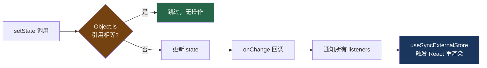

# 18. 极简状态管理

> 源码位置: `src/state/store.ts` — 20 行的 `createStore` 实现

## 概述

Claude Code 没有使用 Redux、Zustand 或任何第三方状态管理库，而是用 **20 行代码**实现了一个完整的状态管理方案。`createStore` 返回 `getState`、`setState`、`subscribe` 三个方法，天然兼容 React 18 的 `useSyncExternalStore`，实现了从状态变更到 UI 更新的完整链路。

## 底层原理

### 完整实现

```typescript
type Listener = () => void
type OnChange<T> = (args: { newState: T; oldState: T }) => void

type Store<T> = {
  getState: () => T
  setState: (updater: (prev: T) => T) => void
  subscribe: (listener: Listener) => () => void
}

function createStore<T>(initialState: T, onChange?: OnChange<T>): Store<T> {
  let state = initialState
  const listeners = new Set<Listener>()

  return {
    getState: () => state,

    setState: (updater: (prev: T) => T) => {
      const prev = state
      const next = updater(prev)
      if (Object.is(next, prev)) return  // 引用相等 → 跳过
      state = next
      onChange?.({ newState: next, oldState: prev })
      for (const listener of listeners) listener()
    },

    subscribe: (listener: Listener) => {
      listeners.add(listener)
      return () => listeners.delete(listener)
    },
  }
}
```

### 与 React 的集成

`createStore` 的 API 天然匹配 `useSyncExternalStore` 的签名：

```typescript
// React 18 的 useSyncExternalStore 需要：
// 1. subscribe(callback) → unsubscribe  ✓ store.subscribe
// 2. getSnapshot() → state              ✓ store.getState

// 在 Claude Code 中的使用
function useAppState<T>(selector: (state: AppState) => T): T {
  return useSyncExternalStore(
    store.subscribe,
    () => selector(store.getState()),
  )
}

function useSetAppState() {
  return store.setState
}

// 组件中使用
function MyComponent() {
  const verbose = useAppState(s => s.verbose)
  const mode = useAppState(s => s.toolPermissionContext.mode)
  const setAppState = useSetAppState()

  // 更新状态
  setAppState(prev => ({ ...prev, verbose: !prev.verbose }))
}
```

### 状态变更流程



### 与 Redux/Zustand 的对比

| 特性 | createStore | Redux | Zustand |
|------|------------|-------|---------|
| 代码量 | ~20 行 | ~2000 行 | ~300 行 |
| 依赖 | 零 | redux + react-redux | zustand |
| Middleware | 无 | 丰富的中间件生态 | 内置中间件 |
| DevTools | 无 | Redux DevTools | Redux DevTools 适配 |
| Selector | 手动 + useSyncExternalStore | useSelector + reselect | 内置 selector |
| 不可变更新 | 手动展开 `{...prev, ...}` | 手动或 Immer | 手动或 Immer |
| 类型推断 | 完美（泛型直传） | 需要额外类型定义 | 良好 |
| 包体积 | 0 KB | ~7 KB (min+gzip) | ~1 KB (min+gzip) |

### 为什么不需要更多？

Claude Code 的状态管理需求相对简单：

1. **单一 store**：整个应用只有一个 `AppState`，不需要多 store 组合
2. **同步更新**：状态变更都是同步的，不需要异步 action 或 thunk
3. **无中间件需求**：没有日志、持久化等中间件需求（日志走 analytics，持久化走 JSONL）
4. **onChange 回调**：替代了 Redux 的 subscriber middleware，用于副作用（如持久化状态变更）

### 在代码库中的广泛使用

`useSyncExternalStore` 模式不仅用于 AppState，还用于多个独立的状态源：

```typescript
// 命令队列
const queueSnapshot = useSyncExternalStore(
  subscribeToCommandQueue,
  getCommandQueueSnapshot,
)

// 查询守卫（是否有活跃查询）
const isQueryActive = useSyncExternalStore(
  queryGuard.subscribe,
  queryGuard.getSnapshot,
)

// 终端焦点状态
useSyncExternalStore(subscribeTerminalFocus, getTerminalFocusSnapshot)

// 分类器检查状态
useSyncExternalStore(subscribeClassifierChecking, () => isClassifierChecking(id))

// 文本选择状态
useSyncExternalStore(ink.subscribeToSelectionChange, ink.hasTextSelection)

// 虚拟滚动
useSyncExternalStore(subscribe, () => Math.floor(scrollTop / SCROLL_QUANTUM))
```

每个状态源都遵循相同的 `subscribe + getSnapshot` 模式，形成了一个统一的响应式数据流。

### Object.is 的精妙之处

```typescript
if (Object.is(next, prev)) return
```

这一行看似简单，但有重要的性能含义：

- `setState(prev => prev)` — 无操作，不触发重渲染
- `setState(prev => ({ ...prev }))` — 新对象，触发重渲染（即使内容相同）
- 这迫使调用者只在真正需要更新时创建新对象，避免了不必要的渲染

## 设计原因

- **极简**：20 行代码覆盖了所有需求，没有任何多余的抽象层
- **零依赖**：不引入任何第三方库，减少包体积和供应链风险
- **类型安全**：泛型直传，TypeScript 推断完美工作，不需要额外的类型定义
- **React 18 原生**：`useSyncExternalStore` 是 React 官方推荐的外部状态集成方式，比 `useEffect` + `useState` 更安全（无 tearing）
- **可组合**：同一个模式用于 AppState、命令队列、查询守卫等多个独立状态源

## 应用场景

::: tip 可借鉴场景
任何中小型 React 应用的状态管理。如果你的需求是"一个全局状态 + 几个独立状态源"，20 行的 `createStore` + `useSyncExternalStore` 就够了。不需要 Redux 的中间件生态，不需要 Zustand 的 API 糖衣。关键洞察：React 18 的 `useSyncExternalStore` 已经解决了外部状态同步的核心问题，你只需要提供 `subscribe` 和 `getSnapshot`。
:::

## 关联知识点

- [全屏模式的消息管理](/claude_code_docs/ui/fullscreen) — `useAppState` 驱动 REPL 的状态更新
- [自研 Ink 渲染引擎](/claude_code_docs/ui/ink-engine) — 状态变更触发 Ink 的重渲染管线
