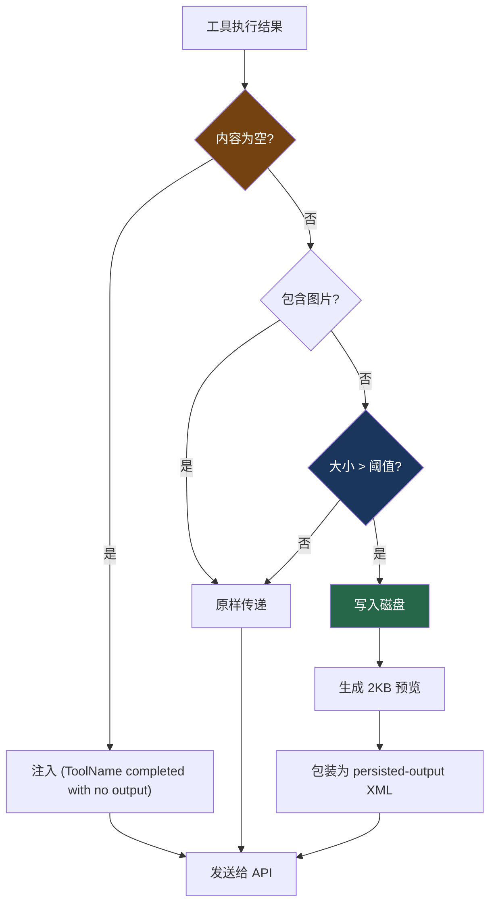

# 11. 工具结果落盘

> 源码位置: `src/utils/toolResultStorage.ts` — `persistToolResult()`, `buildLargeToolResultMessage()`, `enforceToolResultBudget()`

## 概述

当工具执行结果超过阈值（默认 50K 字符），Claude Code 不会截断内容，而是将完整结果**写入磁盘**，只给模型一个 2KB 预览 + 文件路径。模型可以随时用 Read 工具回查完整内容。这个机制是五层上下文防爆体系的 L1 层，也是整个系统中触发频率最高、成本最低的防御手段。

## 底层原理

### persistToolResult 流程

```typescript
async function persistToolResult(
  content: ToolResultBlockParam['content'],
  toolUseId: string,
): Promise<PersistedToolResult | PersistToolResultError> {
  await ensureToolResultsDir()
  const filepath = getToolResultPath(toolUseId, isJson)
  const contentStr = isJson ? JSON.stringify(content, null, 2) : content

  // 关键：用 'wx' flag 写入，如果文件已存在则跳过
  // tool_use_id 是唯一的，内容是确定性的
  // 防止微压缩重放时重复写入
  try {
    await writeFile(filepath, contentStr, { encoding: 'utf-8', flag: 'wx' })
  } catch (error) {
    if (getErrnoCode(error) !== 'EEXIST') {
      return { error: getFileSystemErrorMessage(error) }
    }
    // EEXIST: 之前的轮次已经写过了，跳过
  }

  const { preview, hasMore } = generatePreview(contentStr, 2000)
  return { filepath, originalSize: contentStr.length, isJson, preview, hasMore }
}
```

### 2KB 预览生成

```typescript
function generatePreview(content: string, maxBytes: number) {
  if (content.length <= maxBytes) {
    return { preview: content, hasMore: false }
  }

  const truncated = content.slice(0, maxBytes)
  const lastNewline = truncated.lastIndexOf('\n')

  // 在换行符边界截断，避免切断一行的中间
  const cutPoint = lastNewline > maxBytes * 0.5 ? lastNewline : maxBytes

  return { preview: content.slice(0, cutPoint), hasMore: true }
}
```

### buildLargeToolResultMessage 格式

```typescript
function buildLargeToolResultMessage(result: PersistedToolResult): string {
  return `<persisted-output>
Output too large (${formatFileSize(result.originalSize)}). Full output saved to: ${result.filepath}

Preview (first ${formatFileSize(2000)}):
${result.preview}
${result.hasMore ? '...\n' : '\n'}</persisted-output>`
}
```

### 空结果注入

```typescript
// 空的 tool_result 会导致某些模型误判为轮次边界
// 注入一个短标记防止这种情况
if (isToolResultContentEmpty(content)) {
  return {
    ...toolResultBlock,
    content: `(${toolName} completed with no output)`,
  }
}
```

这个设计解决了一个微妙的 bug：空的 `tool_result` 在 prompt 尾部时，某些模型会输出 `\n\nHuman:` 停止序列并以零输出结束轮次。原因是服务端渲染器在 tool results 后不插入 `\n\nAssistant:` 标记，空内容的 `</function_results>\n\n` 模式匹配到了轮次边界。

### 落盘决策流程



### 阈值配置

```typescript
// 全局默认
const DEFAULT_MAX_RESULT_SIZE_CHARS = 50_000  // 50K 字符

// 每个工具可以声明自己的上限
maxResultSizeChars: number

// 实际阈值 = min(工具声明值, 全局默认值)
// 特殊：Infinity 表示永不落盘（如 Read 工具）
function getPersistenceThreshold(toolName, declaredMax) {
  if (!Number.isFinite(declaredMax)) return declaredMax  // Read 工具
  const override = growthBookOverrides?.[toolName]       // 远程配置覆盖
  if (override > 0) return override
  return Math.min(declaredMax, DEFAULT_MAX_RESULT_SIZE_CHARS)
}
```

Read 工具的 `maxResultSizeChars` 设为 `Infinity`，因为落盘 Read 的结果会创建循环：Read → 文件 → Read → 文件...

### 文件三剑客的安全分层

落盘机制与文件工具的安全设计紧密配合。三个文件工具（Read/Edit/Write）的危险等级递增，安全检查也递增：

| 工具 | 危险等级 | 安全检查 | 落盘行为 |
|------|---------|---------|---------|
| FileRead | 最低（只读） | 路径验证、2000 行限制 | `maxResultSizeChars: Infinity`（永不落盘） |
| FileEdit | 中等（精确修改） | 唯一性匹配、差异显示、历史追踪 | 正常落盘阈值 |
| FileWrite | 最高（覆写） | 路径验证 + 敏感文件检测 + **必须先读后写** | 正常落盘阈值 |

FileWrite 的"必须先读后写"规则值得注意——如果文件已存在但模型没有先 Read 过它，Write 会被拒绝。这防止了模型在不了解文件内容的情况下覆盖重要文件。

FileEdit 的唯一性要求也是一个精巧的设计：`old_string` 必须在文件中恰好匹配一次。如果有多个匹配，编辑失败并要求模型提供更多上下文。这比基于行号的替换更可靠——行号会因为插入/删除而变化，但文本内容是稳定的定位锚点。

### 文件操作的历史追踪

每次 FileEdit 和 FileWrite 操作都会被记录，支持回退：

```typescript
fileHistoryTrackEdit({
  path: "src/app.ts",
  previousContent: "旧内容...",
  newContent: "新内容...",
  timestamp: Date.now(),
  editType: "FileEdit",
})
```

这个历史记录与落盘机制互补——落盘保存工具输出的完整内容，历史追踪保存文件变更的完整记录。两者共同确保了信息的零损失。

### 消息级聚合预算

除了单工具阈值，还有消息级聚合预算（200K 字符）。当一条消息中多个工具结果的总大小超过预算时，最大的结果会被落盘替换：

```typescript
// ContentReplacementState 跨轮次追踪决策
type ContentReplacementState = {
  seenIds: Set<string>                    // 已处理的 tool_use_id
  replacements: Map<string, string>       // 已替换的 → 缓存的替换内容
}

// 决策一旦做出就冻结，保证 prompt cache 前缀稳定
// - 已替换的：每轮重新应用相同的替换（Map 查找，零 I/O）
// - 已见未替换的：永不替换（改变会破坏缓存前缀）
// - 新的：可以做新的替换决策
```

## 设计原因

- **零信息损失**：完整内容在磁盘上，模型可以随时回查，不像截断那样永久丢失数据
- **`wx` flag 幂等**：微压缩每轮重放消息时不会重复写入，利用文件系统的原子性保证
- **换行边界截断**：预览在换行符处截断，避免切断代码行的中间，提高可读性
- **空结果注入**：一行代码解决了一个影响多个模型的轮次边界混淆 bug
- **缓存前缀稳定**：聚合预算的决策冻结机制确保 prompt cache 不被破坏

## 应用场景

::: tip 可借鉴场景
任何需要处理大量工具输出的 AI agent 系统。核心思想是"磁盘作为溢出缓冲区"——不截断、不丢弃，而是落盘 + 预览。`wx` flag 的幂等写入和换行边界截断是两个值得直接复用的工程细节。空结果注入则是一个容易被忽视但影响很大的边界情况处理。
:::

## 关联知识点

- [五层上下文防爆体系](/claude_code_docs/context/five-layers) — 落盘是 L1 层的核心机制
- [工具结果预算](/claude_code_docs/context/tool-budget) — 消息级聚合预算的详细展开
- [工具类型系统](/claude_code_docs/tools/tool-type) — `maxResultSizeChars` 在 Tool 接口中的定义
