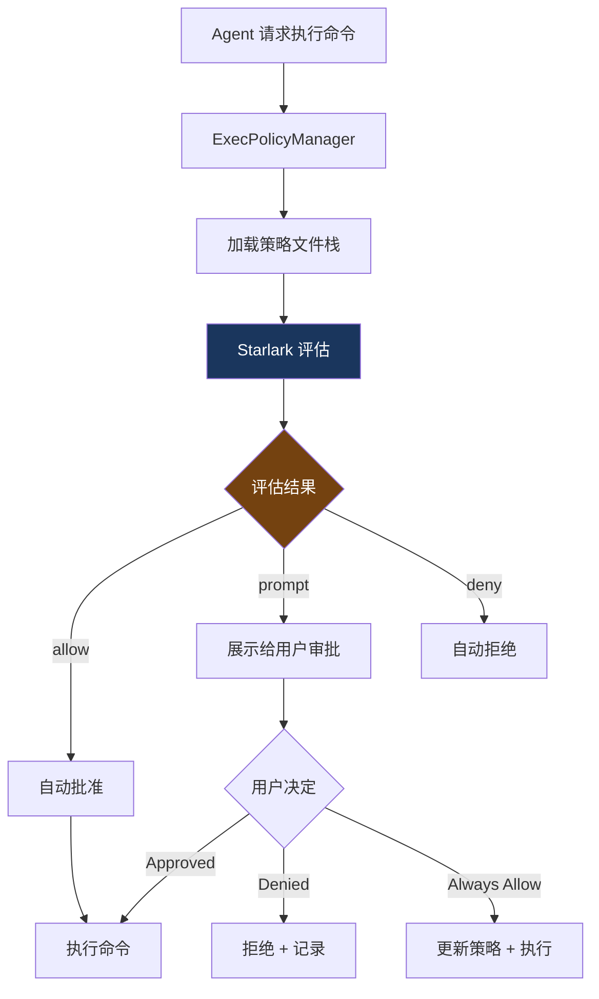

# 9. 策略引擎

> 源码位置: `codex-rs/execpolicy/`, `codex-rs/core/src/exec_policy.rs`

## 概述

Codex 的执行策略引擎使用 **Starlark**（Python 方言，由 Google 开发用于 Bazel）作为策略语言。比 Claude Code 的 `allow/deny` 规则更强大——可以编写条件逻辑、正则匹配、环境检查。

## 底层原理

### 策略评估流程



### ExecPolicyManager

```rust
// exec_policy.rs

struct ExecPolicyManager {
    policy: Arc<Policy>,  // 当前策略（原子引用计数，支持热更新）
}

impl ExecPolicyManager {
    // 为命令创建审批需求
    async fn create_exec_approval_requirement_for_command(
        &self, command: &[String]
    ) -> ApprovalRequirement {
        // 1. 将命令拆分为多个子命令（处理 && || ; 等）
        let (commands, has_pipe) = commands_for_exec_policy(command);
        
        // 2. 对每个子命令评估策略
        for cmd in commands {
            let evaluation = self.policy.evaluate(&cmd);
            match evaluation.decision {
                Allow => continue,
                Prompt(reason) => return ApprovalRequirement::Ask(reason),
                Deny(reason) => return ApprovalRequirement::Deny(reason),
            }
        }
        
        ApprovalRequirement::Allow
    }
    
    // 动态更新策略（用户选择 "Always Allow" 后）
    async fn append_amendment_and_update(&self, amendment: PolicyAmendment) {
        // 追加新规则到策略文件
        // 原子更新 Arc<Policy>
    }
    
    // 动态添加网络规则
    async fn append_network_rule_and_update(&self, domain: &str) {
        // 允许新的域名访问
    }
}
```

### 策略文件层叠

```
策略文件加载顺序（后者覆盖前者）：
  1. 系统默认策略（内置）
  2. 用户策略（~/.codex/exec-policy.star）
  3. 项目策略（.codex/exec-policy.star）
  4. 运行时修改（用户选择 "Always Allow"）
```

### 命令规范化

```rust
// command_canonicalization.rs

// 在策略评估前，命令会被规范化：
// - 展开别名（alias）
// - 解析管道（|）和链接（&&, ||, ;）
// - 提取实际的可执行文件路径
// - 标准化参数格式

// 这防止了通过别名或路径变体绕过策略
```

### 与 Claude Code 权限系统的对比

| 维度 | Codex (Starlark) | Claude Code (allow/deny) |
|------|-----------------|-------------------------|
| 策略语言 | Starlark（可编程） | JSON 规则（声明式） |
| 条件逻辑 | 支持 if/else、循环 | 不支持 |
| 正则匹配 | 支持 | 通配符（*） |
| 环境检查 | 可以检查环境变量、文件存在等 | 不支持 |
| 动态更新 | 追加 amendment | 修改 settings.json |
| 命令规范化 | 有（防绕过） | 基础（工具名匹配） |
| 策略层叠 | 系统 → 用户 → 项目 → 运行时 | Managed → User → Project → Local |

## 设计原因

- **可编程**：Starlark 比声明式规则更灵活，可以表达复杂的审批逻辑
- **防绕过**：命令规范化确保别名和路径变体不能绕过策略
- **渐进式信任**：用户选择 "Always Allow" 后自动更新策略
- **层叠覆盖**：项目级策略可以覆盖用户级，适合团队协作

## 关联知识点

- [审批流程](/codex_docs/execpolicy/approval-flow) — 策略评估后的审批 UI
- [沙箱架构](/codex_docs/sandbox/architecture) — 策略之下的沙箱层
