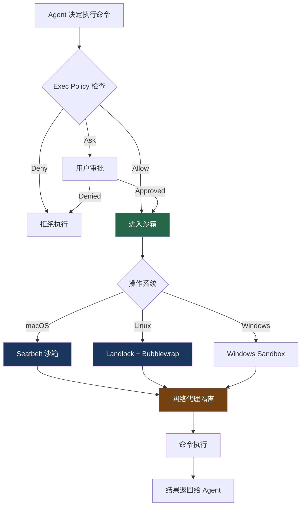

# 5. 沙箱架构总览

> 源码位置: `codex-rs/sandboxing/`, `codex-rs/core/src/seatbelt.rs`, `codex-rs/core/src/landlock.rs`, `go_sandbox/`

## 概述

沙箱是 Codex 与其他 Agent Runtime 的**核心差异化**。所有命令在操作系统级别的隔离环境中执行，即使模型被 prompt injection 操纵，也无法突破沙箱边界。

## 底层原理

### 三层沙箱体系



### 沙箱策略结构

```rust
// codex-rs/protocol/src/permissions.rs

struct SandboxPolicy {
    // 文件系统策略
    filesystem: FileSystemSandboxPolicy {
        read_allow: Vec<PathBuf>,    // 允许读取的路径
        write_allow: Vec<PathBuf>,   // 允许写入的路径
        read_deny: Vec<PathBuf>,     // 禁止读取的路径
        write_deny: Vec<PathBuf>,    // 禁止写入的路径
    },
    
    // 网络策略
    network: NetworkSandboxPolicy {
        allowed_domains: Vec<String>,  // 允许访问的域名
        allow_local_binding: bool,     // 是否允许本地端口绑定
    },
}
```

### 子进程继承

所有由 Codex 生成的子进程**自动继承**沙箱约束。这意味着：

```
Codex 执行 `npm install`
  └── npm 进程在沙箱中运行
      └── npm 的子进程（node-gyp 等）也在沙箱中
          └── 无法逃逸
```

这是通过操作系统机制保证的（Seatbelt 的 `sandbox-exec`、Landlock 的内核级限制），不是应用层的检查。

### 沙箱 vs 权限系统

```
权限系统（Exec Policy）：
  - 应用层检查
  - 可以被绕过（如果有 bug）
  - 决定"是否允许执行"

沙箱（Seatbelt/Landlock）：
  - 操作系统级隔离
  - 无法被应用层绕过
  - 决定"执行时能访问什么"

两者互补：
  权限系统 → 决定是否执行
  沙箱 → 限制执行时的能力
```

### 与 Claude Code 沙箱的对比

| 维度 | Codex | Claude Code |
|------|-------|------------|
| macOS | Seatbelt（Rust 调用） | Seatbelt（TS 调用 sandbox-exec） |
| Linux | Landlock + Bubblewrap（Rust） | Bubblewrap（TS 调用 bwrap） |
| Windows | Windows Sandbox RS | 不支持 |
| 策略语言 | Starlark（可编程） | JSON 配置 |
| 网络隔离 | 专用网络代理（network-proxy crate） | allowedDomains 配置 |
| 进程加固 | 有（process-hardening crate） | 无 |
| escape hatch | 无（更严格） | 有（dangerouslyDisableSandbox） |
| Go 沙箱 | 有（go_sandbox/，策略生成） | 无 |

## 设计原因

- **纵深防御**：即使 Exec Policy 有 bug，沙箱仍然保护系统
- **零信任**：不信任模型的输出，所有命令都在隔离环境中执行
- **子进程安全**：操作系统级隔离确保子进程无法逃逸
- **无 escape hatch**：比 Claude Code 更严格，没有 `dangerouslyDisableSandbox`

## 应用场景

::: tip 可借鉴场景
任何需要执行不受信任代码的 Agent 系统。关键洞察：应用层的权限检查不够，需要操作系统级的隔离。Codex 的三层体系（策略 + 沙箱 + 网络代理）是目前最完善的 Agent 安全模型。
:::

## 关联知识点

- [macOS Seatbelt](/codex_docs/sandbox/seatbelt) — macOS 沙箱实现详解
- [Linux Landlock](/codex_docs/sandbox/landlock) — Linux 沙箱实现详解
- [网络代理隔离](/codex_docs/sandbox/network-proxy) — 网络层隔离
- [策略引擎](/codex_docs/execpolicy/policy-engine) — 沙箱之上的策略层
