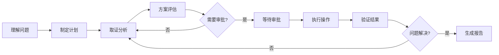
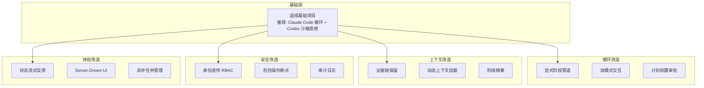

# 实战定制指南：从源码到你的业务场景

> 🎯 核心观点：照搬主流 Agent 源码不会给你最好的体验和最高的成功率。每个业务场景都有独特的约束，你需要知道哪些模块必须定制。

---

## 为什么不能直接抄？

四大开源项目（Claude Code、Codex CLI、Vercel AI SDK、Hermes Agent）都是为**编码场景**设计的。它们的核心假设是：

- 用户是开发者，能理解技术输出
- 工具主要是文件读写、命令执行、代码搜索
- 错误可以通过重试和模型自我修正解决
- 安全边界是文件系统和网络访问

但你的业务场景可能完全不同：

| 场景 | 核心约束 | 与编码 Agent 的差异 |
|------|---------|-------------------|
| **运维 Agent** | 操作不可逆、需要审批、证据链追踪 | 不能让模型"自由发挥"，必须有显式阶段和审批 |
| **客服 Agent** | 响应速度、情感理解、转人工时机 | 对话更短，但需要意图识别和状态机 |
| **数据分析 Agent** | 查询成本、结果准确性、数据安全 | 需要 query 预览和结果校验 |
| **金融 Agent** | 合规审计、操作幂等性、实时风控 | 每一步都需要审计日志和合规检查 |

直接照搬编码 Agent 的设计，你会遇到：
- **安全问题**：编码 Agent 的权限模型不适合生产环境操作
- **体验问题**：用户看不懂纯文本输出，需要结构化 UI
- **可靠性问题**：编码 Agent 的错误恢复策略不适合高风险操作
- **成本问题**：不同场景的 Token 消耗模式完全不同

---

## 七大模块的定制维度

### 1. Agent Loop — 你的业务需要什么样的循环？

**编码 Agent 的做法**：while(true) 循环，模型全权决定下一步，没有显式阶段划分。

**运维 Agent 需要改什么**：



- **显式阶段管道**：理解问题 → 制定计划 → 取证 → 分析 → 待审批 → 执行 → 验证 → 完成
- **双模式交互**：分析模式（只读，自由探索）vs 执行模式（需审批，每步确认）
- **计划前置**：默认先给排查/修复计划，审批通过后才执行
- **阶段回退**：验证失败时能回退到取证阶段，而不是从头开始

**客服 Agent 需要改什么**：

- **意图识别前置**：先判断用户意图，再决定走哪条处理流程
- **多轮对话状态机**：明确的状态转移（问候 → 问题收集 → 方案提供 → 确认 → 结束）
- **转人工触发条件**：情感分数低于阈值、连续 N 轮未解决、用户主动要求
- **满意度追踪**：每轮对话后评估用户满意度

**数据分析 Agent 需要改什么**：

- **查询规划阶段**：先生成查询计划，用户确认后再执行
- **结果校验循环**：每次查询结果都需要合理性检查
- **渐进式分析**：从概览到细节，逐步深入

**通用定制清单**：

- [ ] 你的业务是否需要显式阶段？
- [ ] 是否需要"计划先行、执行后置"？
- [ ] 是否需要双模式（分析/执行）？
- [ ] 循环的退出条件是什么？（不能只靠模型判断）
- [ ] 是否需要阶段回退机制？

---

### 2. 上下文压缩 — 你的对话有多长？

**编码 Agent 的做法**：Claude Code 有 7 层压缩防御，Hermes 有 2 层，核心目标是在长对话中保留关键信息。

**运维 Agent 需要改什么**：

- **证据链不可丢失**：诊断过程中的关键证据（日志片段、指标快照、拓扑信息）必须保留
- **阶段摘要**：每个阶段结束时生成结构化摘要，而不是等到上下文满了才压缩
- **操作审计保留**：所有执行过的操作和结果必须保留在上下文中，不能被压缩掉

**客服 Agent 需要改什么**：

- **对话通常较短**：大多数客服对话在 10 轮以内，压缩需求不大
- **用户信息优先保留**：用户描述的问题和偏好不能被压缩
- **历史工单摘要**：如果需要引用历史工单，用摘要而不是全文

**数据分析 Agent 需要改什么**：

- **查询结果保留策略**：大表结果只保留统计摘要和关键行
- **中间计算保留**：分析链路中的中间结果需要保留，用于回溯验证
- **Schema 信息常驻**：数据库 Schema 作为系统上下文，不参与压缩

**通用定制清单**：

- [ ] 你的对话平均多长？是否真的需要压缩？
- [ ] 哪些信息绝对不能被压缩掉？
- [ ] 是否需要阶段性摘要（而不是被动触发）？
- [ ] 压缩后是否需要保留审计日志？

---

### 3. 记忆系统 — 你需要记住什么？

**编码 Agent 的做法**：Claude Code 用 Markdown 文件 + Dream Mode 自动整合；Hermes 用插件化记忆 Provider。

**运维 Agent 需要改什么**：

- **SOP/Runbook 自动挂载**：根据当前告警类型，自动注入相关的标准操作流程
- **事件历史**：同类事件的历史处理记录，包括根因和修复方案
- **服务拓扑**：当前服务的依赖关系、上下游影响范围
- **环境状态快照**：当前环境的健康状态、最近变更记录

**客服 Agent 需要改什么**：

- **用户画像**：用户的偏好、历史问题、VIP 等级
- **工单历史**：相关的历史工单和解决方案
- **产品知识库**：FAQ、产品文档、政策条款
- **话术模板**：不同场景的标准回复模板

**数据分析 Agent 需要改什么**：

- **Schema 知识**：数据库表结构、字段含义、数据字典
- **查询模式**：常用的查询模板和优化技巧
- **业务指标定义**：KPI 的计算公式和业务含义
- **数据质量规则**：已知的数据质量问题和处理方式

**通用定制清单**：

- [ ] 你的 Agent 需要哪些领域知识？
- [ ] 知识是静态的（文档）还是动态的（实时数据）？
- [ ] 是否需要根据当前上下文动态注入知识？
- [ ] 跨会话记忆的保留策略是什么？

---

### 4. 错误恢复 — 你的容错要求是什么？

**编码 Agent 的做法**：工具失败时把错误信息回填给模型，让模型自己修正。Claude Code 有多级恢复策略。

**运维 Agent 需要改什么**：

- **零容忍静默失败**：任何操作失败都必须明确通知用户，不能让模型"悄悄重试"
- **执行后验证**：每次变更操作后，自动检查指标/日志/告警是否正常
- **回滚机制**：操作失败时能自动回滚到操作前状态
- **升级路径**：连续失败后自动升级到人工处理

**客服 Agent 需要改什么**：

- **优雅降级**：模型不确定时，给出"我不太确定，让我转接专家"而不是瞎猜
- **人工交接**：平滑的转人工机制，包括上下文传递
- **情感安抚**：检测到用户不满时，先安抚再解决问题

**数据分析 Agent 需要改什么**：

- **查询重试**：SQL 超时时自动优化查询或分批执行
- **结果校验**：检查查询结果的合理性（空结果、异常值、数据量级）
- **替代方案**：主查询失败时，尝试用近似查询或缓存数据

**通用定制清单**：

- [ ] 哪些错误是可以自动重试的？哪些必须人工介入？
- [ ] 是否需要操作回滚机制？
- [ ] 连续失败的升级路径是什么？
- [ ] 错误信息是否需要对用户友好化处理？

---

### 5. Token Budget — 你的成本约束是什么？

**编码 Agent 的做法**：Claude Code 有精细的 Token 预算管理，Hermes 动态计算，Vercel 完全交给使用者。

**不同场景的成本差异**：

| 场景 | 平均对话轮次 | 单次 Token 消耗 | 成本敏感度 |
|------|------------|---------------|-----------|
| 编码 Agent | 20-50 轮 | 高（大量代码上下文） | 中 |
| 运维 Agent | 10-30 轮 | 高（日志/指标数据） | 中 |
| 客服 Agent | 3-10 轮 | 低 | 高（量大） |
| 数据分析 Agent | 5-15 轮 | 中（查询结果） | 中 |

**定制要点**：

- **客服场景**：量大但单次消耗低，需要关注总成本和并发控制
- **运维场景**：单次消耗高（大量诊断数据），需要智能截断和摘要
- **数据分析**：查询结果可能很大，需要结果预览和按需加载

**通用定制清单**：

- [ ] 你的单次对话 Token 预算是多少？
- [ ] 是否需要按用户/租户分配预算？
- [ ] 工具结果的截断策略是什么？
- [ ] 是否需要成本监控和告警？

---

### 6. 推测执行 — 你需要预执行吗？

**编码 Agent 的做法**：Codex 在沙箱中推测执行命令；Claude Code 通过工具编排实现有限的并行。

**运维 Agent 需要改什么**：

- **Dry-run 是刚需**：任何变更操作都应该先 dry-run，展示预期影响
- **爆炸半径评估**：执行前评估操作影响的服务范围和用户数量
- **灰度执行**：支持先在小范围执行，确认无问题后再全量推广

**客服 Agent**：通常不需要推测执行。

**数据分析 Agent 需要改什么**：

- **Query EXPLAIN**：执行前先 EXPLAIN 查询计划，评估成本和时间
- **采样预览**：大查询先在采样数据上执行，确认逻辑正确后再全量

**通用定制清单**：

- [ ] 你的操作是否可逆？不可逆操作是否需要 dry-run？
- [ ] 是否需要爆炸半径评估？
- [ ] 是否需要灰度/分批执行？

---

### 7. 沙箱安全 — 你的安全边界在哪？

**编码 Agent 的做法**：Codex 用系统级沙箱（landlock/seatbelt）；Claude Code 用权限门控（43 个工具的 allow/deny 规则）。

**运维 Agent 需要改什么**：

- **身份透传（RBAC）**：Agent 执行操作时使用用户的身份和权限，而不是 Agent 自己的超级权限
- **危险操作断点**：高风险操作（重启服务、修改配置、扩缩容）必须人工确认
- **审计日志**：每一步操作都记录到审计系统，包括操作人、时间、内容、结果
- **操作白名单**：只允许执行预定义的操作集合，拒绝任意命令执行

**客服 Agent 需要改什么**：

- **PII 保护**：自动检测和脱敏个人信息（姓名、电话、地址）
- **回复过滤**：防止模型输出不当内容（歧视、误导、泄露内部信息）
- **操作范围限制**：客服 Agent 只能查询和提交工单，不能修改系统配置

**数据分析 Agent 需要改什么**：

- **查询沙箱**：SQL 只能执行 SELECT，禁止 DDL/DML
- **数据访问控制**：根据用户权限限制可查询的表和字段
- **结果脱敏**：敏感字段自动脱敏后再展示

**通用定制清单**：

- [ ] Agent 是否需要身份透传？
- [ ] 哪些操作需要人工审批？
- [ ] 是否需要审计日志？
- [ ] 敏感数据的脱敏策略是什么？

---

## 案例：运维 Agent 的改造清单

以下是一个完整的运维 Agent（AIOps Agent）改造案例，展示如何基于开源项目定制每个模块。

### 改造总览



### 7 大关键改造点

#### 1. 状态流式反馈

编码 Agent 的输出是纯文本流。运维 Agent 需要**多轨流式反馈**：

```
轨道 1: 阶段状态    [取证中] → [分析中] → [待审批] → [执行中] → [验证中]
轨道 2: 操作日志    正在查询 Prometheus 指标...  ✅ 获取到 CPU 使用率数据
轨道 3: 证据展示    📊 CPU 使用率: 95% (阈值: 80%)  📋 相关日志: 3 条异常
轨道 4: 结论/建议   初步判断: 内存泄漏导致 OOM，建议重启 Pod 并排查代码
```

#### 2. 人机协同与安全拦截

```
分析模式（只读）:
  ✅ 查询指标、日志、告警 → 自动执行，无需审批
  ✅ 查看服务拓扑、配置 → 自动执行

执行模式（需审批）:
  ⚠️ 重启 Pod/服务 → 需要审批
  ⚠️ 修改配置 → 需要审批 + dry-run
  🚫 删除资源 → 需要高级审批
  🚫 修改网络策略 → 需要高级审批
```

#### 3. Server-Driven UI

编码 Agent 输出 Markdown 文本。运维 Agent 需要**结构化 UI 卡片**：

| 卡片类型 | 内容 | 用途 |
|---------|------|------|
| 指标卡片 | 时序图 + 阈值线 + 异常标注 | 展示监控指标 |
| 日志卡片 | 高亮关键词 + 时间线 + 级别过滤 | 展示日志分析 |
| 拓扑卡片 | 服务依赖图 + 健康状态着色 | 展示影响范围 |
| 操作卡片 | 操作描述 + 预期影响 + 审批按钮 | 请求用户审批 |
| 对比卡片 | 操作前后指标对比 | 验证操作效果 |

#### 4. 异步任务与可打断性

编码 Agent 的操作通常秒级完成。运维操作可能需要分钟甚至小时：

- **后台任务**：长时间操作（滚动重启、数据迁移）在后台执行
- **进度推送**：定期推送执行进度和中间状态
- **硬停止**：用户可以随时中断，Agent 执行取消传播（停止后续操作、回滚已执行的部分）
- **断点续传**：中断后可以从上次的阶段继续

#### 5. 动态上下文挂载

编码 Agent 的上下文主要是代码和文件。运维 Agent 需要**动态注入运行时数据**：

```
每次 LLM 调用前自动注入:
├── 当前活跃告警（最近 1 小时）
├── 相关服务的健康状态
├── 最近的变更记录（部署、配置变更）
├── 相关的 SOP/Runbook
└── 同类事件的历史处理记录
```

#### 6. 证据优先

编码 Agent 可以直接给出结论。运维 Agent 的每个结论都必须**引用证据来源**：

```
❌ 错误示范: "服务 A 出现了内存泄漏"
✅ 正确示范: "服务 A 出现了内存泄漏 [证据: Prometheus 内存指标显示
   过去 2 小时持续增长 (从 2GB → 7.8GB)，GC 频率从 5次/分 → 47次/分]"
```

#### 7. 执行后自动验证

编码 Agent 执行完就结束。运维 Agent 每次变更后都需要**自动验证**：

```
执行操作: 重启 Pod service-a-pod-xyz
  ↓
自动验证清单:
  ✅ Pod 状态: Running (30 秒内恢复)
  ✅ 健康检查: 通过
  ✅ CPU 使用率: 45% (正常范围)
  ✅ 内存使用: 1.2GB (正常范围)
  ⚠️ 错误日志: 发现 2 条新的 WARN 日志 (非关键)
  ✅ 上游服务: 无影响
  ✅ 下游服务: 无影响
验证结论: 操作成功，服务恢复正常
```

---

## 定制决策矩阵

根据你的业务场景，快速判断哪些模块需要定制：

| 定制维度 | 编码 Agent | 运维 Agent | 客服 Agent | 数据分析 Agent |
|---------|-----------|-----------|-----------|--------------|
| 显式阶段管道 | 可选 | **必须** | 推荐 | 可选 |
| 计划前置审批 | 不需要 | **必须** | 不需要 | 推荐 |
| 身份透传 RBAC | 基础 | **必须** | 基础 | 推荐 |
| 证据链追踪 | 不需要 | **必须** | 推荐 | 推荐 |
| 执行后验证 | 测试通过即可 | **必须** | 不需要 | 结果校验 |
| 结构化 UI 卡片 | 可选 | **必须** | 推荐 | **必须** |
| 动态上下文注入 | Git/代码状态 | 告警/拓扑/SOP | 用户画像/工单 | Schema/指标 |
| 异步长任务 | 不需要 | **必须** | 不需要 | 推荐 |
| 可打断性 | 基础 | **必须** | 基础 | 推荐 |
| PII 保护 | 不需要 | 基础 | **必须** | 推荐 |
| 操作回滚 | Git revert | **必须** | 不需要 | 不需要 |
| Dry-run 预执行 | 不需要 | **必须** | 不需要 | Query EXPLAIN |
| 成本监控 | 可选 | 推荐 | **必须**（量大） | 推荐 |

**图例**：**必须** = 不做就上不了生产；推荐 = 做了体验明显提升；可选 = 锦上添花；不需要 = 场景不适用

---

## 从源码到产品的改造路径

### Step 1: 选择基础项目

```
你的场景是什么？
├── 需要最成熟的循环和压缩 → 参考 Claude Code
├── 需要框架级灵活性 → 参考 Vercel AI SDK
├── 安全隔离是第一优先级 → 参考 Codex CLI
├── 需要多平台和技能扩展 → 参考 Hermes Agent
└── 综合需求 → 取各家之长
```

### Step 2: 映射业务需求到模块

对照上面的定制决策矩阵，标记每个模块的定制优先级：

1. **P0（必须）**：不做就无法上线的改造
2. **P1（重要）**：做了体验明显提升
3. **P2（可选）**：后续迭代再做

### Step 3: 改造核心循环

这是最重要的一步。根据你的业务流程，设计 Agent Loop：

1. 定义阶段（stages）和状态转移规则
2. 确定每个阶段的工具集合和权限
3. 实现阶段间的数据传递和上下文管理
4. 设计退出条件和超时处理

### Step 4: 添加领域工具

为你的业务场景开发专用工具：

- 运维：Prometheus 查询、日志搜索、K8s 操作、配置管理
- 客服：工单系统、知识库搜索、用户信息查询、满意度评估
- 数据分析：SQL 执行、图表生成、报表导出、数据校验

### Step 5: 实现安全控制

根据定制决策矩阵中标记为"必须"的安全项：

1. 身份透传和权限检查
2. 操作审批流程
3. 审计日志记录
4. 敏感数据脱敏

### Step 6: 测试与验证

- **功能测试**：每个阶段的正常流程和异常流程
- **安全测试**：权限绕过、注入攻击、数据泄露
- **性能测试**：Token 消耗、响应延迟、并发处理
- **用户测试**：真实场景的端到端测试

---

## 面试中如何展示定制能力

在面试中，展示你对 Agent 定制的理解比背诵源码更有价值。推荐的叙事结构：

> "我研究了四大 Agent Runtime 的源码，理解了它们的设计权衡。但我认为直接照搬是不够的——每个业务场景都有独特的约束。
>
> 以运维 Agent 为例，我会做这些改造：
> 1. **循环改造**：从自由循环改为显式阶段管道，加入计划前置和审批机制
> 2. **安全改造**：身份透传 + 操作白名单 + 审计日志
> 3. **体验改造**：多轨流式反馈 + 结构化 UI 卡片
> 4. **可靠性改造**：执行后自动验证 + 回滚机制
>
> 这些改造的核心思路是：编码 Agent 信任模型的判断，运维 Agent 信任但验证（Trust but Verify）。"

这种回答展示了：
- 你读过源码，理解设计原理
- 你能跳出源码，思考业务需求
- 你有系统性的改造方法论
- 你能用具体案例说明抽象概念

---

## 相关资源

- [← 返回全局概览](/overview/) — 重新理解四大项目的全貌
- [Agent Loop 模块](/modules/agent-loop) — 深入理解循环设计
- [上下文压缩模块](/modules/context-compression) — 深入理解压缩策略
- [沙箱安全模块](/modules/sandbox-security) — 深入理解安全机制
- [综合面试题](/comprehensive/) — 练习系统设计题
