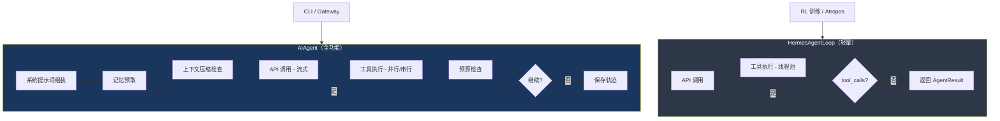

# 1. 双 Agent 循环

> 源码位置: `run_agent.py`（AIAgent）+ `environments/agent_loop.py`（HermesAgentLoop）

## 概述

Hermes Agent 有两个独立的 Agent 循环实现，服务于不同场景：

- **AIAgent**（`run_agent.py`）：全功能循环，用于 CLI 和多平台网关，包含记忆、压缩、技能、流式输出、子 Agent 委托等完整能力
- **HermesAgentLoop**（`environments/agent_loop.py`）：轻量循环，专为 RL 训练环境设计，只保留核心的 tool-calling 循环

## 底层原理

### 双循环架构



### HermesAgentLoop：轻量循环

```python
# environments/agent_loop.py
class HermesAgentLoop:
    async def run(self, messages):
        for turn in range(self.max_turns):
            response = await self.server.chat_completion(
                messages=messages, tools=self.tool_schemas, ...
            )
            if assistant_msg.tool_calls:
                # 线程池执行工具
                tool_result = await loop.run_in_executor(
                    _tool_executor,
                    lambda: handle_function_call(_tn, _ta, task_id=_tid)
                )
                messages.append(tool_result_msg)
            else:
                return AgentResult(finished_naturally=True)
        return AgentResult(finished_naturally=False)
```

关键特征：
- 128 worker 线程池（`_tool_executor`），可通过 `resize_tool_pool()` 动态调整
- `AgentResult` 包含 `reasoning_per_turn` 和 `tool_errors` 用于 RL 奖励计算
- 不包含记忆、压缩、技能、流式输出等功能
- Todo 工具使用 per-loop 的 `TodoStore`（临时，循环结束即销毁）
- Memory 和 session_search 在 RL 环境中返回错误

### AIAgent：全功能循环

AIAgent 的 `run_conversation()` 是一个复杂的 while 循环，每轮经历：

1. **记忆预取** — `_memory_manager.prefetch_all()`
2. **上下文压缩检查** — `should_compress_preflight()` → `compress()`
3. **系统提示词组装** — 身份 + 平台提示 + 技能索引 + 记忆 + 上下文文件
4. **API 调用** — 流式接收，支持 Anthropic prompt caching
5. **工具执行** — 并行/串行分区（详见[并行工具执行](/hermes_agent_docs/agent/parallel-tools)）
6. **预算检查** — `IterationBudget.consume()`，70%/90% 压力警告
7. **轨迹保存** — ShareGPT 格式 JSONL

### Fallback Parser：非结构化工具调用解析

当模型返回的 response 没有结构化 `tool_calls`，但 content 中包含 `<tool_call>` 标签时，HermesAgentLoop 会启用 fallback parser：

```python
if not assistant_msg.tool_calls and "<tool_call>" in (assistant_msg.content or ""):
    from environments.tool_call_parsers import get_parser
    fallback_parser = get_parser("hermes")
    parsed_content, parsed_calls = fallback_parser.parse(assistant_msg.content)
    if parsed_calls:
        assistant_msg.tool_calls = parsed_calls
```

这是为了兼容不支持原生 tool calling 的模型（如某些 vLLM 部署），它们通过文本标签输出工具调用。

### ToolError 追踪

```python
@dataclass
class ToolError:
    turn: int           # 哪一轮出错
    tool_name: str      # 哪个工具
    arguments: str      # 参数（截断到 200 字符）
    error: str          # 错误信息
    tool_result: str    # 返回给模型的原始结果
```

ToolError 在三种情况下记录：
1. 未知工具名（模型幻觉）
2. JSON 参数解析失败
3. 工具执行抛出异常

### 与 Claude Code queryLoop 和 Codex 事件循环的对比

| 维度 | Hermes Agent | Claude Code | Codex CLI |
|------|-------------|-------------|-----------|
| 循环类型 | 双循环（全功能 + 轻量） | 单循环 while(true) | 事件驱动 |
| 工具执行 | 线程池 + 并行分区 | StreamingToolExecutor | 串行 |
| 错误恢复 | ToolError 记录 + 继续 | 多级恢复（3 次重试） | 错误事件 |
| RL 支持 | HermesAgentLoop 专用 | 无 | 无 |
| 流式执行 | AIAgent 支持 | 边收边执行 | 事件流 |
| Fallback 解析 | `<tool_call>` 标签 | 无需（原生 API） | 无需 |

## 设计原因

- **双循环分离**：RL 训练不需要记忆、压缩、技能等重量级功能，轻量循环减少依赖和开销，同时保持工具执行的一致性
- **128 worker 线程池**：RL 评估可能同时运行 89+ 个任务（如 TB2 benchmark），线程池必须足够大以避免饥饿
- **Fallback parser**：兼容不支持原生 tool calling 的开源模型，降低部署门槛
- **ToolError 结构化追踪**：为 RL 奖励函数提供细粒度的错误信号，而不是简单的成功/失败

## 关联知识点

- [并行工具执行](/hermes_agent_docs/agent/parallel-tools) — AIAgent 的工具并行策略
- [迭代预算](/hermes_agent_docs/agent/iteration-budget) — 循环终止条件
- [RL Agent 循环](/hermes_agent_docs/rl/agent-loop) — HermesAgentLoop 在训练中的使用
- [上下文压缩器](/hermes_agent_docs/context/compressor) — AIAgent 的压缩触发逻辑
