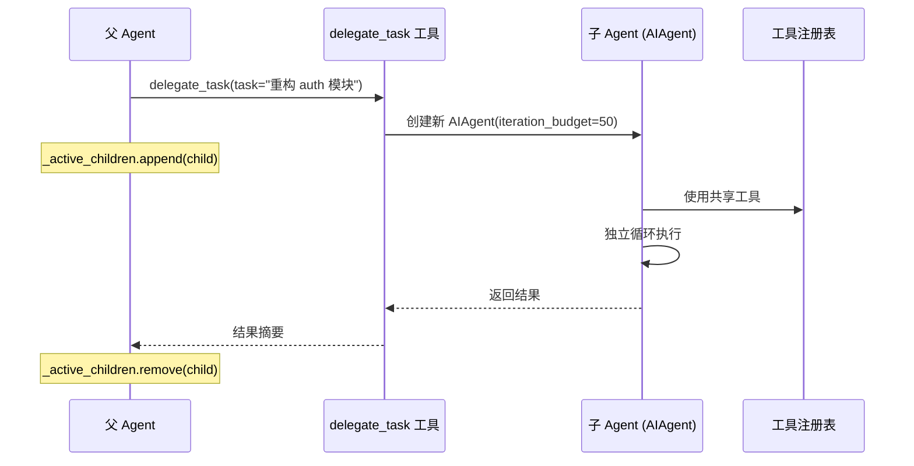
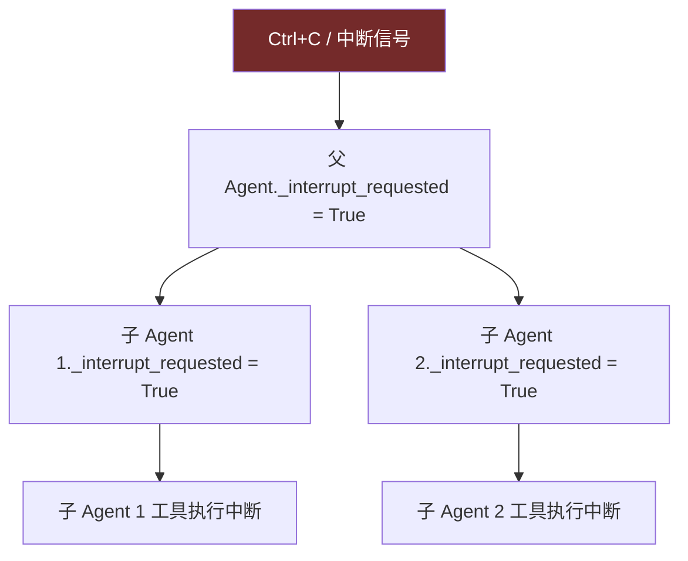

# 4. 子 Agent 委托

> 源码位置: `tools/delegate_tool.py`, `run_agent.py`

## 概述

Hermes Agent 通过 `delegate_task` 工具实现子 Agent 委托。父 Agent 可以将复杂子任务分派给独立的子 Agent，每个子 Agent 拥有独立的 IterationBudget、独立的上下文，但共享工具注册表。

## 底层原理

### 委托流程



### 独立 IterationBudget

```python
# 父 Agent 创建时
self.iteration_budget = IterationBudget(max_iterations)  # 默认 90

# 子 Agent 创建时
child_budget = IterationBudget(delegation_config.get("max_iterations", 50))
child_agent = AIAgent(
    iteration_budget=child_budget,
    # ... 其他参数
)
```

### 中断传播

```python
# run_agent.py
self._active_children = []       # 运行中的子 Agent 列表
self._active_children_lock = threading.Lock()
```

当父 Agent 收到中断信号时，会遍历 `_active_children` 传播中断：



### 上下文隔离

子 Agent 的关键隔离特性：
- **独立消息历史**：子 Agent 从空白开始，只接收任务描述
- **独立 IterationBudget**：不消耗父 Agent 的预算
- **独立 session_id**：用于轨迹保存和记忆隔离
- **共享工具注册表**：使用相同的 ToolRegistry 单例
- **共享 credential_pool**：API key 轮转池共享

### 记忆通知

```python
# memory_manager.py
def on_delegation(self, task: str, result: str, *,
                  child_session_id: str = "", **kwargs) -> None:
    """通知所有 Provider 子 Agent 完成了任务。"""
```

子 Agent 完成后，MemoryManager 会通知所有记忆 Provider，让它们有机会记录委托结果。

### 与 Claude Code 子 Agent 和 Codex 多 Agent 的对比

| 维度 | Hermes Agent | Claude Code | Codex CLI |
|------|-------------|-------------|-----------|
| 委托方式 | `delegate_task` 工具 | 子 Agent 工具 | Agent 注册表 + 邮箱 |
| 预算 | 独立 IterationBudget | 共享上下文 | 深度限制 |
| 中断 | `_active_children` 传播 | AbortController | 事件取消 |
| 上下文 | 完全隔离 | 部分共享 | 邮箱通信 |
| 记忆 | `on_delegation` 通知 | 无 | 无 |

## 设计原因

- **独立预算**：防止子任务耗尽父 Agent 的迭代配额，保证主任务能完成
- **上下文隔离**：子 Agent 不需要父 Agent 的完整对话历史，隔离减少 token 消耗，也避免上下文污染
- **中断传播**：用户按 Ctrl+C 时，所有子 Agent 必须同步停止，否则会有孤儿进程继续消耗资源
- **记忆通知**：外部记忆 Provider 可能需要知道委托发生了什么（如更新知识图谱）

## 关联知识点

- [迭代预算](/hermes_agent_docs/agent/iteration-budget) — 父子预算的独立性
- [双 Agent 循环](/hermes_agent_docs/agent/dual-loop) — 子 Agent 使用 AIAgent 循环
- [记忆管理器](/hermes_agent_docs/memory/manager) — `on_delegation` 生命周期钩子
