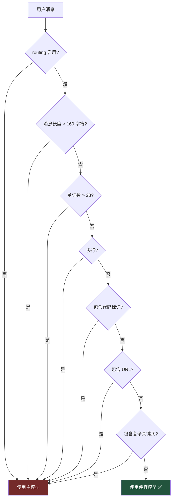

# 18. 智能模型路由

> 源码位置: `agent/smart_model_routing.py`

## 概述

Smart Model Routing 是一个基于关键词启发式的模型切换机制：简单消息（短、无代码、无复杂关键词）路由到便宜模型，复杂消息保持使用主模型。保守设计——有任何复杂信号就使用主模型。

## 底层原理

### 路由决策流程



### 复杂关键词集

```python
_COMPLEX_KEYWORDS = {
    "debug", "debugging", "implement", "implementation",
    "refactor", "patch", "traceback", "stacktrace",
    "exception", "error", "analyze", "analysis",
    "investigate", "architecture", "design",
    "compare", "benchmark", "optimize", "optimise",
    "review", "terminal", "shell", "tool", "tools",
    "pytest", "test", "tests", "plan", "planning",
    "delegate", "subagent", "cron", "docker", "kubernetes",
}
```

### 简单消息判定条件

所有条件必须同时满足：

| 条件 | 阈值 | 原因 |
|------|------|------|
| 字符数 | ≤ 160 | 长消息通常包含复杂需求 |
| 单词数 | ≤ 28 | 多词消息通常是详细指令 |
| 换行数 | ≤ 1 | 多行通常是代码或列表 |
| 代码标记 | 无 `` ` `` 或 ` ``` ` | 代码相关需要强模型 |
| URL | 无 | URL 通常伴随复杂任务 |
| 复杂关键词 | 无匹配 | 技术任务需要强模型 |

### 配置示例

```yaml
# config.yaml
smart_routing:
  enabled: true
  max_simple_chars: 160
  max_simple_words: 28
  cheap_model:
    provider: "openrouter"
    model: "google/gemini-2.0-flash-001"
    api_key_env: "OPENROUTER_API_KEY"
```

### resolve_turn_route

```python
def resolve_turn_route(user_message, routing_config, primary):
    route = choose_cheap_model_route(user_message, routing_config)
    if not route:
        return primary_route  # 使用主模型
    
    runtime = resolve_runtime_provider(
        requested=route.get("provider"),
        explicit_api_key=...,
    )
    return {
        "model": route.get("model"),
        "runtime": runtime,
        "label": f"smart route → {route['model']} ({runtime['provider']})",
    }
```

### 与其他路由方案的对比

| 维度 | Hermes Agent | Vercel AI SDK | OpenRouter |
|------|-------------|---------------|------------|
| 路由策略 | 关键词启发式 | 无内置路由 | Provider 级路由 |
| 粒度 | 每轮消息 | 无 | 每请求 |
| 模型数 | 2（cheap + strong） | 用户选择 | 多 Provider |
| 配置 | YAML | 代码 | API 参数 |
| 回退 | 自动回退到主模型 | 无 | Provider fallback |

## 设计原因

- **保守设计**：宁可多用主模型也不在复杂任务上用便宜模型。错误的路由会导致任务失败，而多花一点钱不会
- **关键词启发式**：比训练分类器简单得多，且对大多数场景足够准确。"你好"显然是简单消息，"帮我 debug 这个 traceback"显然是复杂消息
- **每轮路由**：同一会话中不同轮次的复杂度可能不同，第一轮可能是简单问候，后续轮次可能是复杂调试
- **可配置阈值**：不同用户对"简单"的定义不同，160 字符和 28 单词是合理的默认值，但可以调整

## 关联知识点

- [多 Provider 支持](/hermes_agent_docs/api/multi-provider) — Provider 解析和 runtime 配置
- [双 Agent 循环](/hermes_agent_docs/agent/dual-loop) — 路由在每轮 API 调用前执行
