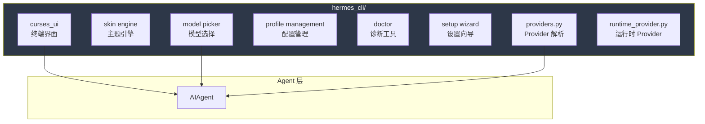

# 21. CLI 架构

> 源码位置: `hermes_cli/`, `cli.py`

## 概述

Hermes Agent 的 CLI 使用 Python curses 构建终端界面，提供模型选择、配置管理、主题引擎、诊断工具和设置向导。CLI 是 AIAgent 的主要交互入口之一。

## 底层原理

### CLI 组件架构



### curses UI

- 基于 Python curses 库的终端界面
- 支持流式输出显示
- 工具执行进度回调
- 中断处理（Ctrl+C 分级响应）

### Skin Engine（主题引擎）

可配置的终端颜色主题，支持：
- 预定义主题
- 自定义颜色方案
- 终端能力检测

### Model Picker（模型选择）

交互式模型选择器：
- 列出可用 Provider 和模型
- 显示模型元数据（上下文长度、价格）
- 支持搜索和过滤

### Doctor（诊断工具）

```
hermes doctor
```

检查系统环境：
- API key 配置状态
- 工具可用性（check_fn 结果）
- 依赖安装状态
- 网络连通性

### Setup Wizard（设置向导）

```
hermes setup
```

引导用户完成初始配置：
- 选择 Provider
- 配置 API key
- 选择默认模型
- 配置工具集

### _SafeWriter

```python
class _SafeWriter:
    """透明的 stdio 包装器，捕获断开管道的 OSError/ValueError。"""
    def write(self, data):
        try:
            return self._inner.write(data)
        except (OSError, ValueError):
            return len(data) if isinstance(data, str) else 0
```

当 Hermes Agent 作为 systemd 服务、Docker 容器或无头守护进程运行时，stdout/stderr 管道可能断开。`_SafeWriter` 防止 print() 调用导致崩溃。

### 与 Claude Code / Codex CLI 的对比

| 维度 | Hermes Agent | Claude Code | Codex CLI |
|------|-------------|-------------|-----------|
| UI 框架 | Python curses | Ink (React) | Ratatui (Rust) |
| 主题 | Skin engine | 内置 | 内置 |
| 模型选择 | 交互式 picker | 命令行参数 | 命令行参数 |
| 诊断 | `hermes doctor` | 无 | 无 |
| 设置向导 | `hermes setup` | 无 | 无 |
| 安全输出 | _SafeWriter | 无 | 无 |

## 设计原因

- **curses 而非 Rich/Textual**：curses 是 Python 标准库，零依赖。Rich/Textual 功能更强但增加依赖
- **_SafeWriter**：Agent 可能在各种环境运行（systemd、Docker、cron），stdout 断开不应导致崩溃
- **Doctor 诊断**：多 Provider + 多工具的组合使配置复杂，诊断工具帮助用户快速定位问题
- **Setup Wizard**：降低新用户的入门门槛，引导完成必要配置

## 关联知识点

- [双 Agent 循环](/hermes_agent_docs/agent/dual-loop) — CLI 是 AIAgent 的入口
- [多 Provider 支持](/hermes_agent_docs/api/multi-provider) — Provider 解析和配置
- [Toolset 系统](/hermes_agent_docs/skills/toolsets) — hermes-cli toolset
