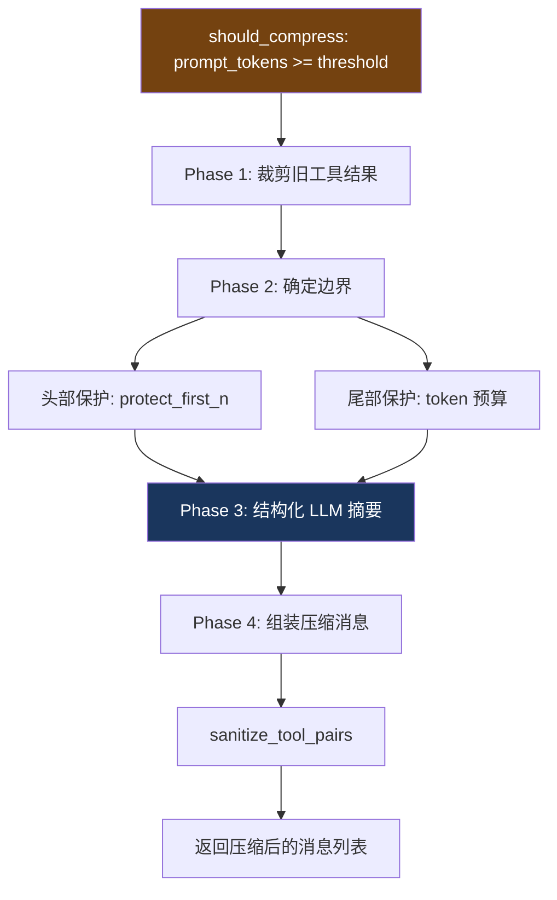

# 10. 上下文压缩器

> 源码位置: `agent/context_compressor.py`

## 概述

ContextCompressor 在对话接近模型上下文限制时自动触发压缩。与 Claude Code 的 92% 阈值不同，Hermes Agent 使用 50% 阈值，更早介入。压缩算法包含工具结果裁剪（廉价预处理）、token 预算尾部保护、结构化 LLM 摘要、迭代摘要更新四个阶段。

## 底层原理

### 压缩算法流程



### Phase 1: 工具结果裁剪（廉价预处理）

```python
def _prune_old_tool_results(self, messages, protect_tail_count):
    """将旧的工具结果替换为占位符（不需要 LLM 调用）。"""
    for i in range(prune_boundary):
        if msg.get("role") == "tool" and len(content) > 200:
            result[i] = {**msg, "content": "[Old tool output cleared to save context space]"}
```

在 LLM 摘要之前先做廉价的工具结果裁剪，减少需要摘要的内容量。

### Phase 2: 边界确定

**头部保护**：固定保护前 N 条消息（默认 3），包含系统提示词和首次交互。

**尾部保护**：按 token 预算从末尾向前累积，而不是固定消息数。

```python
def _find_tail_cut_by_tokens(self, messages, head_end, token_budget=None):
    """从末尾向前累积 token，直到预算用完。"""
    for i in range(n - 1, head_end - 1, -1):
        msg_tokens = len(content) // 4 + 10  # 粗略估算
        if accumulated + msg_tokens > token_budget and (n - i) >= min_tail:
            break
        accumulated += msg_tokens
        cut_idx = i
```

**边界对齐**：不在 tool_call/tool_result 组中间切割。

```python
def _align_boundary_backward(self, messages, idx):
    """将边界拉回到 assistant + tool_results 组之前。"""
    while check >= 0 and messages[check].get("role") == "tool":
        check -= 1
    if messages[check].get("role") == "assistant" and messages[check].get("tool_calls"):
        idx = check
```

### Phase 3: 结构化 LLM 摘要

摘要模板（首次压缩）：

```
## Goal
[用户要完成什么]

## Constraints & Preferences
[用户偏好、编码风格、约束]

## Progress
### Done
[已完成的工作 — 包含具体文件路径、命令、结果]
### In Progress
[正在进行的工作]
### Blocked
[阻塞项]

## Key Decisions
[重要技术决策及原因]

## Relevant Files
[读取、修改、创建的文件]

## Next Steps
[下一步需要做什么]

## Critical Context
[不显式保留就会丢失的具体值、错误信息、配置]
```

### 迭代摘要更新

```python
if self._previous_summary:
    prompt = f"""You are updating a context compaction summary.
    PREVIOUS SUMMARY: {self._previous_summary}
    NEW TURNS TO INCORPORATE: {content_to_summarize}
    Update the summary... PRESERVE all existing information...
    ADD new progress. Move items from "In Progress" to "Done"..."""
```

第二次及后续压缩不是从头摘要，而是在前一次摘要基础上增量更新。这保留了跨多次压缩的信息。

### 摘要失败冷却

```python
_SUMMARY_FAILURE_COOLDOWN_SECONDS = 600  # 10 分钟

if now < self._summary_failure_cooldown_until:
    return None  # 冷却期内跳过摘要
```

如果摘要生成失败（如 Provider 不可用），进入 600 秒冷却期。冷却期内直接丢弃中间轮次而不生成摘要。

### tool_call/tool_result 对清理

```python
def _sanitize_tool_pairs(self, messages):
    """修复压缩后的孤立 tool_call/tool_result 对。"""
    # 1. 移除没有对应 assistant tool_call 的 tool result
    # 2. 为没有对应 tool result 的 assistant tool_call 插入桩结果
```

压缩可能导致 tool_call 和 tool_result 不匹配，API 会拒绝这种消息。清理器确保每个 tool_call 都有对应的 tool_result。

### 与 Claude Code / Codex 压缩的对比

| 维度 | Hermes Agent | Claude Code | Codex CLI |
|------|-------------|-------------|-----------|
| 触发阈值 | 50% | 92% | 自动 |
| 预处理 | 工具结果裁剪 | microcompact + snip | 截断 |
| 摘要模板 | 结构化（7 节） | 意图保持 | 基础 |
| 迭代更新 | `_previous_summary` | 无 | 无 |
| 尾部保护 | token 预算 | 固定消息数 | 固定消息数 |
| 边界对齐 | tool_call/result 组 | 无 | 无 |
| 失败处理 | 600s 冷却 | 降级 | 降级 |
| 对清理 | sanitize_tool_pairs | enforceToolResultBudget | 无 |

## 设计原因

- **50% 阈值**：比 Claude Code 的 92% 更保守，更早压缩意味着摘要质量更高（压缩的内容更少），但也意味着更频繁的 LLM 调用
- **迭代摘要更新**：多次压缩时，从头摘要会丢失早期信息。增量更新保留了完整的工作历史
- **结构化模板**：比自由格式摘要更可靠，确保关键信息（文件路径、决策、下一步）不会被遗漏
- **边界对齐**：在 tool_call/result 组中间切割会导致孤立消息，API 拒绝，用户体验崩溃
- **冷却机制**：避免在 Provider 不可用时反复尝试摘要生成，浪费时间和 token

## 关联知识点

- [双 Agent 循环](/hermes_agent_docs/agent/dual-loop) — 压缩在循环中的触发位置
- [轨迹压缩器](/hermes_agent_docs/context/trajectory-compressor) — RL 训练的后处理压缩
- [多 Provider 支持](/hermes_agent_docs/api/multi-provider) — 摘要使用辅助模型
