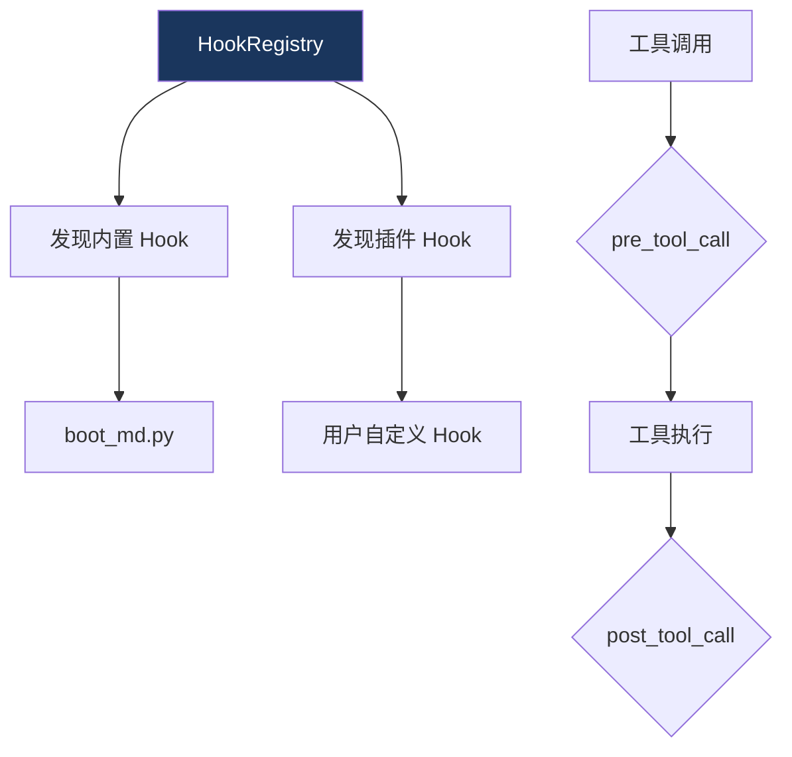

# 7. 网关 Hook

> 源码位置: `gateway/hooks.py`, `gateway/builtin_hooks/`

## 概述

网关 Hook 系统允许在 Agent 生命周期的关键节点注入自定义逻辑。内置 Hook 提供基础功能（如启动消息），插件 Hook 通过 `pre_tool_call` / `post_tool_call` 扩展工具执行行为。

## 底层原理

### Hook 注册与发现



### HookRegistry

`gateway/hooks.py` 中的 HookRegistry 负责：
1. 扫描 `gateway/builtin_hooks/` 目录发现内置 Hook
2. 通过插件系统加载外部 Hook
3. 按事件类型分发 Hook 调用

### 内置 Hook

**boot_md.py** — 启动消息 Hook
- 在 Agent 会话开始时注入启动消息
- 可以包含系统状态、版本信息等

### 插件 Hook 接口

```python
# model_tools.py — 工具执行前后的 Hook 调用
try:
    from hermes_cli.plugins import invoke_hook
    invoke_hook(
        "pre_tool_call",
        tool_name=function_name,
        args=function_args,
        task_id=task_id or "",
        session_id=session_id or "",
        tool_call_id=tool_call_id or "",
    )
except Exception:
    pass  # Hook 失败不阻塞工具执行

# ... 工具执行 ...

invoke_hook(
    "post_tool_call",
    tool_name=function_name,
    args=function_args,
    result=result,
    task_id=task_id or "",
    session_id=session_id or "",
    tool_call_id=tool_call_id or "",
)
```

### Hook 事件类型

| 事件 | 触发时机 | 参数 |
|------|---------|------|
| `pre_tool_call` | 工具执行前 | tool_name, args, task_id, session_id, tool_call_id |
| `post_tool_call` | 工具执行后 | tool_name, args, result, task_id, session_id, tool_call_id |

### 与 Claude Code Hook 系统的对比

| 维度 | Hermes Agent | Claude Code | Codex CLI |
|------|-------------|-------------|-----------|
| Hook 类型 | pre/post_tool_call | PreToolUse/PostToolUse/Notification 等 | Hook 系统 |
| 发现机制 | 目录扫描 + 插件系统 | 配置文件声明 | 配置文件 |
| 失败策略 | 静默忽略（不阻塞） | 可配置 | 可配置 |
| 内置 Hook | boot_md | 多种内置 | 多种内置 |

## 设计原因

- **静默失败**：Hook 是扩展点，不是核心功能。Hook 失败不应阻塞工具执行，否则一个有 bug 的插件会导致整个 Agent 不可用
- **pre/post 对称**：工具执行前后都有 Hook 点，允许实现审计日志、安全检查、结果转换等场景
- **插件系统集成**：通过 `hermes_cli.plugins` 统一管理，与工具注册、记忆 Provider 等使用相同的插件发现机制

## 关联知识点

- [网关架构](/hermes_agent_docs/gateway/architecture) — Hook 在网关中的位置
- [工具注册表](/hermes_agent_docs/tools/registry) — Hook 与工具分发的交互
- [工具审批](/hermes_agent_docs/tools/approval) — 安全相关的 Hook 应用
