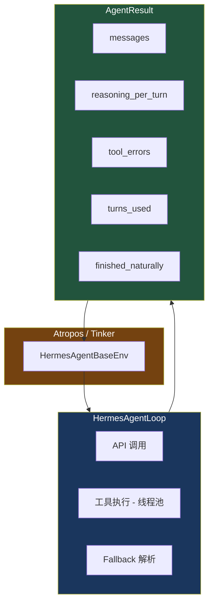

# 19. RL Agent 循环

> 源码位置: `environments/agent_loop.py`, `environments/hermes_base_env.py`

## 概述

HermesAgentLoop 是专为 RL 训练环境设计的轻量 Agent 循环。它保留核心的 tool-calling 循环，去掉了记忆、压缩、技能、流式输出等重量级功能。通过 AgentResult 返回结构化的训练信号（reasoning_per_turn、tool_errors）。

## 底层原理

### RL 集成架构



### AgentResult 结构

```python
@dataclass
class AgentResult:
    messages: List[Dict[str, Any]]           # 完整对话历史
    managed_state: Optional[Dict[str, Any]]  # ManagedServer 状态
    turns_used: int = 0                      # LLM 调用次数
    finished_naturally: bool = False          # 是否自然结束
    reasoning_per_turn: List[Optional[str]]  # 每轮推理内容
    tool_errors: List[ToolError]             # 工具错误列表
```

### 推理内容提取

```python
def _extract_reasoning_from_message(message) -> Optional[str]:
    """从多种 Provider 格式中提取推理内容。"""
    # 1. message.reasoning_content（部分 Provider）
    # 2. message.reasoning（部分 Provider）
    # 3. message.reasoning_details[].text（OpenRouter 风格）
```

支持多种 Provider 的推理格式，为 RL 奖励函数提供推理过程数据。

### 线程池工具执行

```python
_tool_executor = concurrent.futures.ThreadPoolExecutor(max_workers=128)

def resize_tool_pool(max_workers: int):
    """动态调整线程池大小。由 HermesAgentBaseEnv.__init__ 调用。"""
    global _tool_executor
    old_executor = _tool_executor
    _tool_executor = concurrent.futures.ThreadPoolExecutor(max_workers=max_workers)
    old_executor.shutdown(wait=False)
```

工具在线程池中执行，避免同步工具（如使用 `asyncio.run()` 的 Modal/Docker 后端）阻塞 Atropos 的事件循环。

### RL 环境中的工具限制

```python
# 在 RL 环境中，某些工具不可用
if tool_name == "memory":
    tool_result = json.dumps({"error": "Memory is not available in RL environments."})
elif tool_name == "session_search":
    tool_result = json.dumps({"error": "Session search is not available in RL environments."})
```

记忆和会话搜索在 RL 环境中禁用，因为：
- RL 评估需要可重复性，记忆会引入不确定性
- 每个评估任务应该独立，不应依赖历史会话

### Todo 工具的 per-loop 存储

```python
from tools.todo_tool import TodoStore
_todo_store = TodoStore()  # 每个循环实例独立

if tool_name == "todo":
    tool_result = _todo_tool(todos=args.get("todos"), store=_todo_store)
```

### 与 AIAgent 循环的对比

| 维度 | HermesAgentLoop | AIAgent |
|------|----------------|---------|
| 用途 | RL 训练 | CLI / 网关 |
| 记忆 | 禁用 | MemoryManager |
| 压缩 | 无 | ContextCompressor |
| 技能 | 无 | 50+ 技能索引 |
| 流式 | 无 | 支持 |
| 预算 | max_turns 参数 | IterationBudget |
| 输出 | AgentResult | 流式 + 回调 |
| 线程池 | 128 workers（可调） | 8 workers |

## 设计原因

- **轻量设计**：RL 评估可能同时运行数十个任务，每个任务不需要记忆、压缩等重量级功能，减少资源消耗
- **128 worker 线程池**：RL benchmark（如 TB2）可能有 89+ 个并发任务，线程池必须足够大
- **AgentResult 结构化输出**：`reasoning_per_turn` 和 `tool_errors` 为 RL 奖励函数提供细粒度信号
- **工具限制**：RL 评估需要可重复性和独立性，记忆和会话搜索会破坏这些属性

## 关联知识点

- [双 Agent 循环](/hermes_agent_docs/agent/dual-loop) — 两种循环的对比
- [轨迹管理](/hermes_agent_docs/rl/trajectory) — AgentResult 到轨迹的转换
- [轨迹压缩器](/hermes_agent_docs/context/trajectory-compressor) — 轨迹的后处理
