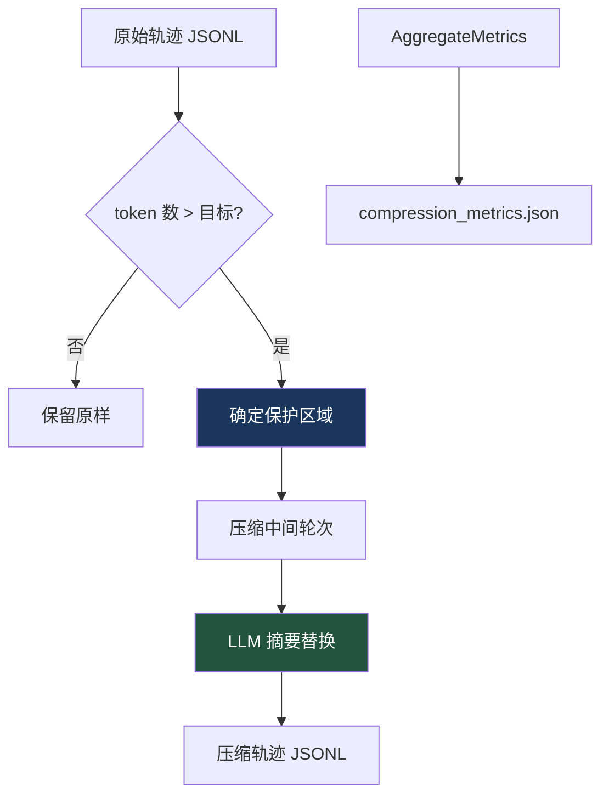

# 20. 轨迹管理

> 源码位置: `agent/trajectory.py`, `trajectory_compressor.py`, `batch_runner.py`

## 概述

Hermes Agent 使用 ShareGPT 格式保存对话轨迹到 JSONL 文件。轨迹系统支持保存、压缩、批量处理，为 RL 训练提供完整的数据管线。

## 底层原理

### 轨迹数据流


### ShareGPT 格式

```json
{"conversations": [
  {"from": "system", "value": "You are Hermes Agent..."},
  {"from": "human", "value": "帮我重构 auth 模块"},
  {"from": "gpt", "value": "好的，让我先查看当前代码结构..."},
  {"from": "tool", "value": "{\"content\": \"src/auth/...\"}"},
  {"from": "gpt", "value": "我看到了以下文件..."}
]}
```

### 轨迹保存

```python
# agent/trajectory.py
def save_trajectory(messages, session_id, ...):
    """将 OpenAI 消息格式转换为 ShareGPT 格式并保存。"""
```

关键转换：
- `system` → `from: "system"`
- `user` → `from: "human"`
- `assistant` → `from: "gpt"`
- `tool` → `from: "tool"`

### Scratchpad 处理

```python
def convert_scratchpad_to_think(messages):
    """将 <scratchpad> 标签转换为 <think> 标签。"""

def has_incomplete_scratchpad(messages):
    """检查是否有未闭合的 <scratchpad> 标签。"""
```

某些模型使用 `<scratchpad>` 标签进行内部推理，保存轨迹时转换为标准的 `<think>` 标签。

### 批量处理

```python
# batch_runner.py
# 批量运行 Agent 任务并保存轨迹
# 支持进度追踪和并行处理
```

### JSONL 存储

每条轨迹是 JSONL 文件中的一行，支持：
- 追加写入（不需要读取整个文件）
- 流式处理（逐行读取）
- 并行写入（不同文件）

### 轨迹压缩管线



详见 [轨迹压缩器](/hermes_agent_docs/context/trajectory-compressor)。

### 与 Claude Code / Codex 的对比

| 维度 | Hermes Agent | Claude Code | Codex CLI |
|------|-------------|-------------|-----------|
| 格式 | ShareGPT JSONL | 无轨迹保存 | 无轨迹保存 |
| 压缩 | TrajectoryCompressor | 无 | 无 |
| 批量处理 | batch_runner.py | 无 | 无 |
| RL 集成 | Atropos / Tinker | 无 | 无 |
| 推理标签 | scratchpad → think 转换 | 无 | 无 |

## 设计原因

- **ShareGPT 格式**：RL 训练社区的标准格式，与 Atropos、Tinker 等工具兼容
- **JSONL 存储**：支持追加写入和流式处理，适合大规模轨迹数据
- **Scratchpad 转换**：统一推理标签格式，确保训练数据一致性
- **批量处理 + 压缩管线**：从数据收集到训练数据准备的完整自动化

## 关联知识点

- [轨迹压缩器](/hermes_agent_docs/context/trajectory-compressor) — 压缩算法详解
- [RL Agent 循环](/hermes_agent_docs/rl/agent-loop) — 轨迹的生成源
- [双 Agent 循环](/hermes_agent_docs/agent/dual-loop) — AIAgent 的轨迹保存
