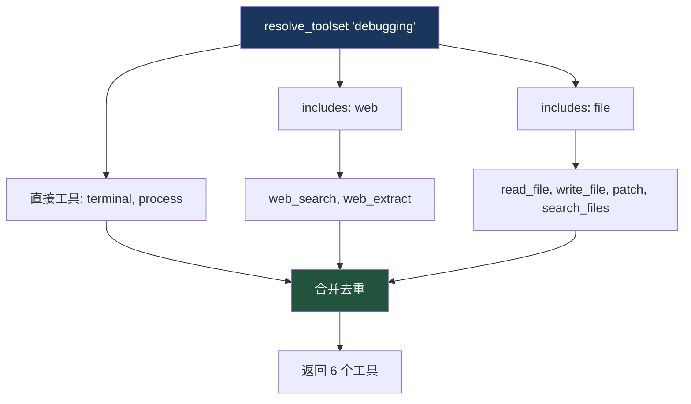

# 9. Toolset 系统

> 源码位置: `toolsets.py`, `model_tools.py`

## 概述

Toolset 是工具的逻辑分组，支持组合（includes）和递归解析。Hermes Agent 定义了 30+ 预定义 toolset，覆盖从基础工具类别到平台级完整工具集。解析过程包含循环检测，防止无限递归。

## 底层原理

### Toolset 定义结构

```python
TOOLSETS = {
    "web": {
        "description": "Web research and content extraction tools",
        "tools": ["web_search", "web_extract"],
        "includes": []
    },
    "debugging": {
        "description": "Debugging and troubleshooting toolkit",
        "tools": ["terminal", "process"],
        "includes": ["web", "file"]  # 组合其他 toolset
    },
    "hermes-cli": {
        "description": "Full interactive CLI toolset",
        "tools": _HERMES_CORE_TOOLS,  # 共享核心工具列表
        "includes": []
    },
}
```

### 递归解析与循环检测

```python
def resolve_toolset(name: str, visited: Set[str] = None) -> List[str]:
    if visited is None:
        visited = set()
    if name in visited:
        return []  # 循环检测：静默返回空
    visited.add(name)
    
    toolset = TOOLSETS.get(name)
    tools = set(toolset.get("tools", []))
    
    for included_name in toolset.get("includes", []):
        included_tools = resolve_toolset(included_name, visited)
        tools.update(included_tools)
    
    return list(tools)
```



### 特殊别名

```python
if name in {"all", "*"}:
    all_tools: Set[str] = set()
    for toolset_name in get_toolset_names():
        resolved = resolve_toolset(toolset_name, visited.copy())
        all_tools.update(resolved)
    return list(all_tools)
```

`"all"` 和 `"*"` 解析为所有 toolset 的并集。

### 插件 Toolset

```python
def _get_plugin_toolset_names() -> Set[str]:
    """返回插件注册的 toolset 名称（不在静态 TOOLSETS 中的）。"""
    from tools.registry import registry
    return {
        entry.toolset
        for entry in registry._tools.values()
        if entry.toolset not in TOOLSETS
    }
```

插件通过 `registry.register()` 注册工具时指定 toolset 名称，如果该名称不在静态 `TOOLSETS` 中，就自动成为插件 toolset。

### Legacy Toolset 映射

```python
_LEGACY_TOOLSET_MAP = {
    "web_tools": ["web_search", "web_extract"],
    "terminal_tools": ["terminal"],
    "file_tools": ["read_file", "write_file", "patch", "search_files"],
    # ...
}
```

旧版 `_tools` 后缀的 toolset 名称映射到新的工具名列表，保持向后兼容。

### Toolset 分类

| 类别 | Toolset | 工具数 |
|------|---------|--------|
| 基础 | web, terminal, file, vision, browser, memory, todo | 1-10 |
| 场景 | debugging, safe | 组合 |
| 平台 | hermes-cli, hermes-telegram, hermes-discord, ... | 30+ |
| 联合 | hermes-gateway | 所有平台的并集 |
| 特殊 | hermes-acp（编辑器集成）, hermes-api-server | 定制 |

## 设计原因

- **组合模式（includes）**：避免在每个场景 toolset 中重复列出工具，`debugging` 只需声明自己的工具 + includes web 和 file
- **循环检测**：`visited` 集合在兄弟 includes 间共享，菱形依赖只解析一次，真正的循环静默跳过
- **插件 Toolset**：插件不需要修改 `TOOLSETS` 字典，只需在注册工具时指定 toolset 名称，系统自动发现
- **共享 `_HERMES_CORE_TOOLS`**：所有平台 toolset 引用同一个列表，修改一处即可更新所有平台

## 关联知识点

- [工具注册表](/hermes_agent_docs/tools/registry) — Toolset 与工具注册的关系
- [平台适配器](/hermes_agent_docs/gateway/platforms) — 平台级 toolset 的使用
- [技能系统](/hermes_agent_docs/skills/skill-system) — 技能条件激活依赖 toolset 可用性
