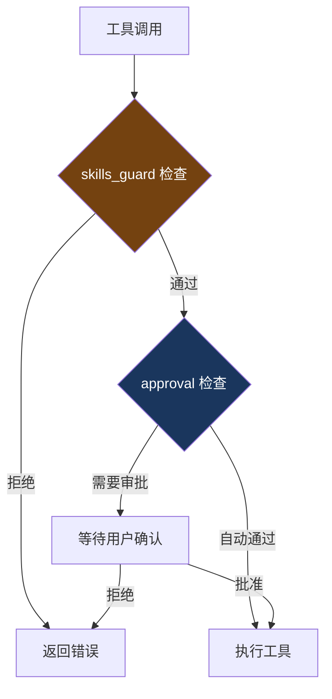

# 16. 工具审批

> 源码位置: `tools/approval.py`, `tools/skills_guard.py`

## 概述

Hermes Agent 的工具审批机制包含基础审批和技能守卫两层。与 Claude Code 的 "Actions With Care" 和 Codex 的 exec policy 相比，Hermes Agent 的审批更轻量，主要依赖平台提示和破坏性命令检测。

## 底层原理

### 审批层次



### Skills Guard

`tools/skills_guard.py` 提供技能级别的安全检查：
- 检查工具调用是否符合当前激活技能的约束
- 防止模型在不适当的上下文中使用危险工具

### 基础审批机制

`tools/approval.py` 提供基本的工具审批：
- 可配置哪些工具需要用户确认
- CLI 模式下通过终端交互确认
- 网关模式下通过平台消息确认

### 破坏性命令检测

```python
# run_agent.py
_DESTRUCTIVE_PATTERNS = re.compile(
    r"""(?:^|\s|&&|\|\||;|`)(?:
        rm\s|rmdir\s|mv\s|sed\s+-i|truncate\s|
        dd\s|shred\s|git\s+(?:reset|clean|checkout)\s
    )""", re.VERBOSE,
)
```

Terminal 工具的命令会经过破坏性模式检测，匹配的命令在并行执行时降级为串行（详见[并行工具执行](/hermes_agent_docs/agent/parallel-tools)）。

### 平台安全提示

不同平台通过 `PLATFORM_HINTS` 注入安全相关的行为提示：
- **cron**：无用户在场，完全自主执行
- **CLI**：可以交互确认
- **消息平台**：terminal 有安全检查

### 与 Claude Code / Codex 审批的对比

| 维度 | Hermes Agent | Claude Code | Codex CLI |
|------|-------------|-------------|-----------|
| 审批模型 | 基础审批 + skills guard | Actions With Care（3 级） | Starlark exec policy |
| 命令检测 | 正则模式匹配 | 分类器评估 | Starlark 规则 |
| 用户确认 | 可配置 | 自动分级 | 策略驱动 |
| 沙箱 | Docker/Modal/Daytona | OS 级 Seatbelt/Bubblewrap | OS 级 Landlock/Seatbelt |
| 网络隔离 | 无 | 网络代理 | 网络代理 |

### Hook 集成

```python
# model_tools.py
invoke_hook("pre_tool_call", tool_name=function_name, args=function_args, ...)
# ... 工具执行 ...
invoke_hook("post_tool_call", tool_name=function_name, result=result, ...)
```

插件可以通过 `pre_tool_call` Hook 实现自定义审批逻辑。

## 设计原因

- **轻量审批**：Hermes Agent 面向个人用户和受信任环境（自己的服务器、自己的 API key），不需要 Claude Code 那样严格的分级审批
- **破坏性检测用于并行降级**：不是阻止执行，而是确保破坏性命令不会并行执行导致竞态
- **Hook 扩展**：基础审批不够时，用户可以通过插件 Hook 实现任意复杂的审批逻辑

## 关联知识点

- [并行工具执行](/hermes_agent_docs/agent/parallel-tools) — 破坏性命令的并行降级
- [网关 Hook](/hermes_agent_docs/gateway/hooks) — pre_tool_call Hook 的审批应用
- [工具注册表](/hermes_agent_docs/tools/registry) — check_fn 的可用性检查
