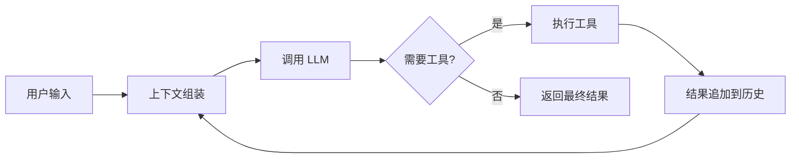
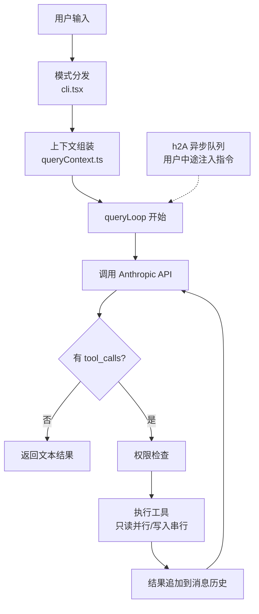
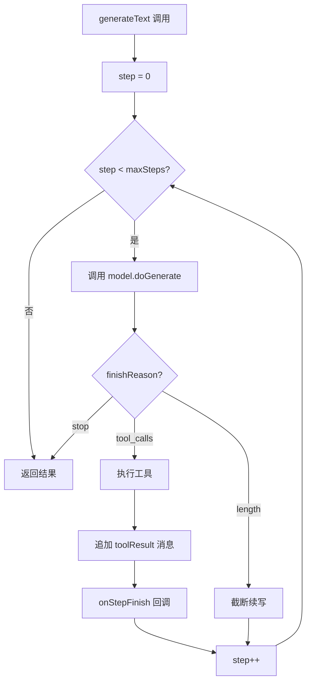
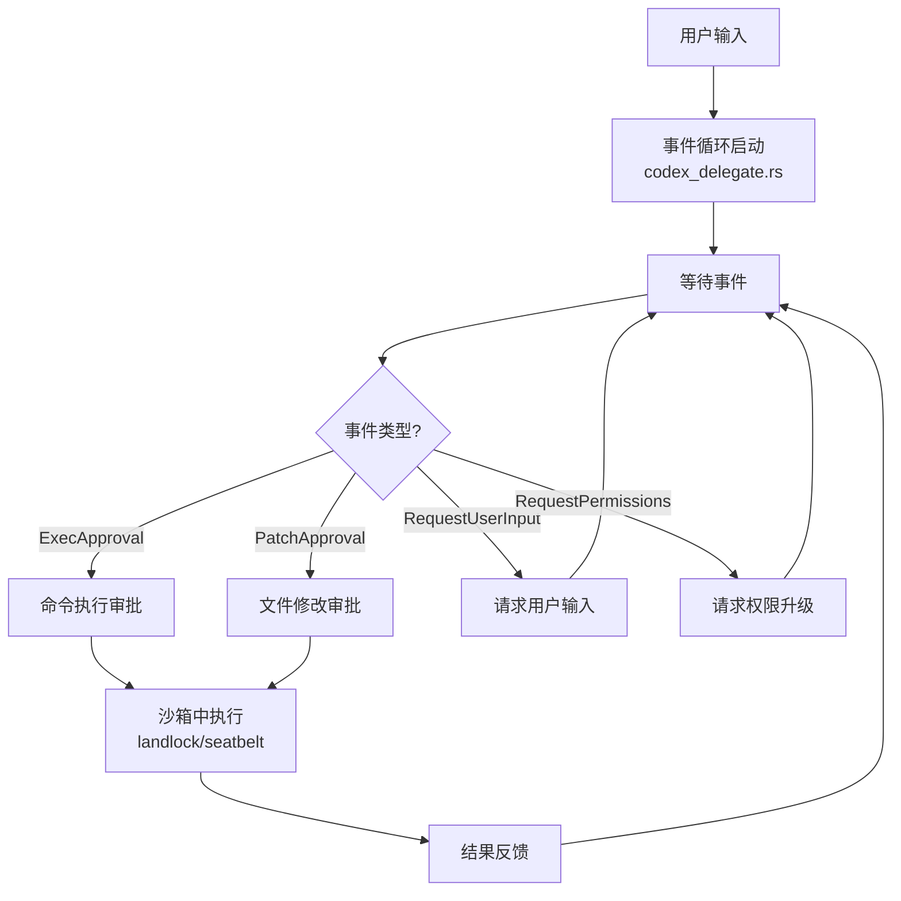
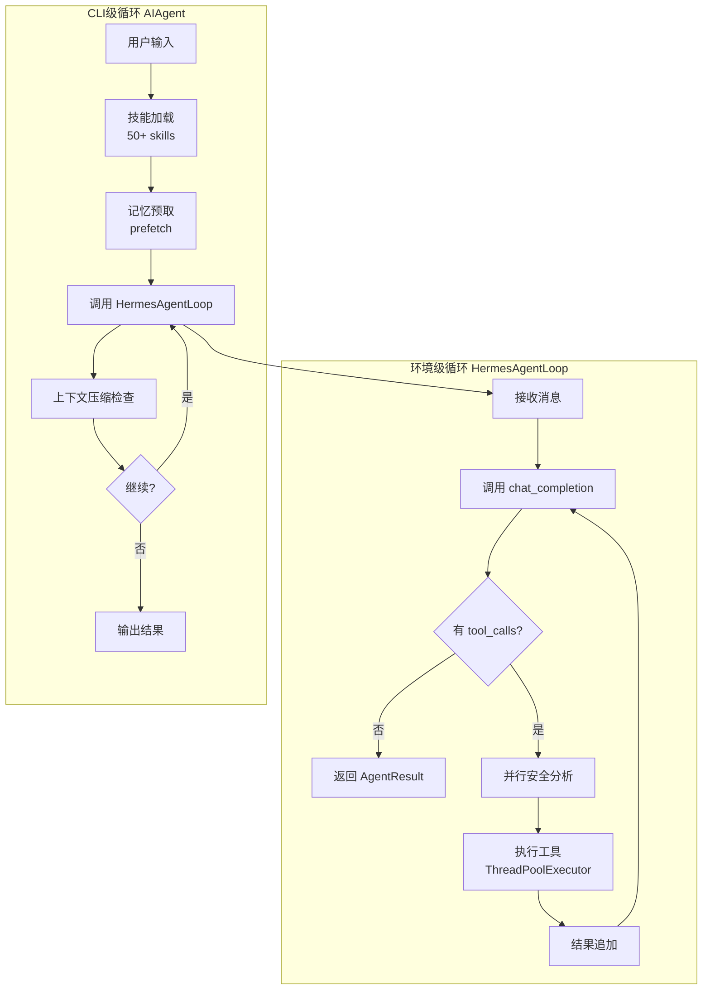
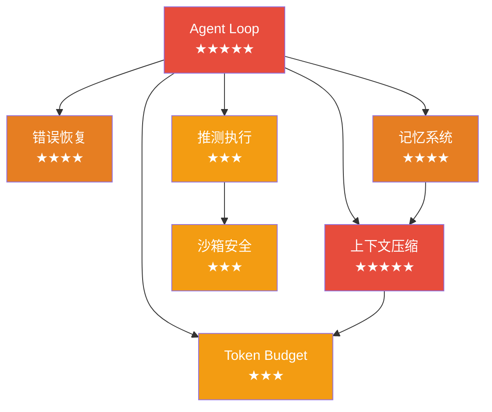

# 全局概览：Agent Runtime 到底在做什么？

> 🎯 本页目标：用 5 分钟建立 Agent Runtime 的全局认知，理解四大项目的主循环框架，然后再深入各个模块。

---

## 什么是 Agent Runtime？

Agent Runtime 是驱动 AI Agent 运行的"引擎"。你可以把它理解为 AI Agent 的操作系统——它负责接收用户输入、组装上下文、调用大模型、执行工具、管理记忆、处理错误，并在一个循环中不断重复这些步骤，直到任务完成。

不管是编码助手、运维机器人还是客服 Agent，底层都需要一个 Runtime 来驱动。四大开源项目（Claude Code、Vercel AI SDK、Codex CLI、Hermes Agent）各自实现了不同风格的 Runtime，但核心都遵循同一个模式：**ReAct 循环**（Reasoning + Acting）。

理解 Runtime 的关键在于：它不是一次性调用 LLM，而是一个**持续循环**——模型思考、调用工具、观察结果、再思考，直到判断任务完成。这个循环的设计决定了 Agent 的能力上限、安全边界和用户体验。

### 通用核心循环

所有 Agent Runtime 都遵循这个基本流程：



这个循环看似简单，但工程化实现中有大量细节需要处理：

- **上下文组装**：如何把系统提示词、工具描述、对话历史、记忆拼装在有限的上下文窗口里？
- **工具执行**：如何保证安全？并行还是串行？失败了怎么办？
- **循环控制**：什么时候停？死循环怎么防？Token 预算怎么管？
- **错误恢复**：模型幻觉、API 超时、工具崩溃，每种错误的处理策略不同

四大项目对这些问题给出了截然不同的答案。

---

## 四大项目的主循环一览

### Claude Code — "简单优先" 的 while(true) 循环



**核心设计哲学**：

- **单线程 while loop**：一条绝对线性的消息历史，最大化可调试性
- **扁平消息数组，只追加不修改**：最大化 Anthropic prompt caching 命中率
- **h2A 异步队列**：支持用户在执行中途注入指令（暂停/恢复/中断）
- **工具编排**：只读工具可并行，写入工具串行执行
- **子 Agent 限制**：最多 1 个子 Agent 分支，防止不受控增殖

> 💡 面试关键词：while loop、h2A、prompt cache、工具编排、子 Agent 深度限制


### Vercel AI SDK — "开发者体验优先" 的 for 循环



**核心设计哲学**：

- **maxSteps 是安全阀**：默认 1（不循环），必须显式设置才启用 agent loop
- **Provider 抽象层**：统一接口，模型切换透明——换模型只改一行代码
- **streamText 和 generateText 共享逻辑**：流式版本用 ReadableStream/TransformStream
- **不内置压缩、记忆、错误恢复**：这是框架，不是产品——复杂性留给使用者

> 💡 面试关键词：maxSteps、Provider 抽象、onStepFinish、框架 vs 产品

---

### Codex CLI — "安全优先" 的事件驱动循环



**核心设计哲学**：

- **Rust 核心**：性能和内存安全，沙箱用系统级隔离（Linux: landlock/seccomp, macOS: seatbelt）
- **事件驱动**：不是简单的 while loop，而是事件循环 + 消息传递
- **exec policy**：细粒度的命令执行策略，比 allow/deny 更精细
- **所有命令在沙箱中运行**：文件系统和网络都受限，安全是第一优先级

> 💡 面试关键词：Rust、事件驱动、exec policy、landlock/seatbelt、沙箱隔离

---

### Hermes Agent — "可扩展" 的双层循环



**核心设计哲学**：

- **双层循环**：HermesAgentLoop（轻量级，用于 RL 训练）+ AIAgent（完整功能，CLI/网关）
- **50+ 技能生态**：通过 skills 系统扩展能力，每个技能是一组工具 + 提示词
- **多平台网关**：CLI、Telegram、Discord、WhatsApp 统一接入
- **并行工具执行**：分析工具调用安全性，只读工具并行，写入工具串行
- **迭代预算**：max_turns 限制防止无限循环

> 💡 面试关键词：双层循环、技能系统、多平台网关、并行工具执行、RL 训练

---

## 四大项目设计哲学速览

| 维度 | Claude Code | Vercel AI SDK | Codex CLI | Hermes Agent |
|------|------------|---------------|-----------|-------------|
| 语言 | TypeScript (Bun) | TypeScript (Node) | Rust + TS | Python |
| 定位 | 生产级编码 Agent CLI | Agent 开发框架/SDK | 编码 Agent CLI + SDK | 通用 Agent 平台 |
| 设计哲学 | 简单优先 + 分层防御 | 开发者体验优先 | 安全优先，沙箱隔离 | 可扩展的技能生态 |
| 循环类型 | while loop | for loop (maxSteps) | 事件驱动 | 双层 while loop |
| 核心用户 | 开发者（终端编码） | 框架使用者 | 开发者（终端编码） | 开发者 + 非技术用户 |

---

## 七大核心模块速览

以下是 Agent Runtime 的 7 个核心模块，按面试权重从高到低排列。每个模块页面都包含四大项目的对比分析和面试题。

| 模块 | 一句话说明 | 四项目实现差异 | 权重 | 详细页面 |
|------|-----------|--------------|------|---------|
| Agent Loop | 驱动 Agent 运行的核心循环 | Claude Code: while loop / Vercel: for loop / Codex: 事件驱动 / Hermes: 双层循环 | ★★★★★ | [进入](/modules/agent-loop) |
| 上下文压缩 | 防止对话历史撑爆上下文窗口 | Claude Code: 7 层防御 / Hermes: 2 层 / Codex: 基础截断 / Vercel: 无 | ★★★★★ | [进入](/modules/context-compression) |
| 记忆系统 | 跨会话知识持久化与检索 | Claude Code: Markdown + Dream Mode / Hermes: 插件化 / Codex: AGENTS.md / Vercel: 无 | ★★★★ | [进入](/modules/memory-system) |
| 错误恢复 | 处理各种运行时错误和异常 | Claude Code: 多级恢复 / Hermes: 断路器 / Codex: 基础重试 / Vercel: 标准传播 | ★★★★ | [进入](/modules/error-recovery) |
| Token Budget | 管理 Token 消耗和成本控制 | Claude Code: 精细预算 / Hermes: 动态计算 / Codex: 固定限制 / Vercel: 使用者管理 | ★★★ | [进入](/modules/token-budget) |
| 推测执行 | 预执行和乐观并发策略 | Codex: 沙箱推测 / Claude Code: 工具编排 / Hermes: 并行分析 / Vercel: 无 | ★★★ | [进入](/modules/speculative-execution) |
| 沙箱安全 | 工具执行的安全隔离机制 | Codex: 系统级沙箱 / Claude Code: 权限门控 / Hermes: 技能守卫 / Vercel: 无 | ★★★ | [进入](/modules/sandbox-security) |


### 模块间的依赖关系

七大模块并非孤立存在，它们之间有明确的依赖和协作关系：



- **Agent Loop** 是中心：所有其他模块都围绕它运作
- **上下文压缩** 和 **Token Budget** 紧密关联：压缩策略直接影响 Token 消耗
- **记忆系统** 依赖 **上下文压缩**：压缩前需要通知记忆系统保存重要信息
- **推测执行** 依赖 **沙箱安全**：预执行必须在安全隔离环境中进行

---

## 学习路径建议

### 推荐阅读顺序

```
1. 本页（全局概览）          ← 你在这里 ✅
   ↓
2. Agent Loop 模块           ← 最核心，必须先理解
   ↓
3. 上下文压缩模块            ← 第二重要，面试高频
   ↓
4. 记忆系统 + 错误恢复       ← 中等权重，但有深度
   ↓
5. Token Budget + 推测执行 + 沙箱安全  ← 补充模块
   ↓
6. 实战定制指南              ← 理解如何应用到业务场景
   ↓
7. 综合面试题                ← 综合练习
```

### 学习策略

1. **先总后分**：先读完本页建立全局认知，再逐个深入模块
2. **对比学习**：每个模块都对比四大项目的实现，理解设计权衡
3. **源码验证**：读完模块分析后，去对应项目的源码文档验证关键实现
4. **面试模拟**：每个模块页面都有面试题，先自己回答再看答案
5. **定制思考**：读完模块后想想：如果是你的业务场景，你会怎么改？

### 时间规划

完整的 4 周学习计划请查看 → [学习计划](/study-plan)

| 阶段 | 时间 | 内容 | 目标 |
|------|------|------|------|
| 第 1 周 | 10-12h | 全局概览 + Agent Loop + 上下文压缩 | 掌握核心循环和压缩策略 |
| 第 2 周 | 8-10h | 记忆系统 + 错误恢复 + Token Budget | 理解状态管理和容错 |
| 第 3 周 | 6-8h | 推测执行 + 沙箱安全 + 实战定制 | 补充模块 + 业务应用 |
| 第 4 周 | 8-10h | 综合面试题 + 模拟面试 | 查漏补缺，综合演练 |

---

## 快速跳转

<div style="display: grid; grid-template-columns: repeat(auto-fit, minmax(250px, 1fr)); gap: 16px; margin-top: 16px;">

**核心模块**
- [Agent Loop ★★★★★](/modules/agent-loop)
- [上下文压缩 ★★★★★](/modules/context-compression)
- [记忆系统 ★★★★](/modules/memory-system)
- [错误恢复 ★★★★](/modules/error-recovery)
- [Token Budget ★★★](/modules/token-budget)
- [推测执行 ★★★](/modules/speculative-execution)
- [沙箱安全 ★★★](/modules/sandbox-security)

**其他资源**
- [实战定制指南](/customization/) — 如何根据业务场景改造 Agent
- [综合面试题](/comprehensive/) — 122 道面试题
- [4 周学习计划](/study-plan) — 结构化学习路径

**项目深度剖析**
- [Claude Code 深度剖析](/deep-dive/claude-code)
- [Codex CLI 深度剖析](/deep-dive/codex)
- [Vercel AI SDK 深度剖析](/deep-dive/vercel-ai-sdk)
- [Hermes Agent 深度剖析](/deep-dive/hermes-agent)

</div>
