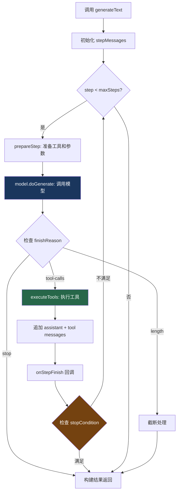

# 1. generateText 循环

> 源码位置: `packages/ai/src/generate-text/generate-text.ts`

## 概述

`generateText` 是 Vercel AI SDK 的核心 Agent Loop 实现。它是一个**阻塞式**的 for 循环，通过 `maxSteps` 参数控制最大迭代次数。与 Claude Code 的 while(true) 不同，这里的循环是有限的、可预测的。

## 底层原理

### 核心流程



### 源码解析

```typescript
// generate-text.ts — 简化版核心逻辑

async function generateText<TOOLS, CONTEXT, OUTPUT>({
  model,
  tools,
  maxSteps = 1,  // 默认 1 = 不循环
  stopWhen,      // 自定义停止条件
  prompt,
  messages,
  system,
  onStepFinish,
  ...
}) {
  const steps: StepResult[] = [];
  let stepMessages = convertToLanguageModelPrompt({ prompt, messages, system });
  let stepType: 'initial' | 'continue' = 'initial';
  
  for (let stepCount = 0; stepCount < maxSteps; stepCount++) {
    // 1. 准备当前步骤（过滤 activeTools、准备 toolChoice）
    const { preparedTools, preparedToolChoice } = prepareStep({
      tools, stepType, activeTools, toolChoice,
    });
    
    // 2. 调用模型
    const response = await model.doGenerate({
      inputFormat: 'messages',
      mode: preparedTools ? { type: 'regular', tools: preparedTools } : { type: 'regular' },
      prompt: stepMessages,
      ...callSettings,
    });
    
    // 3. 解析工具调用
    const toolCalls = response.toolCalls?.map(tc => parseToolCall({ tc, tools }));
    
    // 4. 检查是否需要工具审批
    if (toolCalls?.length) {
      const approvalResults = await collectToolApprovals({ toolCalls, tools });
      // 如果有工具需要审批且被拒绝 → 停止
    }
    
    // 5. 执行工具
    const toolResults = toolCalls?.length
      ? await executeTools({ toolCalls, tools, context })
      : [];
    
    // 6. 构建步骤结果
    const stepResult = buildStepResult({ response, toolCalls, toolResults, ... });
    steps.push(stepResult);
    
    // 7. 回调
    await onStepFinish?.(stepResult);
    
    // 8. 检查停止条件
    if (stopWhen && stopWhen({ steps })) break;
    if (response.finishReason === 'stop') break;
    if (!toolCalls?.length) break;
    
    // 9. 追加消息，继续循环
    stepMessages = [
      ...stepMessages,
      ...toResponseMessages({ response, toolCalls, toolResults }),
    ];
    stepType = 'continue';
  }
  
  return new DefaultGenerateTextResult({ steps, ... });
}
```

### 关键设计：maxSteps 安全阀

```
maxSteps 的默认值是 1（不循环）。
这是一个有意的设计选择——开发者必须显式启用 Agent Loop。

maxSteps = 1  → 单次调用，不执行工具
maxSteps = 5  → 最多 5 轮工具调用
maxSteps = 20 → ToolLoopAgent 的默认值

为什么不默认启用？
  - 安全：防止意外的无限循环
  - 成本：每轮循环都消耗 token
  - 可预测：开发者明确知道最多执行几轮
```

### 关键设计：工具执行

```typescript
// execute-tool-call.ts

async function executeToolCall({ toolCall, tools, context }) {
  const tool = tools[toolCall.toolName];
  
  if (!tool) {
    throw new NoSuchToolError({ toolName: toolCall.toolName });
  }
  
  if (!tool.execute) {
    // 工具没有 execute 函数 → 停止循环
    // 这用于"人工审批"场景：工具定义了参数但不自动执行
    return undefined;
  }
  
  // Zod 参数校验
  const args = tool.parameters.parse(toolCall.args);
  
  // 执行工具
  return await tool.execute(args, { context, toolCallId: toolCall.toolCallId });
}
```

**注意**：所有工具默认用 `Promise.all` 并行执行。一个工具失败会导致整个步骤失败。这与 Claude Code（只读并行、写入串行）和 Hermes Agent（`Promise.allSettled`）不同。

### 关键设计：prepareStep 和 activeTools

```typescript
// prepare-step.ts

function prepareStep({ tools, stepType, activeTools, toolChoice }) {
  // activeTools 允许在不同步骤中启用不同的工具
  // 例如：第一步只允许搜索，第二步允许编辑
  
  const filteredTools = activeTools
    ? filterActiveTools(tools, activeTools)
    : tools;
  
  return {
    preparedTools: prepareTools(filteredTools),
    preparedToolChoice: prepareToolChoice(toolChoice),
  };
}
```

### 关键设计：stopCondition

```typescript
// stop-condition.ts

// 内置停止条件
export function isStepCount(count: number) {
  return ({ steps }) => steps.length >= count;
}

// 自定义停止条件
const result = await generateText({
  stopWhen: ({ steps }) => {
    // 当最后一步没有工具调用时停止
    const lastStep = steps[steps.length - 1];
    return !lastStep.toolCalls?.length;
  },
});
```

### 与 Claude Code queryLoop 的对比

| 维度 | generateText | queryLoop |
|------|-------------|-----------|
| 循环类型 | for loop（有限） | while(true)（无限） |
| 安全阀 | maxSteps（默认 1） | maxTurns + 多种终止条件 |
| 状态管理 | 局部变量 | State 对象整体替换 |
| 工具并行 | Promise.all（全部并行） | 只读并行、写入串行 |
| 流式工具执行 | 无 | StreamingToolExecutor |
| 上下文压缩 | 无 | 7 层防御 |
| 错误恢复 | 无内置 | PTL/max-tokens/fallback |
| 中途中断 | AbortSignal | h2A 队列 |
| 工具审批 | collectToolApprovals | checkPermission + Hooks |

## 设计原因

- **简单优先**：for 循环比 while(true) 更容易理解和调试
- **安全默认**：maxSteps=1 防止意外循环
- **框架定位**：不做产品级的压缩/恢复/记忆，留给使用者
- **类型安全**：泛型推导让工具参数和结果类型在编译时检查

## 应用场景

::: tip 可借鉴场景
如果你在构建自己的 Agent，generateText 的 for 循环 + maxSteps 模式是最简单的起点。当你需要更复杂的功能（压缩、恢复、记忆）时，可以在这个基础上逐步添加——这正是 Claude Code 的演进路径。
:::

## 关联知识点

- [streamText 流式循环](/vercel_ai_docs/agent/stream-text-loop) — 流式版本
- [ToolLoopAgent](/vercel_ai_docs/agent/tool-loop-agent) — Agent 抽象
- [停止条件](/vercel_ai_docs/agent/stop-condition) — 自定义停止逻辑
- [类型安全工具](/vercel_ai_docs/tools/type-safe-tools) — 工具定义和执行
