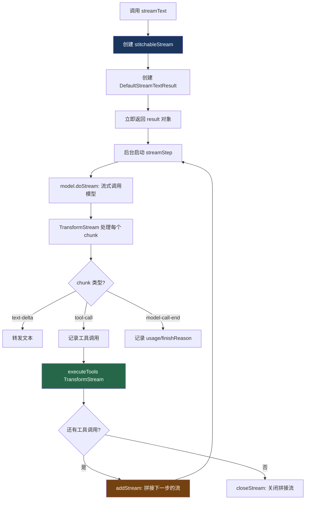

# 2. streamText 流式循环

> 源码位置: `packages/ai/src/generate-text/stream-text.ts`

## 概述

`streamText` 是 `generateText` 的流式版本。它不等待完整响应，而是通过 Web Streams API 逐 chunk 输出。核心架构基于 `stitchableStream`——一个可以动态拼接多个 ReadableStream 的自定义流，实现多步骤（multi-step）流式输出。

## 底层原理

### 核心流程



### stitchableStream：多步流拼接

```typescript
// create-stitchable-stream.ts — 核心机制

function createStitchableStream<T>() {
  let innerStreamReaders: ReadableStreamDefaultReader<T>[] = [];
  let isClosed = false;
  let waitForNewStream = createResolvablePromise<void>();

  return {
    stream: new ReadableStream<T>({
      async pull() {
        // 没有内部流时，等待新流被添加
        if (innerStreamReaders.length === 0) {
          waitForNewStream = createResolvablePromise<void>();
          await waitForNewStream.promise;
          return processPull();
        }
        // 从当前内部流读取
        const { value, done } = await innerStreamReaders[0].read();
        if (done) {
          innerStreamReaders.shift(); // 切换到下一个流
        } else {
          controller.enqueue(value);
        }
      },
    }),
    addStream: (innerStream) => {
      innerStreamReaders.push(innerStream.getReader());
      waitForNewStream.resolve(); // 唤醒 pull
    },
    close: () => { isClosed = true; },
    terminate: () => { /* 立即关闭所有流 */ },
  };
}
```

**关键洞察**：每个 step 的模型输出是一个独立的 ReadableStream。`stitchableStream` 将它们串联成一个连续的流，对消费者透明。

### streamStep 递归

```typescript
// stream-text.ts — 简化版 streamStep

async function streamStep({ currentStep, responseMessages, usage }) {
  // 1. 调用模型获取流
  const { stream } = await model.doStream({ prompt: stepMessages });
  
  // 2. 通过 TransformStream 处理工具调用
  const streamWithToolResults = stream.pipeThrough(
    createExecuteToolsTransformation({ tools, ... })
  );
  
  // 3. 添加到 stitchableStream，并在 flush 中决定是否继续
  self.addStream(
    streamWithToolResults.pipeThrough(new TransformStream({
      async transform(chunk, controller) {
        // 转发 chunk，记录工具调用和 usage
      },
      async flush(controller) {
        // 等待 stepFinish 处理完成
        await stepFinish.promise;
        
        if (hasToolCalls && !stopConditionMet) {
          // 递归：开始下一步
          await streamStep({
            currentStep: currentStep + 1,
            responseMessages: [...responseMessages, ...stepMessages],
            usage: combinedUsage,
          });
        } else {
          // 结束：关闭 stitchableStream
          controller.enqueue({ type: 'finish', totalUsage });
          self.closeStream();
        }
      },
    }))
  );
}
```

### smoothStream：输出平滑

```typescript
// smooth-stream.ts — 避免大块文本突然出现

function smoothStream({ delayInMs = 10, chunking = 'word' }) {
  return () => new TransformStream({
    async transform(chunk, controller) {
      if (chunk.type !== 'text-delta') {
        controller.enqueue(chunk); // 非文本直接透传
        return;
      }
      buffer += chunk.text;
      while ((match = detectChunk(buffer)) != null) {
        controller.enqueue({ type: 'text-delta', text: match });
        buffer = buffer.slice(match.length);
        await delay(delayInMs); // 每个 chunk 之间加延迟
      }
    },
  });
}
```

### 与 generateText 的关键差异

| 维度 | generateText | streamText |
|------|-------------|------------|
| 返回时机 | 全部完成后 | 立即返回 |
| 循环方式 | for loop | 递归 streamStep |
| 流拼接 | 无 | stitchableStream |
| 工具执行 | Promise.all 后继续 | TransformStream 中执行 |
| 输出平滑 | 不需要 | smoothStream |
| 默认 stopWhen | isStepCount(1) | isStepCount(1) |
| 背压控制 | 无 | Web Streams 原生背压 |

### 与 Claude Code / Codex 的对比

| 维度 | streamText | Claude Code | Codex |
|------|-----------|-------------|-------|
| 流式协议 | Web Streams + SSE | Ink 渲染 | Ratatui 渲染 |
| 多步拼接 | stitchableStream | 无（阻塞式） | 无（阻塞式） |
| 输出平滑 | smoothStream | 无 | 无 |
| 工具流式执行 | TransformStream 管道 | StreamingToolExecutor | 无 |
| 背压 | 原生 Web Streams | 无 | 无 |

## 设计原因

- **立即返回**：用户不需要等待完整响应，提升感知速度
- **stitchableStream**：多步骤流式输出的核心抽象，对消费者完全透明
- **递归而非循环**：流式场景中，每步的结束在 `flush` 回调中才知道，递归比 for 循环更自然
- **smoothStream 可选**：不是所有场景都需要平滑，作为 transform 插件提供

## 关联知识点

- [generateText 循环](/vercel_ai_docs/agent/generate-text-loop) — 阻塞式版本
- [Web Streams 基础](/vercel_ai_docs/streaming/web-streams) — 底层流 API
- [smoothStream](/vercel_ai_docs/streaming/smooth-stream) — 输出平滑详解
- [SSE 传输](/vercel_ai_docs/streaming/sse-transport) — 服务端推送
