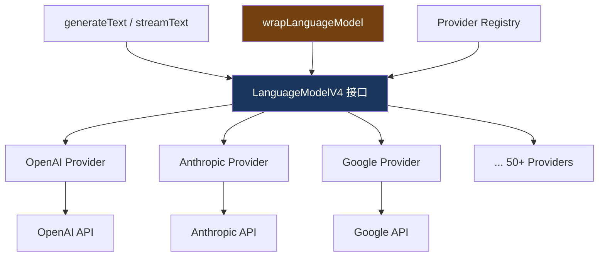
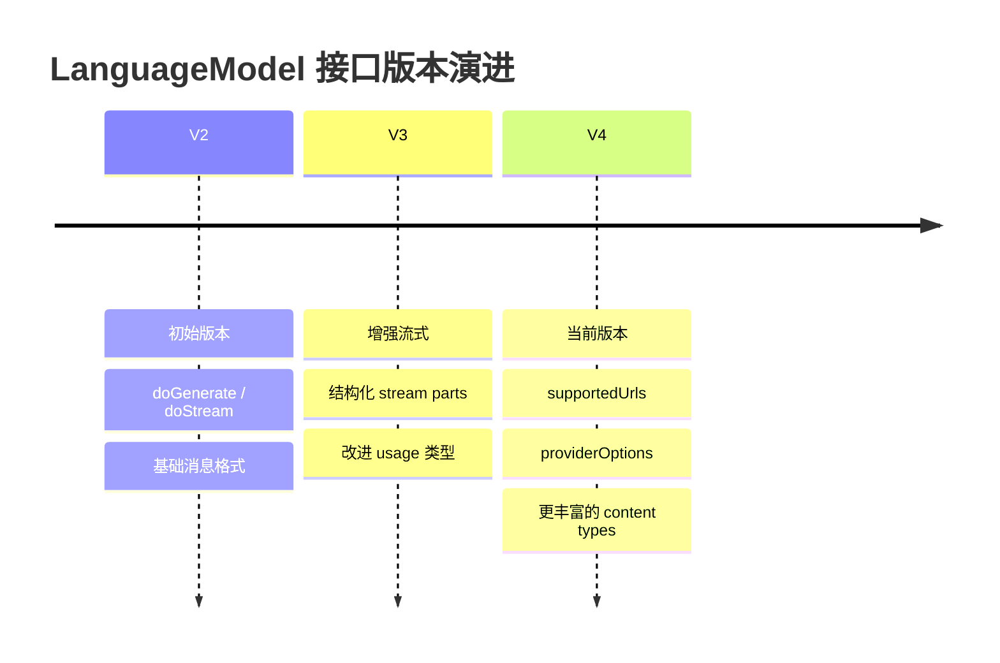

# 5. LanguageModel 接口

> 源码位置: `packages/provider/src/language-model/`

## 概述

`LanguageModelV4` 是 Vercel AI SDK 的核心抽象——所有 Provider（OpenAI、Anthropic、Google 等 50+）都必须实现这个接口。它只有两个核心方法：`doGenerate`（阻塞式）和 `doStream`（流式），加上元数据属性。

## 底层原理

### 接口定义

```typescript
// language-model-v4.ts

type LanguageModelV4 = {
  // 版本标识
  readonly specificationVersion: 'v4';
  
  // 元数据
  readonly provider: string;   // e.g. "openai"
  readonly modelId: string;    // e.g. "gpt-4o"
  
  // URL 支持声明（哪些 URL 模型原生支持，不需要下载）
  supportedUrls: PromiseLike<Record<string, RegExp[]>> | Record<string, RegExp[]>;
  
  // 核心方法：阻塞式生成
  doGenerate(options: LanguageModelV4CallOptions): PromiseLike<LanguageModelV4GenerateResult>;
  
  // 核心方法：流式生成
  doStream(options: LanguageModelV4CallOptions): PromiseLike<LanguageModelV4StreamResult>;
};
```

### 架构关系



### CallOptions 结构

```typescript
// 调用选项（所有 Provider 统一接收）
type LanguageModelV4CallOptions = {
  // 消息格式
  prompt: LanguageModelV4Prompt;
  
  // 生成参数
  maxOutputTokens?: number;
  temperature?: number;
  topP?: number;
  topK?: number;
  presencePenalty?: number;
  frequencyPenalty?: number;
  stopSequences?: string[];
  seed?: number;
  
  // 工具
  tools?: LanguageModelV4FunctionTool[];
  toolChoice?: LanguageModelV4ToolChoice;
  
  // 输出格式
  responseFormat?: { type: 'text' | 'json' };
  
  // Provider 特定选项
  providerOptions?: Record<string, Record<string, unknown>>;
  
  // 控制
  abortSignal?: AbortSignal;
  headers?: Record<string, string>;
};
```

### 版本演进



| 版本 | 关键变化 | 兼容性 |
|------|---------|--------|
| V2 | 初始接口，基础 doGenerate/doStream | asLanguageModelV3 适配 |
| V3 | 结构化流 parts，改进 usage | asLanguageModelV4 适配 |
| V4 | supportedUrls，providerOptions，丰富内容类型 | 当前版本 |

### "do" 前缀设计

```typescript
// 为什么是 doGenerate 而不是 generate？
// → 防止用户直接调用 Provider 方法

// ❌ 错误用法（绕过 SDK 的重试、遥测、中间件）
const result = await model.doGenerate({ prompt: messages });

// ✅ 正确用法（通过 SDK 入口）
const result = await generateText({ model, prompt: "hello" });
```

### 与 Claude Code / Codex 的对比

| 维度 | LanguageModelV4 | Claude Code | Codex |
|------|----------------|-------------|-------|
| 抽象层级 | 通用接口（50+ providers） | 单一 Provider | 多 Provider（有限） |
| 核心方法 | doGenerate + doStream | query（单一） | createResponse |
| 版本管理 | V2→V3→V4 + 适配器 | 无版本概念 | 无版本概念 |
| 工具传递 | CallOptions.tools | 消息中内联 | 消息中内联 |
| Provider 特定 | providerOptions | 无 | 无 |
| URL 支持声明 | supportedUrls | 无 | 无 |

## 设计原因

- **最小接口**：只有 doGenerate 和 doStream，降低 Provider 实现门槛
- **"do" 前缀**：命名约定防止误用，引导用户通过 SDK 入口调用
- **版本化**：specificationVersion 字段支持渐进式升级
- **Provider 无关**：统一接口让上层代码（generateText、middleware）完全不关心具体 Provider

## 关联知识点

- [Provider Registry](/vercel_ai_docs/provider/registry) — 按名称查找 Provider
- [OpenAI 适配器](/vercel_ai_docs/provider/openai-adapter) — 具体实现示例
- [版本兼容](/vercel_ai_docs/provider/version-compat) — V2→V4 适配
- [wrapLanguageModel](/vercel_ai_docs/middleware/wrap-model) — 中间件包装
